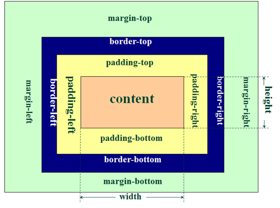

# 科目一《计算机软硬件基础》

## 第一单元 计算机概述

### 任务一 初识计算机

#### 1.计算机的诞生

ENIAC（`Electronic Numerical Integrator And Computer`）是**世界上第一台通用电子计算机**，于 **1946 年 2 月** 在**美国宾夕法尼亚大学**诞生。

- 主要元件：**约18000个电子管**
- 运算速度：**每秒约5000次加法**

#### 2.计算机的发展

计算机的发展通常根据其使用的核心元件分为四个阶段，具体如下：

- | 发展阶段               | 关键技术                                                | 主要特点                                   | 主要应用领域                  |
  |:------------------ |:--------------------------------------------------- |:-------------------------------------- |:----------------------- |
  | **第一代（1946—1957）** | 采用**电子管**；使用**机器语言**和**汇编语言**                       | 运算速度**每秒几千至几万次**，**体积庞大、功耗高、可靠性差、造价高** | **科学计算**                |
  | **第二代（1957—1964）** | 采用**晶体管**；出现**高级语言**和**批处理系统**                      | 速度提升至**每秒几万至几十万次**，**体积更小、功耗降低、更稳定**   | 科学计算、**数据处理**、事务处理、工业控制 |
  | **第三代（1964—1970）** | 采用**集成电路**；**高级**语言成熟，推广**分时系统**                    | 速度达**每秒几十万至几百万次**，计算机走向**小型化、低成本、高性能** | 开始应用于**各个领域**           |
  | **第四代（1971至今）**    | 采用**大规模/超大规模集成电路**；出现**图形化操作界面**、**网络技术**与**多核处理器** | 速度**每秒千万次以上**，向**微型化、网络化、智能化、多媒体化**发展  | 普及至**社会所有领域**           |

#### 3.我国计算机的发展

中国计算机的发展始于20世纪50年代，经历从无到有的奋斗历程，如今已在多个领域达到世界先进水平。以下是我国自主研制的一些关键机型：

| 年代        | 机型          | 类型       | 关键意义                                                             |
|:--------- |:----------- |:-------- |:---------------------------------------------------------------- |
| **1958年** | **DJS-103** | 电子管计算机   | 我国**第一台电子管计算机**，标志着中国计算机事业的**开端**。                               |
| **1965年** | **109乙机**   | 晶体管计算机   | 我国**第一台晶体管计算机**，为 **“两弹一星”** 试验做出重要贡献，被誉为 **“功勋机”**。（及改进型号109丙机） |
| **1983年** | **银河-Ⅰ**    | 巨型计算机    | 我国**第一台巨型机**，打破了国外技术封锁，开启了高性能计算领域的**自主创新之路**。                    |
| **当前阶段**  | **信创计算机**   | 国产化计算机体系 | 基于 **“信息技术应用创新”** 理念，核心部件逐步实现**国产化替代**，旨在提升国家**信息安全**水平。         |

#### 4.计算机的特点

计算机的核心特点包括以下几点：

- **高速、精准的运算能力**
  运算速度极快，从早期的每秒几千次发展至如今的超高水平。它能提供很高的计算精度，并通过技术方法实现更高精度的运算。
- **准确的逻辑判断能力**
  能够根据预设的程序和条件，自动进行逻辑比较、推理并做出决策。
- **强大的存储能力**
  可以存储海量的数据和程序。随着技术进步，存储容量越来越大，能满足大数据、多媒体等存储需求。
- **自动运行功能**
  计算机按照预先编好的程序自动运行和执行任务，无需人工持续干预。
- **网络和通信功能**
  通过网络连接，可以便捷地共享资源、交流信息，并能与各种智能设备相连，实现高效、智能的管理与控制。

#### 5.计算机的性能指标

1. **字长**
   指的是计算机**一次能同时处理的数据位数**（例如32位或64位）。它直接影响计算机的**计算精度、处理速度和能使用的内存大小**。

2. **主频**
   指的是`CPU`的**工作时钟频率**，可以简单理解为`CPU`的“心跳速度”，很大程度上决定了运算速度。主频的单位通常是`GHz`。例如，某款处理器的**主频为3.2 GHz**，表示它每秒可产生约32亿个时钟脉冲。

3. **运算速度**
   指的是`CPU`**每秒能执行指令的平均数量**。由于指令各不相同，通常用一个综合速度来衡量。单位常用`MIPS`（意为“每秒百万条指令”）表示。目前普通计算机的运算速度已达到**每秒数千亿次**。

4. **内存储器容量**
   指的是内存能存储信息的**最大容量**，基本单位是**字节**。
   
   - 最小单位是 **`bit`（位）**，状态为0或1。
   - 基本单位是 **`Byte`（字节）**，**1 字节 = 8 位**。
     常用容量单位换算如下：
     - 1 KB = 1,024 B = 2¹⁰ B
     - 1 MB = 1,024 KB = 2²⁰ B
     - 1 GB = 1,024 MB = 2³⁰ B
     - 1 TB = 1,024 GB = 2⁴⁰ B
     - （更大的单位还有`PB`、`EB`、`ZB`、`YB`，均遵循 **1,024** 的进位关系）

5. **存取周期**
   
   这是衡量**内存速度**的关键指标。将数据存入内存称为 **“写”**，从内存取出数据称为 **“读”**。
   
   - **存取时间**：完成一次“读”或“写”操作所需要的时间。
   - **存取周期**：**连续两次独立的“读”或“写”操作之间所需的最短时间间隔**。它包含了存取操作本身的时间和必要的内部恢复时间。**存取周期越短，意味着内存的读写速度越快**。目前高性能内存的存取周期已可达到 **10纳秒以内**。
   
   如：启动第 1 次读 / 写 → 存取时间 → 恢复时间 → 启动第 2 次读 / 写，整体为存取周期

#### 6.计算机的分类及常见的计算机

- **计算机的分类**
  计算机可以按不同方式分类：
  
  - **按用途**：分为**通用计算机**和**专用计算机**。
  
  - **按规模与性能**：分为**巨型机、大型机、小型机、工作站、微型机**。
  
  - **按使用环境**：分为**服务器、客户机、嵌入式计算机**。

- **常见的计算机**
  
  1. **微型计算机**
     也叫**个人计算机**，诞生于计算机发展的第四代，使用**大规模、超大规模集成电路**。**`IBM`公司在1981年**推出了采用`Intel 8088`处理器和`MS-DOS`系统的**`Personal Computer`（简称`PC`）**，确立了现代个人计算机的基本标准。
     如今，微型计算机形态多样，包括**台式机、笔记本电脑、平板电脑**等，其发展离不开**微处理器**的快速进步。我国自主研发的**龙芯、海光、飞腾、鲲鹏、兆芯、神威**等处理器取得了显著进展。
  2. **巨型计算机**
     也叫**超级计算机**，其**运算速度和存储容量远超普通计算机**，用于**气候模拟、灾害预测、航空航天、生物研究**等复杂计算任务。
     例如，**`El Capitan`** 的计算能力达到了**百亿亿次级**。我国超级计算机发展迅速，拥有**天河系列、曙光系列、神威系列**。其中，**“神威・太湖之光”** 曾多次位居世界第一。
  3. **嵌入式计算机**
     是一种**集成在其他设备中**的专用计算机系统，通过固化软件实现特定功能与控制。
     它广泛应用于**工业生产线、智能家居、汽车系统**的自动化管理，并能处理来自各种传感器（如环境监测、医疗设备）的数据，显著**提升设备的智能化水平**。

#### 7.计算机的应用领域

1. **科学计算**
   也称为**数值计算**，指利用计算机进行**复杂数学运算、模拟和建模**。其特点是**计算量大、精度要求高**。典型应用包括**卫星轨道计算、天气预报、药物研发**等。

2. **数据处理**
   也称为**信息处理**，指用计算机对原始数据进行**收集、整理、分析和存储**，将其转化为有用信息。常见应用于**办公自动化、图书管理、金融分析、地理信息系统**等领域。

3. **过程控制**
   也称为**实时控制**，指计算机作为控制核心，对**设备或整个生产过程进行自动监控与调节**。它广泛应用于**数控机床、航天发射、石油化工、智能交通**等场景，正随着物联网与人工智能技术变得更加**智能化**。

4. **计算机辅助系统**
   指利用计算机技术辅助专业领域工作，主要包括：
   
   - **`CAD`**：计算机辅助设计
   
   - **`CAM`**：计算机辅助制造
   
   - **`CAE`**：计算机辅助工程
   
   - **`CAI`**：计算机辅助教学
   
   - **`CAT`**：计算机辅助测试

5. **人工智能**
   是计算机科学的前沿领域，旨在让机器模拟人类智能。其应用已快速融入生活，例如**机器人、自动驾驶、智能对话、图像识别**以及各类**`AI`大模型**。

6. **网络应用**
   指利用计算机和通信技术实现**数据传输、资源共享与远程交互**。典型服务包括**信息检索、远程教育、在线办公、电子商务**等。

7. **多媒体应用**
   指综合运用**文字、图像、音频、视频、动画**等多种媒体形式来创建和展示信息，并提供**交互体验**。常见形式有**数字电视、虚拟现实（`VR`）、增强现实（`AR`）、视频会议**等。

#### 8.计算机的工作原理

绝大多数计算机基于 **“程序存储和程序控制”** 的设计思想工作。

1. **工作原理核心**
   
   - 计算机硬件由 **运算器、控制器、存储器、输入设备和输出设备** 五大部分组成。
   
   - 计算机内部使用 **二进制** 表示和处理所有信息。
   
   - 核心是 **程序存储和程序控制**：将程序和数据事先存入存储器，然后由计算机自动读取并执行。

2. **程序的执行过程**
   要执行一个程序，其基本工作流程如下：
   
   - **输入与存储**：程序和数据首先通过 **输入设备** 存入 **存储器**。
   
   - **取指令**：运行时，**控制器** 从存储器中取出程序的第一条指令。
   
   - **译码与执行**：控制器**分析指令**，根据指令要求从存储器中取出数据，送到 **运算器** 进行运算，中间结果存回存储器。
   
   - **循环**：控制器再取下一条指令，重复上述过程，**依次执行所有指令**。
   
   - **输出**：最终结果从存储器通过 **输出设备** 呈现出来。

3. **指令与程序**
   
   - **指令**：是计算机完成某个**基本操作**的命令，例如传输数据或执行运算。
   
   - **程序**：是**一系列指令的有序集合**，计算机通过依次执行程序中的指令来完成复杂任务。

### 任务二 了解计算机系统

#### 1.计算机系统组成

一个完整的**计算机系统**由**硬件系统**和**软件系统**两部分共同组成。

1. **硬件系统**
   硬件系统是计算机的物理实体，主要由以下五部分组成：
   
   - **运算器**与**控制器**（通常合称为中央处理器，即`CPU`）
   
   - **存储器**（包括内存和外存）
   
   - **输入设备**（如键盘、鼠标）
   
   - **输出设备**（如显示器、打印机）

2. **软件系统**
   软件系统是运行在硬件上的所有程序和数据，分为两大类：
   
   - **系统软件**：用于管理和控制计算机硬件，是应用软件运行的基础。主要包括：
     
     - **操作系统**（如 `Windows`，`macOS`，`Linux`）
     - **语言处理程序**（如编译器等）
     - **数据库管理系统**
     - 其他**系统支撑软件**
   
   - **应用软件**：为满足用户特定需求而设计的软件。主要包括：
     
     - **办公软件**（如 `Office` 套件）
     - **图形图像软件**
     - **网络通信软件**
     - **多媒体软件**
     - 为各种**用户需求专门开发**的软件

#### 2.中央处理器

中央处理器（`CPU`），常被称为计算机的 **“大脑”** ，负责完成计算机的所有**运算**与**控制**任务。在个人电脑中，它通常是一块高度集成的芯片（微处理器）。`CPU` 主要由三部分组成：

1. **控制器**
   
   - 这是计算机的 **“指挥中心”** ，负责 **控制整个计算机的工作**。它的主要工作是：
     
     - **取指令**：从存储器中获取指令。
     
     - **解释指令**：分析指令的含义。
     
     - **执行指令**：指挥其他部件（如运算器）完成指令要求的操作。
   
   - 它的组成是由：
     
     - 指令指针寄存器
     - 指令寄存器
     - 控制逻辑电路
     - 时钟控制电路

2. **运算器**
   这是计算机的 **“计算单元”** ，专门负责对数据进行各种**算术运算**（如加、减）和**逻辑运算**（如比较、判断）。
   
   它的组成是由：
   
   - 算术逻辑部件（`ALU`）
   - 累加器
   - 状态寄存器
   - 通用寄存器组

3. **寄存器**
   这是 `CPU` 内部的 **“高速临时存储单元”** ，用于快速存取当前运算中正在使用的**数据**、**中间结果**、**地址信息**等。它的**数量与速度**对 `CPU` 的整体性能有直接影响。

#### 3.存储器

存储器是计算机用于存放 **程序和数据** 的记忆部件，其基本功能是根据指令 **存入或取出信息**。

- **存储器的分类**
  
  | 分类依据        | 主要类型                  |
  |:----------- |:--------------------- |
  | **存储介质材料**  | 半导体存储器、磁表面存储器、光存储器    |
  | **工作方式**    | 随机读写存储器、顺序读写存储器、只读存储器 |
  | **在系统中的地位** | **内存储器**、**外存储器**     |

- **内存储器**
  内存储器是`CPU`**能够直接访问**的存储器，用于存储当前正在运行的程序和数据。其主要特点是**速度快，但断电后数据会丢失**（除部分只读存储器外）。内存容量通常指其主存（`RAM`）部分的大小。
  
  - **存储单元与地址**：内存由许多存储单元构成，每个单元有一个唯一的**地址**。地址线的数量决定了可寻址的空间大小（例如，**26根地址线可寻址64 MB空间**）。
  - 存储容量 = 末地址 - 首地址 + 1
  
  内存储器主要由三部分组成：
  
  1. 随机存取存储器（`RAM`，通常说的“内存”）
     
     - 可以随时**读出或写入**数据。
     
     - 用于存放**正在运行的程序和临时数据**。
     
     - **断电后，其中存储的内容会全部丢失**。
     
     - 根据制造原理不同分为：
       
       - `SRAM`：读写速度快，集成度低，生产成本高，不需要电流刷新
       - `DRAM`：需要不断电流刷新
  
  2. 高速缓冲存储器（`Cache`）
     
     - 位于`CPU`和主存之间，是一种**速度极快**的小容量存储器。
     
     - 作用是**缓存`CPU`频繁使用的数据和指令**，减少`CPU`等待数据的时间，从而**大幅提升整机速度**。
     
     - 用户**无法直接访问**`Cache`，其内容由系统自动管理，并与主存保持同步。
     
     - 一般采用**`SRAM`**
     
     - 通常分为一级缓存，二级缓存，三级缓存
  
  3. 只读存储器（`ROM`）
     
     - 内容一般**只能读出，不能随意写入**。
     
     - 用于存储计算机**固定不变的系统程序和数据**（如主板`BIOS`）。
     
     - 断电后信息**不会丢失**。
     
     - 根据其可改写性，主要类型如下：
       
       | 类型               | 主要特点                                  |
       |:---------------- |:------------------------------------- |
       | **普通`ROM`**      | 内容由生产商写入，**无法更改**                     |
       | **可编程`PROM`**    | 允许用户写入一次，之后**不可更改**                   |
       | **可擦除`EPROM`**   | 可用**紫外线擦除**，并可重新写入                    |
       | **电擦除`EEPROM`**  | 可通过**加电**来擦除和重写                       |
       | **闪速存储器`Flash`** | 属于`EEPROM`，**速度快、可靠性高**（U盘、固态硬盘的核心部件） |

- **外存储器**
  外存储器也称为**辅助存储器**，用于**长期、大量**地保存程序和数据。其特点是**容量大、成本低、断电后数据不丢失，但速度较慢**。`CPU`不能直接访问外存，需先调入内存。
  常见的外存储器有：**机械硬盘、固态硬盘（`SSD`）、光盘、U盘、移动硬盘**等。

#### 4.输入设备

- 输入设备用于**向计算机输入数据和信息**。除常见的键盘、鼠标、扫描仪和麦克风外，还包括以下几种常见设备：
  
  - **条形码阅读器**
  
  - **手写笔**
  
  - **数码相机**

#### 5.输出设备

- 输出设备用于将计算机处理完成的信息，**转换为人或其他设备可以理解或接收的形式**。最常见的输出设备如下：
  - **显示器**
  - **投影仪**

#### 6.总线

总线是计算机中各部件之间传递数据、地址和控制信号的**一组公共通道**。

- **总线的分类**
  
  1. **按功能分类**
     - **内部总线**：位于`CPU`内部，连接其各部件（如寄存器、运算器）。
     - **系统总线**：连接`CPU`与内存等高速部件，是计算机内部最重要的总线。它由三部分组成：
       - **数据总线**：传输数据。
       - **地址总线**：传输内存或设备的地址信息。
       - **控制总线**：传输控制与状态信号。
     - **外部总线**：连接计算机与其他外部系统，如：
       - 外部串行总线`RS 232C`
       - 串行总线`IEEE 1394`
       - 并行总线`IEEE 488`
       - 通用串行总线`USB`
  2. **按数据传输格式分类**
     - **串行总线**：数据**一位接一位**顺序传输（如`USB`）。
     - **并行总线**：数据**多位同时**传输（如传统的打印机接口）。
  3. **按时序控制分类**
     - **同步总线**：依靠一个**统一的时钟信号**来协调所有传输。
     - **异步总线**：不依赖统一时钟，设备间通过“请求”与“应答”等**握手信号**来协调传输。

- **微型计算机中的常用总线**
  
  - **`ISA`总线**：早期的工业标准总线。（`IBM`）
  
  - **`PCI`总线**：曾广泛应用的外部设备互连总线。（`Intel`）
  
  - **`AGP`总线**：专为显卡设计的加速图形接口。（`Intel`）
  
  - **`PCI-E`总线**：目前主流的通用总线标准。（`Intel`）其主要优点是：
    
    1. **数据传输速率非常高**。
    2. 采用**点对点串行连接**方式。
    3. 支持**热插拔**（在开机状态下连接或断开设备）。

> 主板是承载这些总线并连接所有计算机硬件部件的**核心电路板**。

### 任务三 了解计算机前沿知识

#### 1.大数据

1. **概念**
   大数据是指**规模巨大、类型多样**的数据集合，无法用传统软件工具在规定时间内进行处理。需要通过新的技术模式进行分析，才能从中获得更强的决策支持、洞察发现和流程优化能力。
   
   其处理流程一般包括四个步骤：**数据采集与预处理、数据存储、数据挖掘、数据呈现**。

2. **应用领域**
   大数据技术已广泛应用于各行各业：
   
   - **金融服务**：用于风险分析、客户忠诚度管理、交易监管等。
   
   - **公共管理**：应用于网络安全、能耗管理等。
   
   - **医疗健康**：支持药品研发分析、患者护理质量评估、健康保险管理等。
   
   - **零售行业**：用于市场与用户分析、销售预测等。
   
   - **环保领域**：应用于大气质量监测、排污管理等。
   
   大数据与`云计算`、`人工智能`、`物联网`等技术深度融合，正推动实时分析和智能决策的发展，加速各行各业的数字化转型。

3. **特征和意义**
   
   **大数据的`4V`特征**
   
   | 特征      | 英文         | 核心描述                              |
   |:------- |:---------- |:--------------------------------- |
   | **大量性** | `Volume`   | 数据体量**巨大**，常达`TB`、`PB`甚至`EB`级别。   |
   | **高速性** | `Velocity` | 数据增长、获取和处理的速度要求**非常快**。           |
   | **多样性** | `Variety`  | 数据种类**多样**，包括文本、图片、音频、视频等各种形式。    |
   | **价值性** | `Value`    | 数据总体价值大，但单个价值密度低，需通过分析**提取有用信息**。 |
   
   **大数据的核心意义**
   其战略意义**不在于掌握海量数据本身，而在于对这些数据进行专业化的处理和分析**。核心是 **“有用”** ，数据的价值含量和挖掘成本比单纯的数量更为重要。

**大数据的价值体现**

1. 服务于海量用户的大型企业，可利用大数据实现**精准营销**。
2. 采用灵活模式的中小微企业，可利用大数据进行**服务转型**。
3. 面临转型压力的传统企业，需要充分利用大数据的价值来**适应新时代**。

#### 2.人工智能

1. **概念**
   `人工智能`（`AI`）是一门研究如何让机器**模拟、延伸和扩展人的智能**的新兴科学。它是计算机科学的重要分支，融合了统计学、脑神经学等多个学科的知识。

2. **基本原理（机器学习）**
   让计算机获得“智能”的核心方法是让它学会学习，这被称为 **`机器学习`** 。根据学习方式的不同，主要分为三种：
   
   - **有监督学习**：给计算机提供**大量带答案（标签）的例子**，让它学习规律并建立一个模型，之后用这个模型去解决新问题。这很像人类通过**观察示例来学习**。
   
   - **无监督学习**：计算机直接面对**大量没有答案的数据**，需要**自己发现其中的结构和规律**。这种方式计算量巨大。
   
   - **半监督学习**：介于以上两者之间，使用**少量有答案的数据和大量无答案的数据**共同进行学习。

3. **发展历程**
   人工智能的发展大致经历了四个主要阶段：
   
   - **第一阶段（符号推理时代）**：计算机通过**预先设定的规则和逻辑**来模拟智能，例如下棋程序。
   
   - **第二阶段（专家系统时代）**：出现了**模拟人类专家经验的专用系统**，用于解决特定领域的问题。
   
   - **第三阶段（深度学习时代）**：随着大数据和强大算力的支持，计算机能够从海量数据中**自动学习复杂特征**，代表性事件是`AlphaGo`战胜人类围棋冠军。
   
   - **第四阶段（大语言模型与通用AI时代）**：以 **`ChatGPT`** 等为代表，人工智能展现出强大的**对话、理解和内容生成能力**，走向更通用的应用。

4. **应用领域**
   `AI`技术已广泛应用于各行各业，以下是两个典型例子：
   
   - **智慧交通**：通过感知和分析**人、车、路**的实时数据，来提升**城市管理效率和应急处理能力**。
   
   - **智能客服**：许多网站提供的在线聊天服务，实际上是由**人工智能程序**在回答用户的常见问题。

#### 3.机器人

机器人是`人工智能`的一种重要应用，能够**感知外部变化并做出反应**，从而影响周围环境。它是一种具有**独立行为能力**的设备，其外观可以设计成人形或非人形。从结构上看，机器人是一种**结合了机械和电子元件的复杂设备**。

**常见的应用场景：**

- **装配机器人**：在汽车生产线上，完成**高精度、高效率**的零件组装。
- **手术机器人**：协助医生进行**精密外科手术**，提升手术安全性与准确性。
- **采摘机器人**：在果园中**自主导航并识别果实**，完成自动化采摘。
- **送餐机器人**：在餐厅等场所，实现**自主送餐**，便捷生活。
- **陪伴机器人**：在家庭中，为老人与儿童提供**互动与陪伴**。

**机器人的发展进程：**

| 发展进程           | 核心特点                                                 | 常见示例        |
|:-------------- |:---------------------------------------------------- |:----------- |
| **第一代（示教再现型）** | 只能**严格按照预设程序**动作，**无法感知和适应环境变化**。                    | 工厂中的**机械臂** |
| **第二代（感知型）**   | 借助简单传感器**获取环境信息**，能做出**初步判断和调整**，具备基础智能。             | **扫地机器人**   |
| **第三代（智能机器人）** | 具有**高度自主性和适应性**，能感知、理解环境，并自主规划决策完成任务；还具备**学习进化**的能力。 | **酒店服务机器人** |

#### 4.无人机

无人机，全称 **`无人驾驶飞机`（`UAV`）** ，是一种通过**远程遥控或程序控制**的**不载人飞行器**。与普通飞机相比，它具有**体积小、造价低、使用方便**的优点。

无人机的历史可以追溯到 **1917年**，当时一项关键的自动稳定技术为其诞生奠定了基础。

随着**材料、通信、能源**等技术的飞速发展，无人机的性能越来越强，应用也越来越广，主要体现在：

1. **灾害勘测**：快速进入灾区，提供**现场数据和图像**，协助救灾决策。
2. **农田监测**：通过摄像头和传感器，实时分析**作物生长情况和病虫害**。
3. **气象探测**：灵活部署，对**台风等极端天气进行近距离观测**，为预报提供关键数据。

目前，无人机的应用领域仍在不断扩大。**集群技术**的运用，使其在**物流配送、农业喷洒、空中表演**等领域展现出巨大潜力。

#### 5.物联网

1. **概念**
   `物联网`（`IoT`）是指通过各种**信息传感设备**，按**通信协议**将物品连接到互联网，实现**信息交换与智能管理**的网络。其概念于 **1999年** 首次提出。
   
   简单来说，它让**物体变得智能并能相互通信**。

2. **示例**
   例如，将**智能音箱**与空调、窗帘等设备连接后，用户就能用**语音控制**它们，完成调节温度、开关窗帘等操作。

3. **应用领域**
   随着技术成熟，物联网已广泛应用于众多场景，主要包括：
   
   - **智慧城市、智慧医疗、智慧交通**
   
   - **智能电网、智能物流、智能农业**
   
   - **智能家居、智能安防**

#### 6.云计算

1. **概念**
   `云计算`（`Cloud Computing`）的概念由**谷歌公司**于**2006年**正式提出。它指的是通过**强大的远程计算机网络**，将各种**计算资源**（如服务器、存储、软件）集中起来，形成一个可按需取用、灵活配置的**共享资源池**，并通过网络为用户提供方便的服务。

2. **一个简单的例子：图片处理**
   
   - **传统方式**：需要在个人电脑上**安装**专门的图像处理软件（如美图秀秀），并需要**手动更新升级**。
   
   - **云计算方式**：用户只需将图片通过**网页浏览器**上传到云平台，直接利用平台提供的**高性能服务和算法**在线处理图片，**无需关心软件安装与更新**。

3. **应用领域**
   随着技术成熟，云计算已广泛应用于**企业管理、在线教育、智慧医疗、金融服务、智慧城市以及媒体娱乐**等多个领域。

#### 7.现代通信技术

现代通信技术利用电子和计算机技术，实现**快速、高效、便捷**的信息交流。与传统方式相比，它具有**数字化、网络化、更快速、更智能、覆盖更广**等优势。

- **发展历程**
  通信技术主要经历了三个阶段：
  1. 从**电报、电话**起步。
  2. 发展到**无线电广播和电视**的普及。
  3. 再到以**移动通信和互联网**为代表的数字时代，形成了多元化、智能化的通信系统。
     未来，它将继续融合**`5G/6G`、卫星通信**等技术，构建更智能、更安全的全球网络。
- **应用领域**
  其应用已渗透到众多领域：
  1. **远程教育**：让人们可以**随时随地**通过互联网学习。
  2. **远程医疗**：使医生能为远距离的患者提供**诊断和建议**，提升医疗效率。
  3. **智能交通**：实现车辆间的**信息共享与协同**，提高道路安全和通行效率。
     此外，它还广泛应用于**智能家居、公共安全、娱乐传媒**等领域，深刻改变着人们的生活和工作方式。

#### 8.区块链

1. **基本概念**
   
   区块链是一种**去中心化的分布式账本**，它结合了多种技术，使数据一旦记录就**难以篡改**，确保了安全与透明。可以将其想象成一个**多人共同维护的共享账本**，任何一笔新记录都会同步到所有人的副本上，并使用独特的“密码学指纹”锁定。这保证了信息的**安全、透明与可靠**。

2. **发展阶段**
   
   | 阶段         | 核心特点                       | 主要应用                    |
   |:---------- |:-------------------------- |:----------------------- |
   | **区块链1.0** | **数字货币**时代，以 `Bitcoin` 为代表 | 实现虚拟货币的支付与交易            |
   | **区块链2.0** | **智能合约**时代，与金融结合           | 拓展到更广泛的金融领域应用           |
   | **区块链3.0** | **超越金融**，应用于各行业            | 在数据存证、供应链、政府管理等众多领域得到应用 |

3. **应用领域**
   
   区块链技术已应用于**供应链金融、司法存证、智能合同、商品溯源、物流管理**等多个领域。
   例如，在**商品防伪**中，通过区块链记录商品从生产到销售的全流程信息，生成不可篡改的 **“数字身份证”** 。消费者扫码即可查询完整信息，有效**保障商品真实性**。

## 第二单元 计算机数据与机内编码

### 任务一 进制计数制

#### 1.编码

- **编码的作用**
  编码就是用少量基本符号，按照一定规则组合，来代表大量复杂信息。在计算机中，它的主要作用是将文字、图像、声音等人类能理解的信息，转换成计算机能处理的 **`二进制`** 形式。

- **为什么计算机使用二进制**
  计算机内部的所有信息和运算都使用二进制（只用 **0** 和 **1** 两个符号），主要原因有：
  
  - **易于物理实现**：两种状态（如电路的 **“通”与“断”**、电平的 **“高”与“低”**）在电子元器件上非常容易表示，系统稳定可靠。
  
  - **运算简单高效**：二进制的运算规则非常简单，这使得硬件电路的设计得以简化。同时，它能与计算机底层的逻辑运算完美匹配，使得处理效率非常高。

#### 2.数值

数制（也叫进位计数制）是计数的规则，即用一组特定符号的组合来表示任意数字的方法。要理解它，需要了解三个基本概念：

1. 数码
   
   一种数制中使用的基本符号。例如：
   
   * **十进制**的数码是：0, 1, 2, 3, 4, 5, 6, 7, 8, 9
   * **二进制**的数码是：0, 1

2. 基数
   
   一种数制中所有数码的**总个数**，它是该数制的基础。
   
   * 二进制有 **2** 个数码，基数就是 **2**。
   * 十进制有 **10** 个数码，基数就是 **10**。
   * 十六进制有 **16** 个数码（0-9 和 A-F），基数就是 **16**。

3. 位权
   
   数码在不同位置上所代表的**实际值大小**。这个值由该位置的**权重**决定。
   
   * 规则是：从右向左（最低位为第1位），**第 i 位的位权 = 基数 ^ (i-1)**。
   * 一个数码**实际代表的数值** = **数码本身的值 × 该位置的位权**。
   
   **一个简单的例子：十进制数 749**
   它可以拆解为：
   
   * 7（在百位，第3位）：**7 × 10² = 7 × 100 = 700**
   * 4（在十位，第2位）：**4 × 10¹ = 4 × 10 = 40**
   * 9（在个位，第1位）：**9 × 10⁰ = 9 × 1 = 9**
     将它们相加：**700 + 40 + 9 = 749**。
   
   > 这个例子清晰地展示了“位权”（10², 10¹, 10⁰）如何决定同一个数码在不同位置上的实际价值。

#### 3.常用进制

以下是计算机中最常用的三种进制：

| 进制       | 基数     | 基本符号                | 位权           | 常用后缀    |
|:-------- |:------ |:------------------- |:------------ |:------- |
| **二进制**  | **2**  | **0， 1**            | **2^(i-1)**  | **`B`** |
| **十进制**  | **10** | **0， 1， 2， ...， 9** | **10^(i-1)** | **`D`** |
| **十六进制** | **16** | **0-9， A-F**        | **16^(i-1)** | **`H`** |

---

- 二进制
  
  二进制只有 **0** 和 **1** 两个数码，规则是“**逢二进一**”。它非常适合表示只有两种状态的事物（如开关、真假）。
  
  * **表示形式**：例如 **`(11001)_2`** 或 **`11001B`**。
  * **位权规则**：从右向左数，第 i 位的位权是 **2^(i-1)**。
  
  **示例：`11001B` 的值是多少？**
  它的计算方法是每位数字乘以其位权后相加：
  `1×2⁴ + 1×2³ + 0×2² + 0×2¹ + 1×2⁰ = 16 + 8 + 0 + 0 + 1 = 25`
  所以，**`11001B = 25`**（十进制）。

- 十六进制
  
  由于二进制书写冗长，常转换为十六进制简化表示。它有16个数码，规则是“**逢十六进一**”。
  
  * **基本符号**：0-9 和 **A， B， C， D， E， F**（分别对应十进制的 **10， 11， 12， 13， 14， 15**）。
  * **表示形式**：例如 **`(B57A)_16`** 或 **`B57AH`**。
  * **位权规则**：从右向左数，第 i 位的位权是 **16^(i-1)**。

#### 4.进制的运算

- 二进制运算
  * **加法**：规则是“**逢二进一**”。
    * 0 + 0 = 0
    * 0 + 1 = 1
    * 1 + 0 = 1
    * 1 + 1 = 10 （即本位为0，并向高位进1）
  * **减法**：规则是“**借一当二**”。
    * 0 - 0 = 0
    * 1 - 0 = 1
    * 1 - 1 = 0
    * 0 - 1 = 1 （需要向高位借位）
- 十六进制运算
  * **加法**：规则是“**逢十六进一**”。
    * 两个数相加，如果和 **小于16**，则直接写下结果。
    * 如果和 **等于或大于16**，则用和减去16作为当前位的结果，并向高位进1。
  * **减法**：规则是“**借一当十六**”。
    * 如果被减数当前位 **大于等于** 减数当前位，直接相减。
    * 如果被减数当前位 **小于** 减数当前位，则需要向高位借位（借来的1相当于当前位的16）。

#### 5.进制转换

1. R进制转十进制
   
   采用 **按权展开求和** 法：将每一位数码乘以其位权 **R^(i-1)**，然后将所有乘积相加。  
   通用公式：`(1234)_R = 1×R^3 + 2×R^2 + 3×R^1 + 4×R^0`

2. 十进制转R进制
   
   采用 **除R取余** 法：
   
   - 将十进制整数除以 **R**，记录商和余数。
   - 继续用商除以 **R**，直到商为 **0**。
   - 将得到的余数从最后一个到第一个排列（即最先得到的余数为最低位）。

3. 二进制与十六进制的相互转换
   
   由于 **16 = 2^4**，一位十六进制数对应四位二进制数。
   
   - **十六进制转二进制**：将每一位十六进制数替换为对应的四位二进制数。  
     例如：**`(F3)_16 = (11110011)_2`**
   - **二进制转十六进制**：从最低位开始，每四位一组（不足四位左侧补0），将每组转换为一位十六进制数。  
     例如：**`(1101101)_2 = (6D)_16`**

4. **进制转换对照表**
   
   | 二进制  | 十六进制 | 十进制 | 二进制  | 十六进制 | 十进制 |
   |:---- |:---- |:--- |:---- |:---- |:--- |
   | 0000 | 0    | 0   | 1000 | 8    | 8   |
   | 0001 | 1    | 1   | 1001 | 9    | 9   |
   | 0010 | 2    | 2   | 1010 | A    | 10  |
   | 0011 | 3    | 3   | 1011 | B    | 11  |
   | 0100 | 4    | 4   | 1100 | C    | 12  |
   | 0101 | 5    | 5   | 1101 | D    | 13  |
   | 0110 | 6    | 6   | 1110 | E    | 14  |
   | 0111 | 7    | 7   | 1111 | F    | 15  |

### 任务二 机内数据标识方式

#### 1.真值数

- 带**正、负**符号的数称为真值数

#### 2.机器数

机器数是数值在计算机中的二进制表示形式，它将正负符号也数字化。其特点是：用 **0 代表“+”，1 代表“-”**；数值范围受**机器字长**限制。

计算机中的数据分为：

- **无符号数**：只能表示非负整数。
- **有符号数**：可表示正数、负数和零，通常**最高位为符号位**。

例如，8位二进制数 `10000001`：

- 作为有符号数，表示 **-1**。
- 作为无符号数，表示 **129**。

有符号数的常用表示方式有原码、反码和补码三种。

------

1. **原码**
   
   在原码表示中，**最高位为符号位**（0正1负），其余位表示数值的绝对值。
   
   - 例如（8位）：
     - `[+1]原 = 00000001`
     - `[-1]原 = 10000001`
     - `[+127]原 = 01111111`
     - `[-127]原 = 11111111`
   - 零的表示**不唯一**：`[+0]原 = 00000000`，`[-0]原 = 10000000`
   - 表示范围：**-127 ~ -0 和 +0 ~ +127**

2. **反码**
   
   - **正数的反码**：与原码**相同**。
   - **负数的反码**：在原码基础上，**符号位不变，数值位按位取反**（0变1，1变0）。
   - 例如（8位）：
     - `[+1]反 = 00000001`
     - `[-1]反 = 11111110`
     - `[+127]反 = 01111111`
     - `[-127]反 = 10000000`
   - 零的表示**不唯一**：`[+0]反 = 00000000`，`[-0]反 = 11111111`
   - 表示范围：**-127 ~ -0 和 +0 ~ +127**

3. **补码**
   
   补码是计算机中**最常用的表示方式**，可以简化硬件设计，将减法运算转化为加法。
   
   - **正数的补码**：与原码、反码**相同**。
   - **负数的补码**：在反码基础上**加1**（即**取反加1**）。
   - 例如（8位）：
     - `[+1]补 = 00000001`
     - `[-1]补 = 11111111`
     - `[+127]补 = 01111111`
     - `[-127]补 = 10000001`
   - 零的表示**唯一**：`[+0]补 = [-0]补 = 00000000`
   - 表示范围：**-128 ~ +127**（比原码和反码多表示一个 -128）
     - 8位时，`[-128]补 = 10000000`

#### 3.真值数与机器数的转换

真值数是带有正负符号的数（如 `+5`、`-3`），而机器数是其在计算机中的二进制表示。转换时，通常将**最高位作为符号位**：**0 表示正数，1 表示负数**，其余位表示数值大小。

------

1. **真值数转机器数（以8位字长为例）**
   - **正数**：最高位为 **0**，数值部分若不足8位，则在**左侧补0**。
     - 例：`(+110101)_2` → 补0后为 **`00110101`**
   - **负数**：最高位为 **1**，数值部分若不足8位，则在**左侧补0**。
     - 例：`(-110101)_2` → 补0后为 **`10110101`**
2. **机器数转真值数**
   - **符号位为0**（正数）：用 **`+`** 表示，将数值位转换为十进制。
     - 例：`00110101` → 符号位 **0**（正），数值位 `0110101` = 53 → 真值数为 **`(+53)_10`**
   - **符号位为1**（负数）：用 **`-`** 表示，将数值位转换为十进制。
     - 例：`10110101` → 符号位 **1**（负），数值位 `0110101` = 53 → 真值数为 **`(-53)_10`**

#### 4.原码、反码、补码的转换

1. **原码与反码的转换**
   - **正数**：原码与反码**完全相同**。
     - 例：`[+1]反 = [+1]原 = 00000001`，`[+127]反 = [+127]原 = 01111111`
   - **负数**：
     - **原码转反码**：**符号位不变，数值位按位取反**（0变1，1变0）。
       - 例：`[-1]原 = 10000001` → `[-1]反 = 11111110`
     - **反码转原码**：同样**符号位不变，数值位按位取反**。
       - 例：`[-127]反 = 10000000` → `[-127]原 = 11111111`
2. **原码与补码的转换**
   - **正数**：原码与补码**完全相同**。
     - 例：`[+1]补 = [+1]原 = 00000001`，`[+127]补 = [+127]原 = 01111111`
   - **负数**：
     - **原码转补码**：**符号位不变，数值位取反后加1**（即**补 = 反 + 1**）。
       - 例：`[-1]原 = 10000001` → 取反得 `11111110` → 加1得 `[-1]补 = 11111111`
     - **补码转原码**：**符号位不变，数值位先减1再取反**。
       - 例：`[-127]补 = 10000001` → 减1得 `00000000` → 取反得 `[-127]原 = 11111111`
3. **反码与补码的转换**
   - **正数**：反码与补码**完全相同**。
   - 负数：
     - **反码转补码**：**符号位不变，数值位加1**。
       - 例：`[+1]补 = [+1]反 = 00000001`，`[+127]补 = [+127]反 = 01111111`
     - **补码转反码**：**符号位不变，数值位减1**。
       - 例：`[-127]补 = 10000001` → 减1得 `[-127]反 = 10000000`

### 任务三 字符编码

#### 1.数据在计算机中的转换过程

计算机内部采用二进制，但与外部交互时需转换为人们熟悉的形式。这个过程在输入和输出两侧分别完成：

1. **输入设备侧的转换**
   - **数值**：十进制 → 二进制转换
   - **西文**：`ASCII`码转换
   - **汉字**：输入码 → 机内码转换
   - **声音、图像**：模/数转换（将模拟信号转为数字信号）
2. **输出设备侧的转换**
   - **数值**：二进制 → 十进制转换
   - **西文**：西文字形码转换（将编码转为显示字形）
   - **汉字**：汉字字形码转换（将机内码转为显示字形）
   - **声音、图像**：数/模转换（将数字信号转回模拟信号）

#### 2.`ASCII`码

西文字符包括拉丁字母、数字、标点及特殊符号。目前使用最广泛的是 **`ASCII`码**（美国信息交换标准代码）。

1. **基本特点**
   - **编码方式**：用 **7位二进制数** 表示，共可编码 **128个字符**。
   - **组成内容**：包含10个数字、52个大小写字母、33个标点/运算符和33个控制字符。
   - **标准地位**：1967年被定为国际标准，全球通用。
2. **字符分类**
   - **0~31及127**：**控制字符**或通信专用字符（不可显示）。
   - **32~126**：**可显示字符**，包括空格、数字、字母和符号。
3. **关键编码值**
   - **空格**：32
   - **数字`0`**：48，数字`1`~`9`依次递增至57
   - **大写字母`A`**：65，`B`~`Z`依次递增（`Z`=90）
   - **小写字母`a`**：97，`b`~`z`依次递增（`z`=122）
4. **重要规律**
   - 数字`0`的`ASCII`码为**48**，数字按顺序递增。
   - 大写字母`A`为**65**，小写字母`a`为**97**，**同一字母的小写比大写大32**。

#### 3.汉字编码

计算机对汉字的处理过程，是各种汉字编码之间的转换。主要环节包括：

1. **汉字输入码（外码）**
   
   用于从键盘等设备输入汉字，也称**外码**。同一汉字可有多种输入码，输入后统一转换为机内码。
   
   - **分类**：
     - **流水码**：按顺序编码（**无重码**）
     - **音码**：按读音编码（如搜狗、全拼）
     - **形码**：按字形编码（如五笔、郑码）
     - **音形结合码**：结合读音和字形（如自然码）

2. **国标码（汉字信息交换码）**
   
   我国标准 **`GB/T 2312-1980`**，用于汉字信息交换。
   
   - **编码方式**：**十六进制编码形式**用**两个字节**表示一个汉字，共收录**7445个**图形字符（含682个符号、3755个一级汉字、3008个二级汉字）。

3. **区位码**
   
   将`GB2312`字符集分为**94区 × 94位**，用4位十进制数表示（前两位区号，后两位位号）。
   
   - **示例**：“啊”的区位码为**1601**（16区01位）。
   - **分布**：
     - 一级汉字（常用）：**16~55区**，按拼音排序
     - 二级汉字（次常用）：**56~87区**，按部首/笔画排序

4. **机内码**
   
   汉字在**计算机内部**的标识编码，由国标码转换而来。
   
   转换规则：将国标码两个字节的最高位都置为“1”，即机内码 = 国标码 + `8080H`。其中国标码 = 区位码 + `2020H`

5. **字符集**
   
   - `Unicode`：全球统一编码标准，包含中、日、韩（`CJK`）统一汉字编码。
   - `UTF-8`：`Unicode`的可变长编码，与ASCII兼容，广泛用于网页和邮件。
   - `BIG5`：繁体中文常用字符集，包含13053个汉字。
   - `GBK`：扩展自`GB2312`，包含20902个汉字，常用于Windows系统。

6. **汉字字形码**
   
   用于显示和打印的数字化字模，用 **1表示黑点，0表示白点**。
   
   - **常见点阵**：**16×16**（简易型）、**24×24、32×32、48×48**（提高型）
   - **存储容量计算**：**16×16点阵 = 32字节**（16×16÷8）
   - **规律**：点阵越大，**字形越精细**，但占用空间也越大。

#### 4.汉字内码的转换

1. **国标码转机内码**
   
   将国标码两个字节的最高位都置为“1”，即加上 `8080H`。公式：**机内码 = 国标码 + `8080H`**。
   示例：“波”的国标码 `3228H` → `32H`+`80H`=`B2H`，`28H`+`80H`=`A8H` → 机内码 **`B2A8H`**。

2. **机内码转国标码**
   
   将机内码减去 `8080H`。公式：**国标码 = 机内码 - `8080H`**。
   示例：“大”的机内码 `B4F3H` → `B4H`-`80H`=`34H`，`F3H`-`80H`=`73H` → 国标码 **`3473H`**。

3. **区位码与机内码的转换**
   
   - **区位码转机内码**：公式：**机内码 = 区位码（转十六进制） + `A0A0H`**。
     示例：“学”的区位码 `4907` → 区号 `49`→`31H`，位号 `07`→`07H` → `31H`+`A0H`=`D1H`，`07H`+`A0H`=`A7H` → 机内码 **`D1A7H`**。
   - **机内码转区位码**：将机内码减去 `A0A0H`，得到十六进制区位码，再将区号、位号转为十进制。公式：**区位码（十六进制） = 机内码 - `A0A0H`**。
     示例：“波”的机内码 `B2A8H` → `B2A8H` - `A0A0H` = `1208H` → 区号 `12H`→18，位号 08H→08 → 区位码 **`1808`**。

## 第三单元 计算机硬件系统

### 任务一 主机外部接口连接

#### 1.计算机硬件的组成

台式计算机主要硬件由**主机，输入设备和输出设备**等组成

------

1. 主机

   主机是计算机的核心单元，内部集成了：

   - **主板、`CPU`、内存、硬盘、电源、散热系统**

   传统主机有**立式**和**卧式**两种形态，现发展为迷你机箱、全塔式等多样设计。

   **一体机**将主机与显示器合为一体，形态紧凑；但**传统独立主机**凭借**扩展性强、散热好**的优势，仍在游戏电脑和工作站领域不可替代。

2. 显示器

   计算机的显示系统主要由**显示器、显卡**及相应软件构成。显示器是**最基本的输出设备**，目前常用的是**液晶显示器（`LCD`）**。

   主要技术参数如下：

   1. **屏幕尺寸**：以**对角线长度**衡量，单位为**英寸**。常见宽高比为 **16:9**。
   2. **面板类型**：常见有 **`IPS`、`VA`、`TN`** 三种。
      - **`IPS`**：色彩好、可视角度佳，但可能漏光。
      - **`VA`**：对比度高，常做成**曲面屏**，可能有拖影。
      - **`TN`**：响应快、刷新率高、成本低，但色彩和可视角度较差。
   3. **分辨率**：指屏幕上的**像素数量**。尺寸相同时，分辨率越高，显示越**清晰细腻**。
   4. **亮度**：画面明亮程度，单位为**尼特（`nit`）**。
   5. **色域覆盖**：指能显示的颜色范围。**色域越广**，颜色越丰富。
   6. **刷新率**：屏幕每秒刷新的次数，单位为**赫兹（`Hz`）**。刷新率越高，画面越**稳定流畅**。常见有 **60Hz、120Hz、144Hz、240Hz**。

3. 键盘

   键盘是计算机的**基本输入设备**，用于输入命令和数据。按工作原理主要分为**机械键盘、薄膜键盘、静电电容键盘**等。

   键盘一般分为以下几个区域：

   1. **主键盘区**（打字区）：用于文字和符号输入。
   2. **功能键区**：各按键功能由**软件定义**。
   3. **小键盘区**（数字键区）：兼具**数字输入**和**光标控制**两种功能，通过 **`NumLock`键**切换（灯亮为数字输入，灯灭为方向键）。
   4. **光标控制键区**：用于移动光标和翻页。
   5. **信号灯状态显示区**：显示键盘状态（如大小写、数字键锁定等）。

4. 鼠标

   图形界面下常用输入设备。按连接方式分为：

   - **有线鼠标**
   - **无线鼠标**：蓝牙、2.4 GHz

5. 打印机

   **常见打印机对比**

   | 类型             | 工作原理              | 优点                                  | 缺点                     | 典型应用      |
   | :--------------- | :-------------------- | :------------------------------------ | :----------------------- | :------------ |
   | **针式打印机**   | 钢针击打色带          | 耗材成本低；支持复写纸/多联打印；耐用 | 噪声大；速度慢；质量低   | 票据打印      |
   | **喷墨打印机**   | 喷嘴喷射墨滴          | 介质兼容广；色彩较好                  | 闲置易堵塞；单页成本较高 | 家庭/照片打印 |
   | **激光打印机**   | 激光成像+静电吸附碳粉 | 速度快；质量高；单页成本低            | 难打印特殊介质           | 企业批量打印  |
   | **热升华打印机** | 加热升华色带          | 照片级色彩过渡；无颗粒感              | 耗材贵；速度慢           | 专业摄影输出  |
   | **热敏打印机**   | 加热头使热敏纸显色    | 结构简单；静音；维护成本低            | 字迹易褪色               | 小票打印      |

   **主要性能指标**

   - **打印分辨率**：用 **`DPI`**（每英寸可打印点数）表示。**`DPI`值越大，打印输出效果越好**。
   - **打印速度**：针式打印机以 **`CPS`**（每秒打印西文字符数）为单位；喷墨、激光打印机以 **`PPM`**（每分钟输出页数）为单位。速度受打印对象、数据传输方式、打印机内存大小等因素影响。
   - **打印幅面**：指打印机最大支持的纸张规格，常见有 **A4、A3** 等。个人或小型办公用户多使用`A4`幅面，广告设计、工程晒图等企业用户则需选择`A3`或更大幅面。

6. 扫描仪

   扫描仪是一种**输入设备**，利用光电技术和数字处理技术，以扫描方式将图形或图像信息转换为数字信号。

   常见类型：

   - **平板式扫描仪**
   - **手持式扫描仪**
   - **滚筒式扫描仪**

   主要技术指标：**分辨率、色彩位数、扫描幅面、扫描速度**等。

7. 音箱与耳麦

   - **音箱**：用于**输出声音**，将音频信号还原为声音。按放音频率可分为**全频带音箱、低音音箱、超低音音箱**等。目前**蓝牙音箱**和 **`Wi-Fi`音箱**逐渐成为主流。
   - **耳麦**：**耳机与麦克风的整合体**，既可**输出声音**（耳机），也可**录制音频**（麦克风）。分为**无线耳麦**和**有线耳麦**两种。

8. 摄像头

   摄像头通过捕捉图像或视频信号，将外部视觉信息转换为数字信号输入计算机，供处理、存储或传输。广泛应用于**安全监控、视频通话、人脸识别、录制视频**等场景。

#### 2.计算机主机外部设备接口识别

1. 电源接口

   通过电源接口将市电（`220V`）接入计算机，由开关电源转换为低压直流电，为`CPU`、主板、硬盘、显卡等内部配件供电。

2. `PS/2`接口

   形状为**圆形6针**。紫色为**键盘插座**，绿色为**鼠标插座**。**不支持热插拔**，需在断电状态下插拔，否则可能损坏接口电路。

3. 显示接口

   - **`VGA`接口**（D-Sub接口）：15针D型接口，传输**模拟信号**，主要用于旧款显示器和投影仪。
   - **`DVI`接口**：传输**未经压缩的数字视频信号**，解决了VGA接口的信号干扰和画质损失问题。
   - **`HDMI`接口**：高清晰度多媒体接口，可**同时传输视频和音频信号**，兼容电视、游戏主机等多种设备。
   - **`DP`接口**：支持**多显示器串联**，适用于高端游戏显示器、专业设计、多屏工作站等场景。

4. 网线接口

   普遍采用 **`RJ-45`接口**，插头有8个凹槽和8个触点。常用网线类型有**超五类、六类、超六类双绞线**。

5. `USB`接口

   通用串行总线（`Universal Serial Bus`），采用串行传输方式，已成为计算机和智能设备的**标配接口**。

   - 主要优点：
     - 传输速度快
     - 支持**热插拔**
     - 标准统一，可连接最多**127个设备**
     - 独立供电
   - 常见接口类型：
     - **`Type-A`**：最常见，用于键盘、鼠标、U盘等
     - **`Type-B`**：用于打印机、扫描仪等大型外围设备
     - **`Type-C`**：新一代接口，**24个金属触点**，支持**正反插拔、快速充电、高速传输**，设计轻薄且功能多样
   - 传输速率：
     - `USB 1.1`：12 `Mbps`
     - `USB 2.0`：480 `Mbps`
     - `USB 3.0`：5 `Gbps`
     - `USB4 v1.0`：40 `Gbps`
     - `USB4 v2.0`：80 `Gbps`

6. 音频接口

   标准3.5 mm三极接口（俗称“小三芯”接口），按颜色区分功能：

   - **粉红色**：麦克风输入
   - **绿色**：线路输出（连接音箱或耳机）
   - **蓝色**：数字音频输入

7. 并行接口和串行接口

   - **并行接口（`LPT`）**：25针D型接口，曾是打印机的主流接口，已逐渐被淘汰。
   - **串行接口（COM）**：9针D型接口，主要连接网络设备的配置线。

### 任务二 计算机硬件系统拆装

#### 任务实施

- **准备工作**

  1. 准备好拆装工具，整理操作台
  2. **消除人体静电**：佩戴防静电手套、触摸机箱金属部件、操作前洗手

- **拆卸步骤**

  1. **电源线和网线**
     - 切断电源，拔除主机上的电源线（一手扶稳机箱，一手握住插头前端轻拔）
     - 拔除网线（先按住水晶头搭扣，再缓缓拔出）
  2. **键盘和鼠标**
     - `USB`接口：捏住接头扁平处向外拔
     - `PS/2`接口：**不支持热插拔**，需断电操作（紫色为键盘，绿色为鼠标）
  3. **显示器连接线**
     - `VGA`接口：逆时针拧松固定螺丝，捏住接头向外拔
     - `HDMI`接口：捏住接头扁平处向外拔
  4. **其他设备连线**
     - 拔除音箱、耳麦、打印机、扫描仪等其他设备的接口
     - 音频设备拔除时，捏住插头轻轻拔出
     - 打印机、扫描仪、摄像头、U盘、数码相机、移动硬盘、手机等设备大多采用 **`USB`接口**，捏住接头扁平处向外拔即可

  > **热插拔说明**：指在不关闭系统电源的情况下安全连接或断开设备。`USB`接口和`IEEE 1394`接口支持热插拔。**并非所有设备都支持热插拔**，强行操作可能导致数据丢失或硬件损坏。

- **安装步骤**

  1. **连接显示器**
     - 准备合适的连接线（`HDMI`线、`VGA`线或`DP`线）
     - 将连接线的一端插入计算机主板上的对应接口（可能是主板集成显卡接口或独立显卡接口）
     - 将连接线的另一端插入显示器的对应接口
  2. **连接键盘与鼠标**
     - 将键盘和鼠标的 **`USB`插头**插入主机上的`USB`接口
     - 对于 **`PS/2`接口**的键盘和鼠标，将**紫色插头**插入键盘接口，**绿色插头**插入鼠标接口
  3. **连接其他外部设备**
     - 将耳机或音箱的插头插入主机上的**音频插孔**（**绿色插孔**用于耳机或音箱，**粉色插孔**用于麦克风）
     - 连接打印机时，使用数据线将打印机连接到计算机，部分打印机需要**安装驱动程序**
  4. **连接电源和网络**
     - 连接电源线并接通电源，进行**点亮测试**，确认外部设备连接成功
     - 将网线的一端插入主机上的**以太网接口**，另一端插入路由器或交换机的 **`LAN`端口**。当`RJ-45`水晶头插入`RJ-45`接口时，听到 **“咔”的一声**表示正确插入，否则可能未插紧，需重新检查
     - 如果是**无线连接**，则确保计算机的 **`Wi-Fi`功能已开启**，选择并连接到可用的无线网络

- **操作提示**

  - **接口识别**：连接时首先要识别接口类型，根据设备选择合适的接口
  - **轻插轻拔**：连接时注意接口针脚是否对齐，轻插轻拔。如果插入不顺利，**切勿强行插入**，应检查针脚位置是否对准、针脚是否弯曲。如针脚弯曲，应使用镊子或尖嘴钳等工具修复后再安装
  - **热插拔注意事项**：明确设备是否支持热插拔。对于**不支持热插拔**的设备（如 `PS/2`接口的键盘和鼠标），**严禁带电操作**

#### 1.`CPU`

`CPU`是计算机的**运算中心和控制中心**，负责执行程序指令。

**核心参数**

| 参数          | 说明                                                 | 关键数据                                 |
| :------------ | :--------------------------------------------------- | :--------------------------------------- |
| **主频**      | `CPU`每秒执行的运算周期数，单位`GHz`                 | 支持动态加速（如3.0→5.0 GHz）            |
| **核心/线程** | 物理核心数决定并行能力，超线程让单核处理两个逻辑线程 | 日常办公**4核以上**，专业设计**8核以上** |
| **缓存**      | 内置高速存储区，分`L1/L2/L3`三级                     | 普通12~32 MB，高性能64 MB以上            |
| **制程工艺**  | 单位`nm`，数值越小工艺越先进                         | 主流**`7nm/5nm`**，比`14nm`功耗降`30%`   |
| **指令集**    | 64位架构+扩展指令集（`SSE`/`AVX`）                   | 集成核显、`AI`加速单元                   |

#### 2.主板

主板是计算机的**基础架构**，负责连接和管理所有硬件。

- **芯片组**

  **传统结构**：北桥（管理内存/显卡，现已集成到`CPU`） + 南桥（管理外设，现演变为**主控芯片**）

- **主要接口**

  | 接口类型      | 用途           | 规格/速度                          | 现状              |
  | :------------ | :------------- | :--------------------------------- | :---------------- |
  | **`CPU`插槽** | 安装`CPU`      | 触点式接口                         | 需与`CPU`型号匹配 |
  | **硬盘接口**  | 连接硬盘/光驱  | `IDE`（133 MB/s）                  | `IDE`已淘汰       |
  |               |                | `SATA`（600 MB/s）                 | 机械硬盘主流      |
  |               |                | `M.2`（`NVMe`协议达3500 MB/s以上） | 高速固态主流      |
  | **内存插槽**  | 安装内存条     | 2~4个，支持`DDR4`/`DDR5`           | 不同类型不可混用  |
  | **显卡插槽**  | 安装独立显卡   | `PCI-E`接口                        | 主流显卡接口      |
  | **电源接口**  | 主板/`CPU`供电 | 20针、24针等多种                   | 防呆设计防止插反  |

#### 3.内存

`RAM`是计算机的**临时数据交换中心**，程序运行时必须加载到内存中。

**内存型号对比**

| 型号       | 频率范围      | 电压  | 定位                 |
| :--------- | :------------ | :---- | :------------------- |
| **`DDR3`** | 800~2133 MHz  | 1.5 V | 已淘汰               |
| **`DDR4`** | 2133~4800 MHz | 1.2 V | 主流，性价比高       |
| **`DDR5`** | 4800~8400 MHz | 1.1 V | 新一代，带宽高功耗低 |

**参数标识示例**（以`DDR4`内存为例）

- `DDR4`：内存类型
- `3200`：频率 **3200 MHz**
- `32G`：容量 **32 GB**
- `1.2V`：工作电压

内存条设有**防呆缺口**，不同类型插槽不通用。

#### 4.硬盘

硬盘负责**数据长期存储、系统运行支持、存储容量扩展**。

1. **机械硬盘（`HDD`）**

   - **原理**：磁性碟片 + 磁头读写
   - **优点**：**价格低**，适合大容量存储
   - **缺点**：**怕振动**，延迟5~10 ms
   - **接口**：`IDE`（已淘汰）、`SATA`、`SAS`

2. **固态硬盘（`SDD`）**

   - **原理**：闪存芯片 + 主控芯片
   - **优点**：**速度快、防震、低功耗、无噪声、重量轻**
   - **接口**：`SATA`、`mSATA`、`PCI-E`、`M.2`、`U.2`等

3. **主要指标**

   | 指标         | 机械硬盘（`HDD`）        | 固态硬盘（`SSD`）        |
   | :----------- | :----------------------- | :----------------------- |
   | **容量**     | 常见500 `GB、1 TB、2 TB` | 同上                     |
   | **读写速度** | 约 **200 `MBps`**        | 可达 **7000 `MBps`以上** |
   | **转速**     | `5400/7200/10000 rpm`    | **无此指标**             |
   | **抗震性**   | 较差                     | 强                       |
   | **噪音**     | 有                       | 无                       |

#### 5.显卡

显卡全称**显示接口卡**（又称显示适配器），是负责**图形运算、图像处理和显示输出**的核心组件。

1. **显卡的组成**

   | 组成部分              | 功能说明                                                     |
   | :-------------------- | :----------------------------------------------------------- |
   | **显示芯片（`GPU`）** | 显卡的**核心**，负责图形渲染和处理任务。在大数据和`AI`领域，`GPU`已成为深度学习、科学计算等场景的**核心算力引擎**。 |
   | **显存**              | 用于临时存储`GPU`处理图形数据时需要访问的信息，**大小和速度直接影响显卡性能**。 |
   | **显卡主板**          | 承载所有组件的硬件基板，提供电气连接和物理支撑。             |
   | **散热器**            | 包括散热片和风扇，将`GPU`高负荷运行时产生的热量散发出去，确保稳定运行。 |
   | **接口**              | 连接显示器、主板等设备，可传输图像、音频和控制信号。         |

2. **显卡的种类与性能指标**

   | 类型         | 特点                                                         | 适用场景                     |
   | :----------- | :----------------------------------------------------------- | :--------------------------- |
   | **集成显卡** | 集成于主板，共享系统内存，**功耗低、无法升级**，性能较弱     | 基础办公、简单显示需求       |
   | **核芯显卡** | 内置于`CPU`中，图形处理效率高于集成显卡                      | 日常办公、轻度娱乐           |
   | **独立显卡** | 独立电路板，配备专用显存，**性能强劲、支持升级**，但功耗和成本较高 | 大型游戏、专业设计、`AI`计算 |

   独立显卡按用途分为**娱乐显卡**（侧重游戏）和**专业显卡**（专攻人工智能、图形渲染）。

   **主要性能指标**：核心频率、显存容量、显存位宽、显存类型、流处理单元数量等。

3. **独立显卡的接口类型**

   显卡与主板连接的接口经历了 `ISA` → `PCI` → `AGP` → `PCI-E` 的发展历程。**`PCI-E`已成为主流接口**，主板上常见 `PCI-E×16` 插槽用于安装独立显卡。

#### 6.机箱

机箱是台式计算机的**外部壳体**，包括外壳、支架、面板开关、指示灯等。

- **主要作用**：
  - 放置和固定各计算机配件，起**承托和保护**作用
  - 屏蔽电磁辐射
- **分类**：
  - **外形**：卧式、立式（目前立式更常用）
  - **主板规格**：`AT`、`ATX`、`Micro ATX`、`BTX` 等类型，**不同类型机箱与主板需匹配，一般不能混用**

#### 7.计算机电源

计算机电源将 **220 V 交流电**转换为 **12 V、5 V、3.3 V 直流电**，其中 **12 V 为核心硬件供电**，是整机供电的枢纽。

1. **电源接口类型**

   电源提供多种接口以满足不同设备需求：

   - **主板电源接口**（20针、24针等）
   - **`CPU`电源接口**（4针、8针等）
   - **`SATA`设备电源接口**（L型）
   - **`IDE`设备电源接口**（D型）
   - **`PCI-E`设备电源接口**（为独立显卡供电）
   - 软驱电源接口（已较少使用）

2. **关键指标与选型**

   - **额定功率**：单位**瓦特（`W`）**，体现电源的**持续稳定输出能力**。额定功率越大，能负载的设备越多。
   - **现代标准**：遵循 **`ATX 3.0`** 标准
   - **选型建议**：**优先匹配硬件功耗与未来扩展需求**，而非盲目追求高功率
     - 普通办公计算机：**300 ~ 450 W**
     - 采用独立显卡的计算机：需选择**更高功率**电源

   > 注意事项：使用劣质电源可能导致**工作不稳定、死机、自动重启甚至损坏硬件**。

### 任务三 硬盘分区与格式化

#### 1.`BIOS`和`COMS`

- `BIOS`（基本输入/输出系统）是安装在主板`ROM`芯片上的**固件程序**，保存着计算机最基本的输入/输出程序、开机自检程序和系统启动程序等。断电后程序不会丢失。
- `CMOS`（互补金属氧化物半导体存储器）是一块**可读/写的`RAM`芯片**，用于保存当前计算机系统的硬件配置参数。由主板上的**后备电池供电**，断电后信息不会丢失。
- **核心区别**：`BIOS`是**控制硬件启动流程的固件程序**，`CMOS`是**存储`BIOS`配置参数的物理介质**。用户修改硬件参数时，实际是在向`CMOS`芯片写入数据；`BIOS`每次启动时都会读取`CMOS`中的配置参数来初始化硬件。

#### 2.`UEFI`

`UEFI`（统一可扩展固件接口）是一种旨在**替代传统`BIOS`** 的新型接口标准，可简化开机程序，提高启动速度。

- **运行流程对比**
  - **传统`BIOS`**：开机 → `BIOS`初始化 → `BIOS`自检 → 引导操作系统 → 进入系统
  - **`UEFI`**：开机 → `UEFI`初始化 → 引导操作系统 → 进入系统
- **`UEFI`主要特点**
  - **安全性更高**：通过保护预启动进程，能抵御`bootkit`攻击
  - **启动更快**：缩短启动时间和从休眠状态恢复的时间
  - **支持大容量硬盘**：支持容量超过 **2.2 TB** 的驱动器
  - **支持64位寻址**：可对超过 **172亿GB** 的内存进行寻址
  - **兼容传统模式**：可通过兼容模式支持传统`BIOS`引导方式

#### 3.硬盘分区

- **分区概念**

  硬盘分区是指将一块物理磁盘划分为若干个**独立存储区域**的过程。目的是**更好地管理存储空间**，提高数据的安全性和访问效率。

- **`MBR`与`GPT`分区方案对比**

  | 对比项         | **MBR**                                   | **GPT**                                                      |
  | :------------- | :---------------------------------------- | :----------------------------------------------------------- |
  | **分区数量**   | 最多 **4个主分区**（或3主分区+1扩展分区） | 最多 **128个分区**（Windows系统限制）                        |
  | **硬盘容量**   | 单分区最大 **2 TB**                       | 支持 **超过2 TB** 的硬盘                                     |
  | **数据可靠性** | 只有一份分区表，损坏后可能丢失数据        | 在磁盘开头和结尾**各保存一份分区表**，一份损坏可用另一份恢复 |
  | **启动方式**   | 配合传统`BIOS`使用                        | 配合`UEFI`使用，**启动速度更快**（支持并行初始化硬件）       |
  | **兼容性**     | 早期计算机广泛使用                        | 支持现代硬件和大容量固态硬盘                                 |

  **查看硬盘分区**：右键“此电脑”→选择“管理”→打开“计算机管理”→单击“磁盘管理”。

  **转换注意事项**：从`MBR`转换到`GPT`时，需要确认当前`BIOS`模式为 **`UEFI`模式**（传统`BIOS`模式无法完成转换）。

#### 4.硬盘分区格式

格式化是对磁盘或分区进行初始化的操作，会清除现有数据。硬盘需经过**低级格式化（物理格式化）** → **硬盘分区** → **高级格式化（逻辑格式化）** 三个步骤才能存储数据。低级格式化通常由生产厂家完成；用户需要进行分区和高级格式化操作。

**“快速格式化”**：仅在文件分配表中做删除标记，不扫描坏扇区，仅适用于先前已格式化且无损坏的硬盘。

**常见分区格式对比**

| 格式        | 特点                                        | 优点                                                         | 局限性                                                    | 适用场景                             |
| :---------- | :------------------------------------------ | :----------------------------------------------------------- | :-------------------------------------------------------- | :----------------------------------- |
| **`FAT32`** | 32位文件分配表，广泛兼容                    | 几乎所有操作系统都能识别和读写；小分区中簇容量小，利用率高   | **单个文件不能超过 4 GB**；分区最大容量受限（不超过8 TB） | 早期Windows系统、跨平台数据交换      |
| **`NTFS`**  | 微软开发的高级日志型文件系统                | **安全性和稳定性好**；支持大容量和大文件；支持加密、压缩；具备事务日志，可自动恢复一致性 | 部分非Windows系统兼容性较差                               | `Windows NT`及之后系统的标准文件系统 |
| **`exFAT`** | 微软专为闪存设备设计的轻量级系统            | 兼具`FAT32`的兼容性与`NTFS`的扩展性；支持动态簇大小；无日志功能，读写负载低 | 不支持日志功能                                            | **U盘、`SD`卡**等低性能闪存设备      |
| **`Linux`** | `Linux Native`主分区 + `Linux Swap`交换分区 | 安全性与稳定性好，可显著降低死机概率                         | 仅`Linux`操作系统支持                                     | `Linux`系统                          |

## 第四单元 计算机软件系统

### 任务一 操作系统概述

#### 1.操作系统的概念

- 操作系统（`OS`）是**管理和控制计算机硬件与软件资源**的核心程序集合，是**最基本且最重要的系统软件**。它直接运行在物理硬件（“裸机”）上，为用户和应用程序提供**操作接口和稳定的工作环境**，实现人机对话（图形界面或命令行）。

#### 2.操作系统的功能

| 功能                       | 核心任务                                                     |
| :------------------------- | :----------------------------------------------------------- |
| **处理器管理（进程管理）** | 合理分配处理器资源，通过进程调度保障高效、公平利用           |
| **存储器管理（存储管理）** | 内存的分配、回收、保护和扩充，利用**虚拟存储技术**提供大于实际物理内存的空间 |
| **设备管理**               | 管理输入/输出设备的分配、回收、控制与信息传输，采用中断、通道、缓冲等技术 |
| **文件管理**               | 实现**“按名存取”**，对文件进行组织、存储、操作和保护         |
| **作业管理**               | 负责作业调度与作业控制，管理用户提交的任务                   |

#### 3.操作系统的类型及特点

| 类型               | 特点                                               | 典型应用           |
| :----------------- | :------------------------------------------------- | :----------------- |
| **批处理系统**     | **多道、成批处理**                                 | 早期大型机批量作业 |
| **分时操作系统**   | **同时性、交互性、独占性、及时性**                 | 多终端共享主机     |
| **实时操作系统**   | **及时响应、高可靠性**                             | 工业控制、航天系统 |
| **网络操作系统**   | 实现网络管理、通信、资源共享                       | 服务器、网络设备   |
| **分布式操作系统** | **透明性、可靠性、高性能**，将多台计算机虚拟成一台 | 大规模集群、云计算 |

> 网络操作系统与分布式操作系统的关键区别：网络操作系统**知道确切地址**，分布式操作系统**隐藏地址细节**，负责全局资源分配。

#### 4.主流操作系统

- **`Windows`**：个人计算机主流，`Windows 10/11` 融合云服务、智能移动集成、生物识别等，对现代硬件优化良好。
- **`Linux`/`UNIX`**
  - **`Linux`**：**开源免费**，内核可修改。在服务器、嵌入式、云计算、超级计算机领域占主导。常见发行版：**Ubuntu、Debian、Fedora**。
  - **`UNIX`**：诞生于1969年，以**稳定、安全、多任务**著称，主要应用于服务器和工作站。开源类UNIX（如`FreeBSD`）在网络设备中广泛应用。因`Linux`免费开源且社区强大，更受欢迎。
- **国产操作系统**：基于`Linux`内核定制开发，拥有自主知识产权，代表有**银河麒麟、统信`UOS`、深度`Deepin`、中兴新支点**，旨在增强信息安全，减少对外依赖。
- **移动终端操作系统**
  - **`Android`**（谷歌）
  - **`iOS`**（苹果）
  - **`HarmonyOS`（鸿蒙）**：华为开发，基于**微内核**，采用**分布式架构**，实现跨手机、平板、智能穿戴等设备的**无缝协同**。

#### 5.驱动程序

驱动程序是**操作系统内核与硬件设备之间的接口程序**，使操作系统能识别和控制硬件。

- 现代操作系统（如`Windows 10`）能自动识别并安装多数基本硬件驱动（由`BIOS`/`UEFI`固件支持）。
- 若无法自动识别，需**手动安装**。硬件制造商会定期更新驱动以提升性能和兼容性，但升级需谨慎，可能引发不兼容问题。

**查看设备状态**：右键“此电脑”→管理→设备管理器。

- **问号（❓）**：硬件未被识别
- **感叹号（❗）**：驱动未安装或不正确
- **向下箭头（⬇️）**：设备被禁用、损坏或严重冲突

**更新驱动**：右键设备→“更新驱动程序”→选择“自动搜索驱动程序”（联网自动安装）或“浏览我的电脑以查找驱动程序”（手动指定下载的驱动）。

### 任务二 主流操作系统操作

#### 1.`Windows 10` 图形用户界面主要元素

1. 桌面

   用户登录后看到的整个屏幕界面，由三部分组成：

   - **背景**：底层显示内容，可以是纯色、图片或动态壁纸，用于美化桌面。
   - **图标**：文件、文件夹、应用程序的形象化表示。**双击图标**可快速打开对应内容。
   - **任务栏**：通常位于桌面底部，包含**开始按钮、搜索工具、应用程序图标、通知区域、显示桌面按钮**等，用于快速启动程序、切换任务、查看系统状态。

2. “开始”菜单

   访问应用程序、设置和文件的主要入口。单击 **“开始”按钮**打开，分为左右两部分：

   - **左侧**：系统关键设置和应用列表
   - **右侧**：**动态磁贴**，可展示应用程序的实时信息（如天气、新闻等）

3. 窗口和对话框

   **窗口**：应用程序或文件运行时的显示区域，是用户查看和操作内容的主要界面。通常包含**标题栏、菜单栏、工具栏、工作区、滚动条、状态栏**等。

   **对话框**：在应用程序执行过程中弹出，用于**获取用户输入或显示提示信息**。

   **窗口基本操作**

   - **打开与关闭**：双击图标或从“开始”菜单打开；单击右上角 **×** 关闭，或使用 **`Alt+F4`**
   - **最大化/最小化/还原**：单击 **□** 最大化，单击 **－** 最小化到任务栏，最大化后单击还原按钮恢复原大小
   - **调整大小**：鼠标移至窗口边框或角落，变成双向箭头时拖动
   - **移动与布局**：
     - 按住**标题栏拖动**可移动窗口
     - 拖至**左侧/右侧边缘**：窗口自动调整为**半屏**
     - 拖至**四角**：窗口调整为 **1/4屏**
     - 拖至**顶部**：窗口**最大化**；再次拖离顶部可恢复原尺寸
   - **切换窗口**：**`Alt+Tab`** 在打开的窗口间切换；也可单击任务栏图标

4. 虚拟桌面与任务视图

   在同一台计算机上创建**多个独立的桌面环境**，每个桌面可独立运行应用程序。

   **操作方法**

   - 按 **`Win+Tab`** 或单击任务栏 **“任务视图”按钮** 打开任务视图
   - 单击 **“新建桌面”** 创建虚拟桌面
   - 使用 **`Win+Ctrl+左右方向键`** 在不同虚拟桌面间快速切换
   - 在任务视图中可关闭不需要的虚拟桌面

   > **提示**：若任务栏无“任务视图”按钮，右击任务栏空白处，选择 **“显示‘任务视图’按钮”** 即可调出。

#### 2.文件与文件夹

1. 文件`/`文件夹命名规则

   - **长度限制**：文件名最大长度为 **255个字符**
   - **字符限制**：可包含字母、数字、汉字及 `_ - ~ ! @ #` 等特殊字符，但**不能使用**以下字符：`\ / : * ? " < > |`（这些字符在系统中有特殊用途）
   - **扩展名规则**：由主文件名和扩展名组成，用点“.”分隔（如 `安装说明.txt`）。扩展名标识文件类型，但**非必需**（如系统配置文件可无扩展名）
   - **大小写规则**：**不区分大小写**，`MyText.txt`、`MYTEXT.TXT`、`mytext.txt` 视为同一文件，但显示时保留原始大小写
   - **预留名称限制**：不能使用系统预留名称，如 `CON`、`PRN`、`AUX`、`NUL`、`COM1-COM9`、`LPT1-LPT9` 等
   - **唯一性要求**：同一文件夹下文件名不能重复，不同文件夹下可以有同名文件

2. 文件扩展名的作用

   | 扩展名      | 文件类型     | 说明                                     |
   | :---------- | :----------- | :--------------------------------------- |
   | **`.exe`**  | 可执行文件   | 可运行的程序或应用程序                   |
   | **`.txt`**  | 文本文件     | 存储纯文本信息，可用任何文本编辑器打开   |
   | **`.pdf`**  | 便携式文档   | 跨平台展示文档，保持排版一致             |
   | **`.png`**  | PNG图像      | 支持透明度，常用于图像存储               |
   | **`.docx`** | 文档文件     | 文档编辑和处理                           |
   | **`.xlsx`** | 电子表格文件 | 存储和操作数据                           |
   | **`.pptx`** | 演示文稿文件 | 创建和展示幻灯片                         |
   | **`.wps`**  | WPS文档      | 金山办公软件的文字处理文档               |
   | **`.rar`**  | 压缩文件     | 将多个文件压缩成一个，节省空间、方便传输 |

3. 文件常用属性

   除文件名外，文件还具有**类型、大小、占用空间、创建时间、修改时间**等信息，以及**只读、隐藏**等特性，这些统称为文件属性。

4. 快捷方式

   快捷方式提供**快速访问**文件、文件夹、应用程序或网址的方法。图标左下角有**小箭头标识**，存储了目标对象的位置信息。

   **创建快捷方式**

   - 方法一：右击桌面空白处 → “新建” → “快捷方式” → 输入目标路径或单击“浏览”找到目标 → 设置名称 → “完成”
   - 方法二：右击目标文件/文件夹/程序 → “发送到” → “桌面快捷方式”

5. 文件和文件夹的基本操作

   - **创建**

     在桌面或目标文件夹空白处右击 → “新建” → 选择文件类型或“文件夹” → 输入名称确认

   - **复制、移动和删除**

     - **复制**：选中 → 右击“复制”（`Ctrl+C`） → 目标位置 → 右击“粘贴”（`Ctrl+V`）
     - **移动**：选中 → 右击“剪切”（`Ctrl+X`） → 目标位置 → 右击“粘贴”
     - **删除**：选中 → 右击“删除”（`Del`） → 文件移至**回收站**；**`Shift+Del`** 直接永久删除，不进回收站

     > **剪贴板**：内存中的临时存储区，用于复制/剪切时暂存数据
     > **回收站**：系统文件夹，用于存放从硬盘删除的文件，清空前可恢复；U盘等移动设备上的文件删除为**永久删除**，不进回收站

   - **重命名**

     选中 → 右击“重命名”或按 **`F2`** → 输入新名称 → 回车

   - **查看和设置文件属性**

     右击文件 → “属性” → 可查看文件类型、大小、创建时间等信息；勾选“隐藏”可设为隐藏文件

   - **显示文件扩展名和隐藏文件**

     打开文件资源管理器（`Win+E`） → “查看”选项卡 → “显示/隐藏”组：

     - 勾选 **“文件扩展名”**：显示文件扩展名
     - 勾选 **“隐藏的项目”**：显示隐藏文件
     - 单击 **“选项”**：打开“文件夹选项”对话框，进行更多设置

   - **搜索文件**

     在文件资源管理器右上角搜索框中输入文件名或关键词。支持通配符：

     - **`\*`**：代表**任意个**合法字符（如 `*.txt` 搜索所有文本文件）
     - **`?`**：代表**一个**合法字符（如 `file?.docx` 搜索 `file1.docx`、`file2.docx` 等）

#### 3.系统软硬件管理工具

- 文件资源管理器

  文件资源管理器是 Windows 10 中用于**浏览、管理和操作文件系统**的图形界面工具。窗口主要分为两部分：

  - **左侧（导航窗格）**：快速导航到计算机上的各个文件夹和子文件夹
  - **右侧（内容窗格）**：显示当前文件夹中的文件和子文件夹

  内容窗格可通过“查看”选项卡中的“窗格”组设置**预览窗格**或**详细信息窗格**；文件查看方式（如大图标、列表、详细信息等）可在“布局”组中调整。

- 控制面板

  - **“设置”窗口**

    - 微软为 Windows 10 引入的**现代化配置界面**，提供系统关键设置选项
    - 特点：**直观、触摸友好**，适用于桌面和平板设备
    - 打开方式：单击“开始”按钮 → 单击“设置”图标，或搜索“设置”
    - 主要功能：系统设置、个性化定制、账户管理、网络和 Internet、更新和安全等

  - **“控制面板”**

    - 传统的**经典系统配置工具**，保留部分高级或传统管理功能
    - 打开方式：双击桌面上的“控制面板”快捷方式，或搜索“控制面板”
    - 主要功能：程序卸载、设备和打印机管理、备份和还原等高级设置

    > 许多基本功能已迁移到“设置”窗口中，但部分高级设置仍需通过“控制面板”访问。

#### 4.`Windows 10`基本操作常用快捷键

| 快捷键           | 功能             | 快捷键                | 功能               |
| :--------------- | :--------------- | :-------------------- | :----------------- |
| `Ctrl+A`         | 全选             | `Win+I`               | 打开“设置”         |
| `Ctrl+C`         | 复制             | `Win+E`               | 打开文件资源管理器 |
| `Ctrl+X`         | 剪切             | `Win+R`               | 打开“运行”对话框   |
| `Ctrl+V`         | 粘贴             | `Win+L`               | 锁屏               |
| `Ctrl+Z`         | 撤销             | `Win+D`               | 显示桌面           |
| `Ctrl+Y`         | 恢复撤销         | `Win+Shift+S`         | 截图               |
| `Ctrl+Shift+Esc` | 打开任务管理器   | `Win+Tab`             | 打开任务视图       |
| `Ctrl+F4`        | 关闭当前文档窗口 | `Win+Ctrl+左右方向键` | 切换虚拟桌面       |
| `Alt+F4`         | 关闭当前应用程序 | `Ctrl+Shift`          | 依次切换输入法     |
| `Alt+Tab`        | 切换窗口         | `Ctrl+Space`          | 切换中英文输入法   |

#### 5.操作系统的备份和还原

- **系统备份的作用**

  - 创建操作系统、应用程序、设置和个人文件的**完整副本**
  - 在硬件故障、软件错误、病毒攻击等情况下**快速恢复系统或文件**
  - 避免系统重装和重新配置的麻烦
  - 便于在新硬件上**重新部署系统**或升级

-  **Windows 10 系统备份及还原方法**

  1. 文件历史记录

     用于**自动备份个人文件**（文档、图片、视频等）到外部硬盘或网络位置，支持恢复丢失或修改的文件版本。

     **启用步骤**：

     1. 连接外部硬盘或USB驱动器
     2. `Win+I` → “更新和安全” → “备份”
     3. 单击“添加驱动器”，选择备份位置
     4. 单击“更多选项” → 调整备份频率、保存期限、选择要备份或排除的文件夹
     5. 单击“立即备份”

     **还原**：进入备份选项窗口，单击“从当前的备份还原文件”，选择文件/文件夹后单击“还原”图标。

  2. 系统映像备份

     备份**整个系统**（操作系统、程序、设置和文件），适用于**全面数据保护和灾难恢复**。需手动设置，建议定期执行。

     **创建步骤**：

     1. 打开“控制面板” → “系统和安全” → “备份和还原(Windows 7)”
     2. 左侧单击“创建系统映像”
     3. 选择备份存储位置（外部硬盘、DVD光盘或网络位置）
     4. 确认设置，单击“开始备份”

     **恢复**：使用Windows安装介质启动计算机 → “修复计算机” → “疑难解答” → “高级选项” → “系统映像恢复” → 按向导操作。

  3. 创建还原点

     保存**特定时间点的系统状态**（系统文件、注册表、已安装程序信息），用于**回滚系统配置**，**不影响个人文件**。还原时间短，操作方便。

     **创建还原点**：

     1. 搜索“创建还原点”并打开
     2. “系统保护”选项卡 → 单击“创建”
     3. 输入描述 → 单击“创建”

     **恢复还原点**：

     1. 打开“系统属性” → “系统保护”选项卡
     2. 单击“系统还原”
     3. 选择还原点，按向导操作

     > **提示**：系统驱动器（如C盘）需先启用保护。在“系统保护”选项卡中选择系统盘 → 单击“配置” → 选择“启用系统保护”，可设置最大磁盘空间用于存储还原点文件。

  4. 三种备份方式比较

     - **文件历史记录**：备份个人文件，支持版本恢复
     - **系统映像备份**：备份整个系统，适合灾难恢复
     - **还原点**：仅备份系统文件和注册表，还原速度快，不影响个人文件

  5. 第三方工具软件

     提供更便捷高效的备份解决方案，如 **Ghost、傲梅轻松备份、易我备份专家** 等。

### 任务三 常用应用软件操作

#### 1.软件版权知识

1. 软件版权的概念

   软件版权，也称**软件著作权**，是指软件开发者或其他著作权人依法对其开发的计算机软件作品所享有的**专有权利**。它属于**知识产权**的一种，旨在保护软件的表达形式（如程序代码、文档）。

2. 软件版权的权利内容

   - **人身权**：署名权、发表权等
   - **财产权**：使用权、获得报酬权等

3. 软件著作权的取得

   我国采取 **“自动取得”原则**：软件自**开发完成之日起**自动享有著作权。著作权人向**中国版权保护中心**办理登记，可获得更强法律保护，发生纠纷时作为证据更为有力。

4. 软件著作权的保护期限

   - **永久保护**：署名权、修改权、保护作品完整权（不受期限限制）
   - **有期限保护**：发表权及其他财产权利
     - 公民作品：**作者终生 + 死后50年**
     - 合作开发：截止于**最后死亡的作者死后第50年的12月31日**

5. 软件盗版行为

   任何未经软件著作权人许可，擅自**复制、传播**软件，或以其他方式超出许可范围**传播、销售、使用**软件的行为，均属于**软件盗版**。

#### 2.漏洞和补丁

- 漏洞

  漏洞是指计算机操作系统、软件程序、网络配置或硬件中存在的**安全缺陷或弱点**，攻击者可利用其执行未经授权的操作。

  - **产生原因**：软件开发缺陷、系统配置错误、硬件设计缺陷、协议设计缺陷、人为因素等。
  - **主要危害**：可能导致**数据泄露、系统被控制、服务中断、声誉和经济受损**等。及时发现和修复漏洞是保障系统安全的重要措施。

- 补丁

  补丁是开发者发布的**修复程序**，用于解决操作系统、软件或硬件中的漏洞、缺陷或错误。应从**官方渠道**下载安装。

  **补丁分类**

  | 类型           | 说明                                                      | 安装建议               |
  | :------------- | :-------------------------------------------------------- | :--------------------- |
  | **安全补丁**   | 修复系统安全漏洞，防止被攻击者利用                        | **必须安装**           |
  | **功能补丁**   | 优化性能、新增或改进功能                                  | 根据需求**选择性安装** |
  | **不适合补丁** | 特殊需求补丁、已被替代的补丁、存在兼容性/稳定性问题的补丁 | **不要安装**           |

  **漏洞与补丁的关系**：旧版本漏洞通过补丁或新版系统修复，但新版系统可能带来新漏洞。漏洞的 **“发现–修复–新漏洞产生”** 循环持续存在，因此**漏洞无法彻底避免**，需要通过持续的补丁修复来应对。

#### 3.应用软件的获取和安装

在 Windows 10 中，获取和安装应用软件主要有以下两种方式：

-  **通过 `Microsoft Store` 获取和安装**

  `Microsoft Store` 是 Windows 10 内置的**应用商店**，提供的软件经过**安全性验证**。用户可直接输入软件名称搜索获取并一键安装。

- **通过官方网站或其他可信来源下载和安装**

  适用于未上架 `Microsoft Store` 或需要特定版本的软件。访问软件**官方网站**或其他可信渠道下载安装文件（通常为 `setup.exe` 或 `install.exe`），**双击运行**后按照**安装向导**的提示完成：

  - 接受许可协议
  - 选择安装路径
  - 选择安装组件或附加功能

- **补充说明：绿色软件**

  指**无需通过传统安装程序即可使用**的软件。通常以压缩包形式提供，**解压到指定目录后可直接运行**。部分软件官方会直接提供绿色版本（如 `DCloud` 推出的前端开发工具 `HBuilderX`）。

#### 4.应用软件的更新和卸载

- **应用软件更新**

  在 Windows 10 中，更新应用软件主要有以下方式：

  - **`Microsoft Store` 更新**：打开 `Microsoft Store` → 左侧选择“下载” → 单击右上角 **“获取更新”** 按钮，系统自动完成更新。也可单击用户图标 → “设置” → 开启 **“应用更新”** 功能，让系统自动下载安装更新。

  - **软件内置更新功能**：大多数应用软件自带更新检查器。打开软件后，在**设置或帮助菜单**中找到 **“检查更新”** 或 **“关于”** 选项，按提示完成更新。

  - **第三方工具软件**：使用 **腾讯电脑管家、360软件管家** 等工具，自动扫描并提示可更新的软件，支持**一键更新**。

- **应用软件卸载**

  在 Windows 10 中，卸载应用软件主要有以下方式：

  - **通过“设置”卸载**：打开“设置”窗口 → 单击 **“应用”** → 在“应用和功能”列表中找到目标软件 → 单击 **“卸载”** → 按向导确认。

  - **通过“控制面板”卸载**：打开“控制面板” → 单击 **“程序”** 下的“程序和功能” → 在列表中找到目标软件 → 右击选择 **“卸载”** → 按向导确认。

  - **通过“开始”菜单卸载**：在“开始”菜单的程序列表中找到目标软件 → **右击** → 单击 **“卸载”**。
    - 系统自带应用：弹出确认对话框
    - 自行安装的应用：打开“控制面板”的“卸载或更改程序”列表

  > **提示**：部分软件自带卸载程序。在“开始”菜单的程序组中找到 **“卸载……”** 或 **“Uninstall”** 程序，运行后按向导确认即可。

  - **通过第三方工具软件卸载并清理残留**：系统自带卸载功能可能无法完全删除残留文件和注册表项。使用 **腾讯电脑管家、360软件管家** 等工具，在程序列表中找到目标软件，单击 **“卸载”**，工具会自动检测并删除残留文件和注册表项。

## 第五单元 计算机系统维护

### 任务一 计算机系统维护方法

#### 1.计算机硬件系统维护方法

硬件维护主要包括**环境管控、清洁保养和电力保障**。现代计算机对温湿度要求已降低，但灰尘堆积仍是影响稳定运行的关键因素，因此**清洁保养**成为核心环节。

- **灰尘的危害**
  - 影响风扇运转，产生**噪声**
  - 进入插槽导致**接触不良**
  - 影响散热，引发**死机、重启甚至烧毁元器件**
  - 降低绝缘性能，易引发**漏电**
- **除尘操作步骤**
  1. 准备工作
     - **工具**：磁性十字螺丝刀、软毛刷、橡皮擦、超细纤维布、吹气球、专用清洁剂、润滑油、防静电手环或手套
     - **断电**：关闭计算机，拔掉电源线
     - **防静电**：佩戴防静电手环/手套，或触摸接地的金属物体释放静电
  2. 清洁键盘
     - 物理除尘：键盘倒置轻拍，用吹气球清理键帽缝隙
     - 表面清洁：用**微湿的超细纤维布**擦拭，顽固污渍用专用清洁剂。**避免使用酒精等有机溶剂**
  3. 清洁显示器
     - 将专用清洁剂喷在清洁布上，静置2-3秒
     - 从屏幕内圈向外呈放射状**同一方向**轻轻擦拭
     - **避免使用含氨或酒精的清洁剂**，以免损伤防护涂层
  4. 清洁主机内部
     - **机箱除尘**：打开侧板，用吹气球重点清洁电源、散热器和风扇区域，顽固灰尘用软毛刷轻扫
     - **板卡维护**：拆卸内存条、显卡等，用**橡皮擦轻轻擦拭金手指**去除氧化层，用毛刷或吹气球清理插槽
     - **散热系统**：含油轴承风扇可揭开密封标签，滴加**1-2滴润滑油**；噪声过大或停转时**建议更换新风扇**

#### 2.计算机软件系统维护方法

软件维护包括**系统清理、系统优化、数据备份与安全防范**等。可使用系统自带工具或第三方软件（如360安全卫士、腾讯电脑管家、鲁大师）。

1. **使用Windows系统工具维护**

   | 工具                     | 功能                                               | 适用说明                       |
   | :----------------------- | :------------------------------------------------- | :----------------------------- |
   | **磁盘清理**             | 清除临时文件、缓存等垃圾文件，释放磁盘空间         | 基础清理                       |
   | **碎片整理和优化驱动器** | 对`HDD`进行**碎片整理**，对`SSD`执行**`TRIM`操作** | `Windows 10`可设置定期自动优化 |
   | **磁盘检查**             | 检查磁盘错误，修复文件系统，扫描坏扇区             | 故障排查                       |

2. **使用第三方工具维护**

   功能更强大、操作更便捷，通常具备：

   - **系统检测与诊断**：检测硬件和软件状态，提供优化建议
   - **垃圾清理**：深度清理系统垃圾和注册表冗余
   - **木马查杀**：扫描并清除恶意软件和病毒
   - **启动项管理**：优化开机启动程序，提升启动速度

3.  **系统速度变慢的原因及改进方法**

   | 原因                       | 改进方法                                                     |
   | :------------------------- | :----------------------------------------------------------- |
   | **开机启动程序过多**       | 任务管理器 → “启动”选项卡 → 禁用不必要启动项；或用第三方工具管理 |
   | **桌面主题或背景过于华丽** | 更换为简约主题或纯色背景，关闭不必要的视觉效果               |
   | **桌面图标或文档过多**     | 将不常用图标/文档归类到文件夹，定期清理                      |
   | **网卡自检耗时**           | 为网卡设置**静态IP地址**                                     |
   | **磁盘垃圾文件过多**       | 定期使用磁盘清理工具或第三方软件清理                         |
   | **机械硬盘碎片过多**       | 定期执行**磁盘碎片整理**                                     |
   | **程序卸载不彻底**         | 使用专业卸载工具（如360安全卫士“强力卸载”）进行深度清理      |

#### 3.磁盘碎片

**磁盘碎片**是机械硬盘（`HDD`）因文件存储不连续而产生的碎片，会**增加磁头寻道时间**，降低系统性能。

- **维护建议**

  - **个人普通用户**：每**三个月**整理一次

  - **商业/企业/政府部门**：每**一个月**整理一次

- **操作注意事项**

  - 关闭屏幕保护程序，避免同时运行其他程序

  - **避免过度频繁整理**，以免增加硬盘读写次数、缩短使用寿命

> **固态硬盘（`SSD`）注意**：由于其存储机制与机械硬盘不同，**不需要进行碎片整理**，频繁整理反而可能因增加写入次数而影响使用寿命。

### 任务二 常见故障的诊断与修复

#### 1.计算机常见故障产生的原因

| 分类         | 故障类型       | 产生原因                           | 故障现象                         |
| :----------- | :------------- | :--------------------------------- | :------------------------------- |
| **硬件问题** | 电源故障       | 功率不足、老化、短路               | 无法启动、运行不稳定             |
|              | 主板故障       | 电容老化、电路短路、接口损坏       | 无法启动、频繁死机或重启         |
|              | 硬盘故障       | 老化、坏道、分区表损坏             | 数据丢失、系统崩溃、读写异常     |
|              | 内存故障       | 老化、不兼容、损坏                 | 运行缓慢、死机、蓝屏             |
|              | 显卡故障       | 驱动问题、散热不良、硬件损坏       | 显示异常、花屏、死机             |
|              | `CPU`故障      | 过热、风扇故障、硬件损坏           | 运行缓慢、死机、蓝屏             |
| **软件问题** | 操作系统错误   | 系统文件损坏、注册表错误、驱动冲突 | 无法启动、运行不稳定             |
|              | 应用程序错误   | 代码错误、不兼容、程序冲突         | 程序崩溃、功能异常               |
|              | 病毒或恶意软件 | 通过网络、移动设备传播             | 文件篡改、信息窃取、硬件破坏     |
| **环境问题** | 温度异常       | 高温或低温                         | 过热保护/损坏或性能下降          |
|              | 湿度异常       | 湿度过大或过小                     | 元器件腐蚀或损坏                 |
|              | 灰尘过多       | 长期未清理                         | 散热不良、电路短路               |
| **人为问题** | 操作不当       | 非法关机、强制插拔、误删文件       | 系统文件损坏、接口损坏、数据丢失 |
|              | 维护不及时     | 未定期清理灰尘、更新驱动、检查硬件 | 性能下降、突发故障               |

#### 2.计算机故障处理的原则

| 原则             | 描述                                                         |
| :--------------- | :----------------------------------------------------------- |
| **先静后动**     | 断电状态下静态检查，确保安全；规划方案后再动手排除故障       |
| **先外后内**     | 先检查外部设备（显示器、键盘、鼠标等），再排查内部设备       |
| **先电源后部件** | 先检查电源部分，确认供电正常后再检查其他组件                 |
| **先软件后硬件** | 优先排查软件问题（系统配置、驱动等），确认无问题后再检查硬件 |
| **先一般后特殊** | 优先考虑最常见的原因，排除后再考虑特殊原因                   |

#### 3.计算机常见故障处理的方法

| 方法           | 说明                                                         |
| :------------- | :----------------------------------------------------------- |
| **观察法**     | 观察使用环境、硬件配置、连接状况、风扇转动、灰尘情况、软件运行状态及故障提示信息 |
| **软件诊断法** | 使用专用检测软件（如 `3DMark`、鲁大师）反复测试，通过报告定位故障；也可检查操作系统信息辅助诊断 |
| **插拔法**     | 拆下疑似故障的板卡，清洁金手指后重新安装。若不涉及硬盘故障，建议先拔掉硬盘电源线，避免频繁开关机损伤硬盘 |
| **最小系统法** | 用最基本的硬件和软件环境判断故障。分为：**启动型**（电源+主板+`CPU`+内存）、**点亮型**（加显卡+显示器）、**进入系统型**（加硬盘+键盘） |
| **替换法**     | 用正常部件替换疑似故障部件，或将疑似故障部件换到正常机器中测试，判断故障点 |
| **诊断卡法**   | 将专用诊断卡插入主板插槽，开机后根据指示灯显示状况对照说明书鉴别故障部件 |

#### 4.计算机蓝屏

蓝屏（`BSOD`，蓝屏死机）是 `Windows` 系统在遇到**无法恢复的严重错误**时，为防止数据损坏而强制显示的屏幕保护界面。

**常见原因**：硬件设备故障、驱动程序问题、软件冲突等。

**诊断信息**：蓝屏界面会显示 **`STOP` 错误代码**，以及发生错误的代码所属模块名称（在 **“故障模块：”** 之后列出）。

### 任务三 计算机的选购

#### 1.计算机市场发展趋势

当前计算机行业正经历以**人工智能（`AI`）**和**云服务**为核心的技术变革：

- **消费端**：`AI`绘图、语音实时转写等智能功能拉动市场需求
- **企业端**：加速向云端迁移，通过云桌面降低运维成本
- **国产化**：在国家信创工程推动下，**龙芯、鲲鹏**等自主`CPU`已占据超一半市场份额，**统信`UOS`** 操作系统广泛应用于教育、政务等领域

#### 2.计算机产品的主要分类

| 分类维度     | 类型   | 特点                                                   |
| :----------- | :----- | :----------------------------------------------------- |
| **设备类型** | 笔记本 | 侧重**移动办公**，注重屏幕素质、续航能力及便携性       |
|              | 台式机 | 侧重**固定部署**，强调硬件扩展空间、散热性能及性价比   |
| **市场定位** | 消费级 | 满足个体用户对性能、体验及价格的多样化需求             |
|              | 商用级 | 专注机构用户对**稳定性、数据安全及售后服务**的核心诉求 |

#### 3.`CPU`的选购

**主流厂商及产品系列**

| 厂商        | 核心产品系列                                                 | 特点                                                         |
| :---------- | :----------------------------------------------------------- | :----------------------------------------------------------- |
| **`Intel`** | 酷睿（`Core i3/i5/i7/i9`）、酷睿`Ultra`、至强（`Xeon`）      | PC和服务器市场应用较多，至强系列占据服务器较大份额           |
| **`AMD`**   | 锐龙（`Ryzen 3/5/7/9`）、线程撕裂者（`Threadripper`）、`EPYC` | **多核性能和性价比**突出，高端工作站市场应用较多             |
| **`Apple`** | `M`系列（`M1/M2/M3`）                                        | 用于苹果生态设备，**高性能、低功耗**，集成`CPU`、`GPU`和`AI`处理能力 |
| **国产**    | 龙芯、飞腾、鲲鹏、海光、兆芯、申威                           | **自主研发**，面向信创市场或特种领域，完全自主可控           |

> **AI趋势**：`Intel`酷睿`Ultra`系列和`AMD` `Ryzen AI`系列均集成专用**`AI`加速引擎**。

#### 4.主板的选购

选购原则：

- **兼容性优先**：根据`CPU`型号匹配插槽类型
- **扩展性适配**：根据未来升级需求选择`PCIe`插槽、`M.2`接口及`USB`接口数量
- **品牌可靠性**：优先考虑**华硕、技嘉、微星**等主流品牌
- **预算合理化**：办公用途可选入门级，高性能场景（游戏、设计）建议中高端型号

#### 5.内存的选购

| 类型       | 特点         | 适用场景             |
| :--------- | :----------- | :------------------- |
| **`DDR4`** | **性价比高** | 普通办公/娱乐        |
| **`DDR5`** | **高带宽**   | 专业计算、游戏、`AI` |

**选购要点**

- **容量**：日常使用 **8~16 GB**，大型软件/游戏建议 **32 GB及以上**
- **通道配置**：**双通道**（两条同容量内存）可提升性能
- **品牌**：**金士顿、威刚**等品牌质量稳定
- **频率**：频率越高性能越强，但需主板支持

#### 6.硬盘的选购

**类型对比**

| 类型                  | 优点                             | 适用场景                         |
| :-------------------- | :------------------------------- | :------------------------------- |
| **固态硬盘（`SSD`）** | **读写速度快、抗震性强、功耗低** | 安装操作系统及高频使用的应用程序 |
| **机械硬盘（`HDD`）** | **容量大、成本低**               | 海量数据存储（文档、音视频备份） |

**选购要点**

- **类型与容量**：
  - 办公/家用：**512 GB `SSD`**（系统盘）+ **1 TB以上 `HDD`**（存储）
  - 游戏/设计：**1 TB及以上 `NVMe`协议 `SSD`**（如三星990 Pro）
- **接口匹配**：
  - `SATA 3.0`：通用性强，理论速率约 **550 MB/s**
  - `PCIe`接口（`NVMe`协议）：高性能`SSD`专用，`PCIe 5.0×4`可达 **12000 MB/s以上**
- **品牌**：
  - `HDD`：**希捷、西部数据**
  - `SSD`：**三星、致钛**（国产长江存储技术）、西部数据旗下闪迪
- **性价比策略**：预算有限用 **“小容量`SSD`+大容量`HDD`”组合**；追求极致性能用**单条大容量`NVMe` `SSD`**

#### 7.显示器的选购

**屏幕尺寸与比例**

| 比例     | 特点                          | 典型尺寸与分辨率                                            | 适用场景                       |
| :------- | :---------------------------- | :---------------------------------------------------------- | :----------------------------- |
| **16:9** | 通用性强，适配广泛            | 24英寸（1920×1080） 27英寸（2560×1440） 32英寸（3840×2160） | 日常办公、影音娱乐、基础设计   |
| **21:9** | 横向视野扩展约33%，支持多任务 | 34英寸（3440×1440） 38英寸（3840×1600）                     | 游戏影视、分屏办公、视频剪辑   |
| **32:9** | 双屏等效宽度，超宽显示        | 49英寸（5120×1440） 57英寸（7680×2160）                     | 金融交易、视频剪辑、多任务处理 |

**面板类型对比**

| 面板      | 优点                            | 缺点               | 适用场景                          |
| :-------- | :------------------------------ | :----------------- | :-------------------------------- |
| **`IPS`** | 色彩精准（ΔE<2）、178°广视角    | 对比度较低         | 专业设计、影像处理、办公应用      |
| **`VA`**  | 高对比度（≥3000:1）、暗场细节佳 | 响应时间略慢       | 影视观赏、游戏娱乐、`HDR`内容创作 |
| **`TN`**  | 响应时间快（1 ms）、价格亲民    | 色彩一般、视角较窄 | 竞技类游戏、预算有限用户          |

**色域标准**

| 色域            | 覆盖率要求 | 适用领域                          |
| :-------------- | :--------- | :-------------------------------- |
| **`sRGB`**      | ≥99%       | 日常办公、基础图像处理、网页设计  |
| **`DCI-P3`**    | ≥95%       | 视频剪辑、`HDR`内容创作、游戏娱乐 |
| **`Adobe RGB`** | ≥90%       | 专业摄影、印刷出版、高级影像处理  |

#### 8.笔记本电脑的选购

**主要硬件选购要点**

| 硬件                | 关键参数   | 选购要点                                                     |
| :------------------ | :--------- | :----------------------------------------------------------- |
| **处理器（`CPU`）** | 型号与代数 | 优先**最新一代**（Intel酷睿`Ultra`/AMD 9000系列）            |
|                     | 核心数     | 4核8线程（日常办公）；6核12线程以上（设计/渲染）             |
|                     | 主频       | 主频≥**3.5 GHz**（单核性能强）                               |
| **显卡（`GPU`）**   | 集成显卡   | Intel Iris Xe / AMD Radeon Vega                              |
|                     | 独立显卡   | 入门：`RTX 3050`；中端：`RTX 5060`/`RX 7700`；旗舰：`RTX 5080/5090`、`RX 7900` |
| **内存**            | 容量       | 8 GB（基础办公）；**16 GB**（设计/游戏标配）；32 GB（大型程序多开） |
|                     | 规格       | `DDR4 3200 MHz`（性价比）；`DDR5 4800 MHz`（高性能）         |
| **存储（硬盘）**    | 类型       | **`NVMe` `SSD`**（优选），`HDD`（补充）                      |
|                     | 容量       | 512 GB（基础）；**1 TB**（游戏/设计）                        |
| **屏幕**            | 分辨率     | 1080P（日常）；**2K/4K**（设计/影视）                        |
|                     | 色域       | `sRGB 100%`（办公）；`DCI-P3 95%`（广色域）                  |
|                     | 刷新率     | 60 Hz（办公）；**120 Hz/144 Hz**（电竞游戏）                 |
| **电池**            | 容量       | 50 Wh（4~6小时办公）；**80 Wh以上**（长续航）                |
|                     | 快充       | 支持**`PD`快充**（30分钟充至50%）                            |
| **接口**            | 必备接口   | `USB-C`（支持雷电4/`PD`充电）、`HDMI`、`USB-A 3.0`、`SD`卡槽（设计需求） |
|                     | 无线连接   | **`Wi-Fi 6/6E`**、蓝牙5.2以上                                |
| **散热**            | 散热方案   | 双风扇+多热管（游戏本/工作站）；单风扇/被动散热（轻薄本需注意降频） |
|                     | 噪音控制   | ≤35 dB（日常）；≤45 dB（高负载）                             |

> **选购提示**：笔记本在相同配置下价格高于台式机，且受限于散热与功耗，性能可能略有不足。需根据用途选择：基础需求可选入门级配置；专业领域（视频剪辑、`3D`建模）需侧重**高性能处理器与独立显卡**。

## 第六单元 信息安全及防护

### 任务一 初识信息安全防护

#### 1.信息安全的概念

信息安全是指保障信息系统的**硬件、软件及相关数据**，使其不因偶然或恶意侵犯而遭受**破坏、更改及泄露**，保证信息系统能够连续、可靠、正常运行。其本质是保护信息资源免受各种威胁、干扰和破坏。

#### 2.信息安全的基本属性

| 属性           | 说明                                                         |
| :------------- | :----------------------------------------------------------- |
| **完整性**     | 信息在存储或传输过程中**不被篡改、破坏、延迟或丢失**，是最基本的安全特征 |
| **保密性**     | 信息在产生、传输、处理和存储的各个环节**不泄露给非授权实体或个人** |
| **可用性**     | 信息可被授权实体**正确访问、正常使用**，或在非正常情况下能恢复使用 |
| **可控性**     | 能够对网络系统中传播的信息及其内容进行**有效的控制和管理**   |
| **不可否认性** | 通信双方在信息交互过程中，确信**参与者本身及所提供信息的真实同一性** |

> **核心三大属性**：完整性、保密性、可用性。

#### 3.信息安全的分类

| 分类标准           | 类型                                         |
| :----------------- | :------------------------------------------- |
| **按保护对象分类** | 数据安全、系统安全、网络安全、物理安全       |
| **按威胁类型分类** | 恶意软件、网络攻击、内部威胁、社会工程学攻击 |
| **按应用领域分类** | 企业信息安全、政府信息安全、个人信息安全     |
| **按攻击目标分类** | 针对性攻击、非针对性攻击                     |

#### 4.信息安全面临的威胁

| 威胁类型     | 说明                                         | 常见形式/后果                                                |
| :----------- | :------------------------------------------- | :----------------------------------------------------------- |
| **自然灾害** | 洪水、地震、火灾、台风等                     | 数据丢失、设备损坏、系统瘫痪                                 |
| **恶意软件** | 植入、破坏、窃取数据或损害系统的软件         | 病毒、蠕虫、间谍软件、勒索软件；破坏文件、降低性能、网络拥堵 |
| **网络攻击** | 黑客对信息系统进行未经授权的访问、破坏或窃取 | 拒绝服务攻击、跨站脚本；服务中断、隐私泄露、系统崩溃         |
| **系统漏洞** | 软件、硬件或协议中存在的安全缺陷或不当配置   | `SQL`注入、弱口令、远程命令执行、权限绕过                    |
| **人为失误** | 人员疏忽、操作不当或缺乏安全意识             | 使用弱口令、设备丢失未清除信息、打开不安全链接；数据泄露、系统瘫痪 |

### 任务二 信息安全防护

#### 1.信息安全防护措施

| 防护层面       | 防护措施                       | 防护操作                                                    |
| :------------- | :----------------------------- | :---------------------------------------------------------- |
| **技术防护**   | 加密技术                       | 对敏感数据加密，确保传输和存储安全                          |
|                | 身份认证与权限管理             | 通过多因素认证、角色访问控制，确保只有授权用户访问资源      |
|                | 防火墙与入侵检测/防御系统      | 监控网络流量，拦截恶意攻击                                  |
|                | 漏洞管理                       | 定期扫描和修补系统漏洞，降低被利用风险                      |
|                | 数据备份与恢复                 | 定期备份关键数据，确保灾难时快速恢复                        |
|                | 终端安全                       | 安装杀毒软件、`EDR`（终端检测与响应）工具，防止恶意软件入侵 |
| **管理防护**   | 安全策略与制度                 | 制定并执行安全管理制度（如密码策略）                        |
|                | 安全意识培训                   | 定期进行安全培训，防范社会工程学攻击（如钓鱼邮件）          |
|                | 风险评估与应急响应             | 识别潜在威胁，制定应急预案，及时处理安全事件                |
| **物理防护**   | 保护数据中心、服务器等硬件设施 | 通过门禁系统、监控摄像头、防破坏设备防止物理入侵            |
| **法律与合规** | 遵守相关法规                   | 遵守数据隐私保护法规，明确数据使用边界，避免法律风险        |

#### 2.信息安全法律法规

| 序号 | 名称                                             | 生效时间       | 核心内容                                                     |
| :--- | :----------------------------------------------- | :------------- | :----------------------------------------------------------- |
| 1    | **《中华人民共和国网络安全法》**                 | 2017年6月1日   | 确立网络空间主权原则，规范网络运营者责任义务，强化个人信息和关键信息基础设施保护 |
| 2    | **《中华人民共和国密码法》**                     | 2020年1月1日   | 规范密码应用和管理，明确商用密码、核心密码和普通密码的分类管理要求 |
| 3    | **《中华人民共和国个人信息保护法》**             | 2021年11月1日  | 规范个人信息处理活动，保护个人信息权益，促进个人信息合理利用 |
| 4    | **《全国人大常委会关于加强网络信息保护的决定》** | 2012年12月28日 | 加强网络信息保护，规范网络信息服务行为，保护公民个人信息安全 |
| 5    | **《计算机病毒防治管理办法》**                   | 2000年4月26日  | 规范计算机病毒的预防、检测和清除活动，防止病毒的制作、传播和破坏 |

#### 3..信息安全保护等级

我国将信息系统划分为**5个等级**，安全保护要求逐级提高：

| 等级                     | 受害客体                                             | 侵害程度     | 适用场景                             | 防护要求                                     |
| :----------------------- | :--------------------------------------------------- | :----------- | :----------------------------------- | :------------------------------------------- |
| **第一级（自主保护级）** | 公民、法人和其他组织的合法权益                       | 一般损害     | 小型企业或个人非敏感数据             | 基本安全防护（密码保护、定期备份）           |
| **第二级（指导保护级）** | 公民、法人和其他组织的合法权益，或社会秩序和公共利益 | 较大损害     | 中小型企业信息系统或少量敏感数据     | 增加日志记录、访问控制                       |
| **第三级（监督保护级）** | 社会秩序和公共利益，或国家安全                       | 严重损害     | 大型企业、金融机构或较多敏感数据     | 增加安全审计、入侵检测、数据加密             |
| **第四级（强制保护级）** | 国家安全或社会公共利益                               | 特别严重损害 | 关键基础设施、政府部门或涉及国家秘密 | 增加严格访问控制、多重身份认证、灾难恢复     |
| **第五级（专控保护级）** | 国家安全                                             | 灾难性损害   | 涉及国家核心机密或战略安全           | 最高级别防护（物理隔离、高级加密、实时监控） |

#### 4.常见的防护软件

| 软件类型           | 常见防护软件                                               | 防护功能                                     |
| :----------------- | :--------------------------------------------------------- | :------------------------------------------- |
| **杀毒软件**       | 火绒安全软件、360安全卫士、金山毒霸、瑞星杀毒软件          | 检测和清除病毒、木马等恶意软件，提供实时防护 |
| **防火墙**         | 天融信防火墙、华为防火墙、启明星辰防火墙                   | 监控和控制网络流量，防止未授权访问           |
| **反恶意软件工具** | `Malwarebytes`、`AdwCleaner`、腾讯电脑管家、`SpyHunter`    | 检测和移除间谍软件、广告软件、勒索软件等     |
| **加密工具**       | 亿赛通加密软件、金山文档加密软件、`VeraCrypt`、`BitLocker` | 数据加密，防止敏感信息泄露                   |

## 出处：23数媒2班 陆云清


# 科目二《Python程序设计基础》

## 第一单元 打开编程的大门
### 1.1 编程世界初探
- **程序**
  “程序”常被认为是执行一系列特定任务或解决问题的核心**指令集合**。这些指令的集合描述了计算机解决某一问题的工作步骤。

- **程序设计语言**
  是一种用于编写指令的集合的**形式化语言**，可以用于**完成特定的任务或解决问题**。
  目的：提供一种方式，使人类能够以高效，清晰，结构化的方式表达计算机逻辑和数据操作

  -  **低级语言**（机器语言，汇编语言）

    **机器语言**：是由计算机处理器执行的最基础的语言，它完全由二进制代码（1,0）组成，并且与硬件架构密切相关

    **汇编语言**：又称符号语言，是一种符号化的机器语言，使用计算机助记符（如`MOV`，`ADD`）来代替二进制代码，需要通过**汇编器**转换成机器语言。常用于需要精确控制硬件操作的程序，如嵌入式系统，驱动程序开发等

  - **高级语言**

    采用更接近自然语言的语法和结构，简化了编程过程，易于维护和阅读，且能够通过编译器或解释器转换成机器可执行的代码

    | 编程语言     | 主要特点                               | 常见的应用领域                        |
    | ------------ | -------------------------------------- | ------------------------------------- |
    | `C语言`      | **面向过程**，抽象化，高效性和控制能力强   | 系统编程，嵌入开发                    |
    | `C++`        | **面向对象**，性能强                       | 游戏开发，高性能应用                  |
    | `Python`     | **跨平台**，**面向对象**，易读性强，库支持丰富 | `Web`开发，数据科学，自动化，人工智能 |
    | `Java`       | **跨平台**，**面向对象**，强大的生态系统       | 企业级应用，安卓系统开发              |
    | `JavaScript` | `Web`开发核心，支持前后端              | 前端开发，部分后端应用                |
    | `C#`         | **面向对象**，与`.NET`框架紧密集成         | `Windows`应用，游戏开发               |

### 1.2 初识Python语言

1. **Python发展历史**

   | 年份      | 事件描述                                                     |
   | --------- | ------------------------------------------------------------ |
   | 1989      | 荷兰的**`吉多·范罗苏姆`**开始创建`Python` 编程语言           |
   | 1991      | `Python 0.9.0`版本**首次发布**，包括模块、异常处理和函数等特性 |
   | 1994      | `Python 1.0`版本发布，引入循环、异常处理、函数和模块等基本特性 |
   | 2000      | `Python 2.0`版本发布，引入列表推导、**垃圾回收**等特性       |
   | 2008      | `Python 3.0`版本发布，进行了重大改进，包括**`Unicode`支持 新的`I/O`库等** |
   | 2010      | `Python 3.1`版本发布，标志着`Python 3.x`系列的**稳定**。`Python 3.9`开始停止**`Windows7`支持** |
   | 2020      | `Python 2.7.18`版本为`Python 2.x`的**最后一个版本**`Python` |
   | 2010-至今 | `Python 3.x`系列持续改进和增强，引入了一系列新特性，包括异步编程、类型注解等。 |

2. **Python特点**

   - **语法特点**

     Python的语法设计**简洁、清晰**，强调代码的**可读性**，使开发者能够编写易于理解和维护的代码。

   - **免费开源**

     Python是一个**开源且免费**的编程语言，这意味着任何人都可以自由地使用、研究、修改和分发

   - **跨平台性**

     Python的**跨平台性**让它能够在`Windows`、`Linux` 和`macOS`等多种操作系统上运行，**不需要修改代码**就能在这些平台之间迁移，极大地提高了开发的灵活性和应用的可移植性。

   - **强大的库**

     `Python`的库是其**最大的特点之一**。

     | 第三方库                | 用途       |
     | ----------------------- | ---------- |
     | `NumPy`，`Pandas`       | **数据分析**   |
     | `Matplotlib`，`Seaborn`  | **数据可视化** |
     | `Flask`，`Django`       | **`Web`开发**  |
     | `TensorFlow`，`PyTorch` | **深度学习**   |

   - **解释性语言**

     **解释型语言**指的是程序在执行时由**解释器逐行将源代码转换为机器码**，然后立即执行，**无须事先编译**。

3. **Python应用领域**

   - **Web开发**：`Python`的`Django`和`Flask`框架为开发高效、安全的网站和应用程序提供了强大的支持。
   - **人工智能**：`Python` 配合 `TensorFlow`、`PyTorch`等深度学习框架，极大地简化了机器学习模型的开发。
   - **网络爬虫**：利用Python的`BeautifulSoup`和`Scrapy`等库，开发者可以高效地抓取和处理网页数据。
   - **游戏开发**：Python在大型游戏开发中`不是主流选择`，但通过`Pygame`等库，它支持制作`2D`游戏。

4. **面向对象编程**

   **面向对象编程**是一种**以对象概念为核心**的编程范式，同时也是一种指导程序开发的抽象策略。提高了开发效率和代码的可重用性。

   - **类（`Class`）**：是**对象的模板**，定义了一组对象共有的属性和方法，描述了相同种类对象共享的行为和状态。

   - **对象（`Object`）**：是类的实例。基于类的定义创建的对象拥有类中定义的属性（数据）和方法（行为）。

   - **属性（`Attributes`）**：用来描述对象**特征或状态的信息**。

   - **行为（`Methods`）**：对象可以执行的动作或方法。

     面向对象编程还包括**继承、封装、多态**等其他特性

### 1.3 迈出Python编程的第一步

1. **Python版本的选择**：选择与操作系统兼容的`Python`版本是软件顺利运行的基本保障

2. **Python安装及环境变量配置**：将`Python` 添加到`PATH`环境变量是为了方便用户在命令提示符中直接调用`Python`解释器，无须指定完整路径。

3. **检查Python版本**：用户可以在命令提示符中运行“`python --version`”命令来确认Python版本

4. **文件保存**：保存文件时，应确保文件以`.py`扩展名结尾，这样`Python`解释器可以识别

5. **`Pycharm`专业版与社区版的主要区别**

   | 特性/功能  | `Pycharm`专业版                            | `Pycharm`社区版            |
   | :--------: | ------------------------------------------ | -------------------------- |
   |    价格    | 付费软件，需购买订阅                       | **免费开源**                   |
   |  Web开发   | 支持Web开发                                | 支持Web开发                |
   | 数据库支持 | 提供数据库和`SQL`编辑支持                  | 提供有限的数据库支持       |
   |  框架支持  | `Django`、`Flask`、`PyQT`、`Angular`等     | `PyQT`                     |
   |    部署    | `Docker`， `Docker Compose` ，`Kubernetes` | `Docker`、`Docker Compose` |

## 第二单元 与Python语言熟悉起来

### 2.1 流程图

1. **算法**

   运用信息技术解决问题的**一系列计算步骤**称为算法。

2. **程序流程图**

   | 作用       | 图形                 |
   | ---------- | -------------------- |
   | **起止框**     | 圆角矩形             |
   | **输入输出框** | 平行四边形           |
   | **处理框**     | 矩形/长方形          |
   | **判断框**     | 菱形                 |
   | **流程线**     | 带方向箭头的流程符号 |
   | **连接点**     | 小圆圈               |

3. **程序的三种思维逻辑**

   - **顺序结构**

     按先后顺序**自上而下**逐条执行，直到执行完所有步骤。

   - **选择结构**

     通过**选择判断**决定程序走向，从给定的两种或多种操作中选择一种执行，不同的执行流程就是程序的一个分支。

   - **循环结构**

     重复执行某语句，直到条件不符合为止

### 2.2 `turtle`

- **海龟(`turtle`)概念及画图原理**

  中文翻译：海龟

  定位：`turtle`是一个`Python`中用于绘图的**内置标准模块**。

  起始坐标：**（0，0）**

  默认方向：**向右**

- **`turtle` 模块的常用语句**

  - `import turtle`，表示导入turtle模块

  - turtle模块常见动作（`turtle`.后所跟的＜语句＞）

    | 语句              | 描述                       |
    | ----------------- | -------------------------- |
    | `forward（参数n）` | 表示前进`npx`，简写为`fd(n)`。 |
    | `backward（参数n）` | 表示后退`npx`，简写为`bk(n)`。 |
    | `left（参数n）` | 表示方向左转角`n°`，可简写为`lt(n)` |
    | `right（参数n）` | 表示方向右转角`n°`，可简写为`rt(n)` |
    | `goto（参数 x，y）` | 表示光标移到`（x，y）`位置，可取正负值 |
    | `color（参数 m，参数 n）` | 表示设置颜色，**m表示画笔颜色（若省略与n相同），n表示填充颜色** |
    | `begin_fill（）与end_fill（）` | 表示在**封闭图形**中开始填充颜色与结束填充颜色，**需成对出现** |
    | `penup（）与pendown（）` | 表示**提笔**与**落笔**，**需成对出现**。 |
    | `circle（参数n，参数m）` | 表示画**半径**为`npx`的圆或圆弧，**`m>0` 逆时针；`m<0` 顺时针（若省略`m`则默认`360°`）** |
    | `pensize（参数 n）` | 表示设置画笔宽度（粗细）为`npx` |
    | `done（）` | 表示结束海龟画图，**不自动关闭画布** |
    

### 2.3 常见数据标识与语句

1. **常见标识符**

   - **常量**

     常量指在程序运行过程中值**保持不变的量**。

   - **变量**

     变量是指在程序运行过程中值**会发生变化的量**。命名规则如下：

     1. **只能包含**字母、数字和下划线；
     2. 不能以**数字开头；**
     3. 英文字母**区分**大小写
     4. 建议以**见名知意**的原则来命名

   - **标识符的名称**

     - **命名规范**

       1. **大驼峰命名法**：每一个单词**首字母大写**
       2. **小驼峰命名法**：第一个单词**首字母小写**，其余单词**首字母大写**
       3. **下划线命名法**：单词之间以**下划线相连**

     - **其他注意事项**

       1. 不能使用**系统关键字**作为变量名

          ```python
          import keyword       #查看所有系统关键字
          print(keyword.kwlist)
          ```

       2. **不建议**使用系统内置函数名、类型名、模块名来定义变量

          ```python
          print(dir(__builtins__))    #查看所有内置函数名、类型名、模块
          ```

2. **赋值语句**

   将等号右边的值输送到等号左边的变量中的语句即为赋值语句。

3. **输入语句**

   Python中，使用`input`函数接收用户的键盘输入

   ```python
   <变量名>=input("提示文字")		#无论输入数字还是其他字符都将作为字符串读取
   ```

4. **输出语句**

   Python中，使用`print`函数可以将结果输出到标准控制台上

   ```python
   print(输出内容)
   ```

### 2.4 命名与注释

1. **注释**

   注释是程序的一个重要组成部分，其内容会被`Python`解释器忽略，不会出现在程序的运行结果中。

   - **单行注释**

     单行注释以“#”开头，到换行为止。“#”后面所有的内容都作为注释的内容。

     ```python
     #注释内容
     ```

   - **多行注释**

     多行注释以三个单引号`''' '''`或三个双引号`"""  """`作为开始和结束符号。

     ```python
     '''
     注释内容1
     '''
     或者
     """
     注释内容2
     """
     ```

2. **代码缩进**

   Python采用代码**缩进和冒号**来区分代码块之间的层次。缩进的空格数**是可变的**，一般是**4个空格、8个空格或1个制表符**。

   但是同一个代码块的语句**必须包含相同**的缩进空格数

3. **空行**

   但是空行的作用在于**分隔两段不同功能或含义的代码**，便于日后代码的维护或重构。

4. **多行语句**

   Python 通常是一条语句在一行中，但如果语句很长，可以使用以下方法来实现多行续行语句

   - 使用反斜杠**`“\”`**续行

     ```python
     total=5+4+3+\
     		  2+1
     ```

   - 在`[]、{}或()`中的多行语句，不需要使用反斜杠`“\”`

     ```python
     total=[5+4+3+
     		  2+1]
     ```

5. **同一行显示多条语句**

   Python可以在同一行中使用多条语句，语句之间使用**英文**分号`“;”`分隔

   ```python
   print("I love Python");print("very much!")
   ```

## 第三单元 程序世界中的数据奥秘

### 3.1 数据类型的概念

- **Python中常用的数据类型**

  1. **数值**（`Numeric Types`）

     数值型数据主要用于表示数学运算中的**数字**

  2. **字符串**（`String`）

     字符串主要用于表示**文本或字符序列**。

  3. **列表**（`List`）

     列表是一种**有序的集合**，主要用于保存一组按照特定顺序排列的元素。

  4. **元组**（`Tuple`）

     元组是另一种**有序**的数据结构，主要用于存储一组相关且不变的值。

  5. **集合**（`Set`）

     集合是一个**无序且不重复元素序列**。主要用于成员检测（即检查某个元素是否存在于集合中）和**消除重复元素**

  6. **字典**（`Dictionary`）

     字典是一种**可变**的数据结构，主要用于存储键值（`key-value`）对。字典中的每个元素都由一个键和一个值组成，**键必须是唯一的**，而值可以是任何数据类型。

- **数据类型的分类方式**

  1. **有序**：字符串，列表，元组
  2. **无序**：字典，集合
  3. **可变**：列表，字典，集合
  4. **不可变**：数值，字符串，元组

### 3.2 数值类型

1. **数值类型的分类**

   - **整数**（`int`）

     整数是没有小数部分的数字，可以是正数、负数或零。在Python中，整数的范围**只受限于可用内存大小**

   - **浮点数**（`float`）

     浮点数是有小数部分的数字。由整数部分、小数点和小数部分组成：0.9、-0.12;

     也可以用科学计数法表示,如`1.2e3、-2E5`。

   - **复数**（`complex`）

     复数表示数学中的复数**，包含实部和虚部**，通常用于解决一些在实数范围内无法解决的数问题，用`J`或者`j`表示虚数部分。

2. **数值的运算**

   - **算术运算**

     算术运算是最基础的数学操作,用于对数字进行基本计算

     | 运算类型 | 运算符 | 描述                            |
     | :------: | :----: | ------------------------------- |
     |   加法   |  `+`   | 两个数相加                      |
     |   减法   |  `-`   | 两个数相减                      |
     |   乘法   |  `*`   | 两个数相乘                      |
     |   除法   |  `/`   | 两个数相除，结果为浮点数        |
     | 整数除法 |  `//`  | 两个数相除,结果为整数(向下取整) |
     |   取余   |  `%`   | 返回第一个数除以第二个数的余数  |
     |  幂运算  |  `**`  | 返回第一个数的第二个数次幂      |
     |   负号   |  `-`   | 返回相反数                      |

     算术运算的优先级：括号 > 幂运算 > 正负号 > 乘 = 除 > 取模 = 整除 > 加 = 减。

   - **比较运算**

     比较运算用于判断两个值之间的关系,包括它们是否相等、一个值是否大于或小于另一个值等。

     这些比较运算的结果不是`True`就是`False`。

     | 运算类型 | 运算符 | 描述                             |
     | :------: | ------ | -------------------------------- |
     |   等于   | `==`   | 检查两个数是否相等               |
     |  不等于  | `!=`   | 检查两个数是否不相等             |
     |   大于   | `>`    | 检查第一个数是否大于第二个数     |
     |   小于   | `<`    | 检查第一个数是否小于第二个数     |
     | 大于等于 | `>=`   | 检查第一个数是否大于等于第二个数 |
     | 小于等于 | `<=`   | 检查第一个数是否小于等于第二个数 |

     Python中的布尔类型用`bool`表示,布尔类型只有两个值:`True`(真)和`False`(假)

     它是整数型的子类,其中`True` 相当于整数值 1 ,`False` 相当于整数值 0 。这两个值都是Python的**内置常量**,它们的**首字母大写**。

   - **逻辑运算**

     逻辑运算是计算机中用于处理布尔值(真或假)的数学运算,也被称为**布尔运算**。

     | 运算符 | 描述 | 举例                                                         |
     | :----: | :--: | ------------------------------------------------------------ |
     | `and`  |  与  | `x and y`。如果 x 为 `True`,则返回 y 值;如果 x 为 `False`,则返回 x 值 |
     |  `or`  |  或  | `x or y`。如果 x 为 `True`,则返回 x 值;否则返回 y 值         |
     | `not`  |  非  | `not x`。如果 x 为`True`,则返回 `False`;如果 x 为 `False`,则返回 `True` |

     运算结果**不一定是布尔值**：逻辑运算的结果**不一定局限于布尔值**`True`或`False`。

     逻辑运算符的优先级：`not > and > or`。可以通过使用括号来改变运算顺序。

   - **三者之间的优先级**

     算术运算 > 比较运算 > 逻辑运算

3. **数值的函数**

   | 函数名        | 描述                                                 | 举例               | 运行结果 |
   | ------------- | ---------------------------------------------------- | ------------------ | -------- |
   | `abs(x)`    | 返回数字 `x` 的**绝对值**                            | `abs(-1.5)`        | 1.5      |
   | `max()`     | 返回给定参数的**最大值**,参数可以为序列              | `max(1,9,8,4,5)`   | 9        |
   | `min()`     | 返回给定参数的**最小值**,参数可以为序列              | `min(23,45,56,-3)` | -3       |
   | `sqrt(x)`   | 返回数字 x 的平方根,需导入`math`模块（结果为浮点数） | `math.sqrt(100)`   | 10.0     |
   | `pow(x, y)` | 返回 x 的 y 次方的值                                | `pow(2, 3)`         | 8        |

4. **数值类型的转换**

   - **转换成整数型**

     `int()`函数将只包含数字的字符串转换为整数。还可以将布尔型`True`转换为整数 1 ,将布尔型`False`转换为整数 0 。

   - **转换成浮点型**

     `float()`函数将包含数字和小数点的字符串转换为浮点数。

   - **转换为数值型**

     `eval()`函数可以用来执行一个字符串表达式，并返回表达式的值，结果将自动转换成为相应的数值类型。

### 3.3 字符串类型

1. **字符串的索引及切片**

   要访问字符串中的一段字符,可以用：字符串名**`[start: stop: step]`**的方法来表示

   `start` 是切片的开始索引(可选，默认为 0 ) ，`stop` 是切片的结束索引(不包含该索引，可选)， `step`是步长(可选,默认为 1 )。

   - Python中的字符串索引**是从0开始的**
   - 切片产生的字符串**不包含**结束索引位置的字符
   - 冒号左右两边的索引是可以**灵活省略的**;省略起始索引表示从字符串的首位开始,省 略结束索引表示取值到字符串的末位;两者均省略,则表示取整个字符串。
   - 负数索引从字符串的末尾开始计数
   - `[::-1]`也是切片操作符,表示从字符串的末尾到开头的**逆向截取**(即步长为`-1`)。

2. **字符串的格式化输出**

   | 格式化输出方法 | 展示                                                 |
   | -------------- | ---------------------------------------------------- |
   | `format`       | `print("你好 {}, 你今年 {} 岁。".format(name, age))` |
   | `f-string`     | `print(f"你好 {name}, 你今年 {age} 岁。")`           |
   | `%`操作符      | `print("你好 %s, 你今年 %d 岁。" % (name, age))`     |

   `format`中可以使用`“{:.2f}”`来保留小数位数

   输出的填充和对齐可以使用**`^`、`<`或`>`来分别表示居中对齐、左对齐或右对齐**。`{0:width}`表示字段宽度,如果需要填充,可以在冒号后面添加填充字符,如`{0:fill<width}`。例如,`"{:*>5}".format(123)`的输出结果为`“**123”`,即把123补齐为5位,右对齐,前面以*填充。例如,`"{:*^7}".format(123)`的输出结果为`“**123**”`,即以中间对齐的形式输出123,两端以“*”补足7位。

3. **字符串的运算**

   字符串的运算逻辑基本与Python的运算逻辑相似

   | 运算符        | 描述                                           |
   | ------------- | ---------------------------------------------- |
   | `+`           | 表示字符串的连接                               |
   | `*`           | 表示字符串的重复                               |
   | `>`           | 检查一个字符串按字典顺序是否大于另一个字符串。 |
   | `in ，not in` | 判断字符串中是否包含指定的字符串或字符。       |

   注意事项：

   - 字符串的比较**遵循字典顺序,**按照ASCII的大小比较
   - 中文字符的比较,**不能**直接使用`“==”、“<”、“>”`等比较运算符。

4. **字符串的函数**

   | 函数名                    | 描述                                                         | 举例 `str = "HelloPython"`              | 运行结果                 |
   | :------------------------ | :----------------------------------------------------------- | :-------------------------------------- | :----------------------- |
   | `len()`                   | 返回字符串`str`的**长度**                                    | `len(str)`                              | 11                       |
   | `max()`                   | 返回字符串中**最大**的字母                                   | `max(str)`                              | y                        |
   | `min()`                   | 返回字符串中**最小**的字母                                   | `min(str)`                              | H                        |
   | `str.replace(old, new)`   | 将字符串中的old(旧字符串)**替换**成 new (新字符串)           | `str.replace('Python','Java')`          | `HelloJava`              |
   | `str.find(x)`             | 检测字符串中是否包含子字符串x,若存在,**则返回索引值,不存在则返回-1** | `str.find('Java') str.find('Python')`   | -1 5                     |
   | `','.join(str)`           | 将序列中的元素以指定的字符`(,)`连接,生成一个新的字符串       | `','.join(str)`                         | H,e,1,1,0, P, y,t,h,o, n |
   | `str.upper()`             | 将字符串中的小写字母**转为大写字母**                         | `str.upper()`                           | `HELLOPYTHON`            |
   | `str.lower()`             | 将字符串中的大写字母**转为小写字母**                         | `str.lower()`                           | `hellopython`            |
   | `str.count(x)`            | 统计字符串里某个字符(x)出现的**次数**                        | `str.count('o')`                        | 2                        |
   | `str.split(x)`            | 以指定分隔符(x)对字符串进行**切片**                          | `str.split('o')`                        | `['Hell', 'Pyth','n']`   |
   | `str.index(x)`            | 检测字符串中是否包含子字符串x,若存在,**则返回索引值,不存在则报错** |                                         |                          |
   | `str.strip()`             | 删除字符串**两端**的空格                                     | `str.strip('   abc  ')`                 | `abc`                    |
   | `str.lstrip()`            | 删除字符串**左端**的空格                                     | `str.lstrip('   abc  ')`                | `abc   `                 |
   | `str.rstrip()`            | 删除字符串**右端**的空格                                     | `str.rstrip('   abc  ')`                | `   abc`                 |

5. **字符串的转换**

   可以直接使用**内置**的`str()`函数可以将整数、浮点数转换为字符串。

### 3.4 列表类型

1. **列表元素的访问**

   - **索引访问**

     通过指定元素的索引位置(从0开始),可以直接访问列表中的特定元素。

   - **切片访问**

     利用切片操作(使用冒号分隔起始索引和结束索引),可以访问列表中的一个 子序列,即连续多个元素的集合。

2. **列表的运算**

   | 运算符                           | 描述                                                         |
   | -------------------------------- | ------------------------------------------------------------ |
   | 加法运算（ `+` ）                | 两个列表相加会返回一个**新列表**, 其中包含两个列表中所有的元素。 |
   | 乘法运算（ `*` ）                | 列表与整数相乘会返回一个**新列表**， 其中包含重复指定次数的原列表元素。 |
   | 比较运算(`==、!=、>、>=、<=、<`) | 逐个元素地比较两个列表, 直到找到一对不满足的元素或者一个列表被**完全遍历**。 |
   | 成员运算(`in, not in`)           | 判断某个元素是否**存在于列表中**。                           |

3. **列表的函数**

   | 函数名      | 描述                                               | 示例                  |
   | :---------- | :------------------------------------------------- | :-------------------- |
   | `append()`  | 向**列表末尾**添加一个元素                         | `lst.append(4)`       |
   | `extend()`  | 将另一个列表的元素添加到当前列表的**末尾**         | `lst.extend([5, 6])`  |
   | `insert()`  | 在指定位置**插入**一个元素                         | `lst.insert(1, 'b')`  |
   | `remove()`  | 移除列表中**第一个出现**的指定元素                 | `lst.remove('a')`     |
   | `pop()`     | 移除列表中的指定元素(**默认是最后一个**), 并返回它 | `lst.pop(0)`          |
   | `index()`   | 返回指定元素在列表中的索引(**没找到报错**)         | `lst.index('a')`      |
   | `count()`   | 返回列表中指定元素出现的**次数**                   | `lst.count('a')`      |
   | `sort()`    | 对列表中的元素进行排序(**直接改变原列表**)         | `lst.sort()`          |
   | `reverse()` | 反转列表中的元素(**直接改变原列表**)               | `lst.reverse()`       |

4. **列表的转换**

   可以通过内置的 `list()` 函数将其他类型(元组、集合、字符串)的数据转换成列表。

## 第四单元 控制程序的“指挥棒”

### 4.1 顺序结构与选择结构

- **顺序结构**

  顺序结构是程序中最基本的程序结构,没有特定的语法结构,按照代码语句的先后顺序, 从左到右,从上到下依次进行,一直执行到最后一条代码语句。

- **选择结构**

  选择结构可控制程序的流程,根据表达式从指定的两种或多种操作中选择一种执行,不同的执行流程就是程序的分支。

  1. **单分支**：如果条件成立,执行代码段1;条件不成立,不执行代码段1。

     ```python
     if 条件:				
     	代码段1
     ```

  2. **双分支**：当条件满足时,执行代码段1;当条件不满足时,执行代码段2。

     ```python
     if 条件:				
         代码段1
     else:
         代码段2
     ```

  3. **多分支**

     ```python
     if 条件1:
         代码段1
     elif 条件2:
         代码段2
     else:
         代码段3
     ```

### 4.2 `while`循环和`for`循环

1. **循环结构**

   循环结构是指在程序中**反复执行某个功能**代码。一般由循**环关键字、循环条件、循环体**组成。

2. **`for`循环**

   - **格式一**

     ```python
     for 迭代变量 in 字符串|列表|元组|字典|集合 :
         循环体语句
     ```

     在Python 中 for 循环常用于遍历**字符串、列表等序列类型**,逐个获取序列中的各个元素,**迭代变量**(循环变量)用于存放从序列中逐个取出的元素。

   - **格式二**

     ```python
     for 迭代变量 in range(start , stop, step):
         循环语句
     ```

     `range` 函数产生一个**整数**序列,程序先读取整数系列中的第一个整数,放到循环变量中,然后执行循环语句体完成一次循环操作,再重复操作(即取下一个整数,执行循环语句体),直到所有的**整数全部取完**,结束for循环。

     1. `start`：计数开始值。默认为 0 ,**可省略**。
     2. `stop`：计数结束值。结束值**不能省略**。
     3. `step`：步长,默认为1,**可省略**。

3. **`while`循环**

   - **格式一**

     ```python
     while 表达式:
         循环体语句体
     ```

     while循环的执行流程为：**先判断条件**，若为真则执行循环体，执行完毕后再次进行条件判断，直到**条件为假时循环结束**。

   - **格式二**

     ```python
     while True:
         循环语句体
         break
     ```

     无限循环的条件始终为真，会一直执行循环体，通常需要在循环体内使用 break 语句来终止循环。

4. **`break`语句和`continue`语句**

   用在循环体内,控制程序的流程走向。

   - `break` 语句的作用是**终止循环**。break 只中断它所在的那**一层循环**，**外层循环不受影响**。
   - `continue` 语句会跳过本次循环中其后的代码，立即开始下一次循环。

### 4.3 流程嵌套

1. **流程嵌套**

   流程嵌套是指在一个**控制结构**内部包含另一个控制结构。例如**循环内嵌套循环**，或**条件语句内嵌套条件语句**。这种结构使程序能够处理**更复杂的多层次逻辑问题**。

2. **枚举算法**

   **枚举算法（穷举法）** 是一种**流程嵌套**。其核心是**遍历所有可能方案或值**，并**检查每个方案是否满足特定条件**。在程序实现上，通常表现为**循环结构与选择结构的结合**。

   ```python
   #基础使用：百钱百鸡
   '''
   枚举所有可能，找出满足条件的组合：
   公鸡 5 元 1 只
   母鸡 3 元 1 只
   小鸡 1 元 3 只
   100 元买 100 只鸡
   '''
   # 枚举所有可能
   for x in range(0, 21):    # 公鸡最多20只
       for y in range(0, 34):# 母鸡最多33只
           z = 100 - x - y   # 小鸡数量
           if z % 3 == 0:
               if 5*x + 3*y + z//3 == 100:
                   print(f"公鸡:{x} 母鸡:{y} 小鸡:{z}")
   ```

3. **冒泡排序**

   **排序的作用**是将**无序列表变为有序列表**。

   **冒泡排序**通过**重复遍历列表**，在每次遍历中**比较相邻元素**的大小。若顺序不符合要求（如升序中前一个大于后一个），则**交换它们的位置**。经过多轮遍历，较大（或较小）的元素会逐渐移动到一端，如同**气泡上浮**，故此得名。

   ```python
   # 冒泡排序（基础示例）
   arr = [64, 34, 25, 12, 22, 11, 90]
   n = len(arr)
   
   for i in range(n):
       for j in range(n - 1):        #降序（从大到小）：if arr[j] < arr[j+1]
           if arr[j] > arr[j + 1]:   #升序（从小到大）：if arr[j] > arr[j+1]
   		if arr[j] < arr[j+1]
               arr[j], arr[j + 1] = arr[j + 1], arr[j]
   
   print(arr)
   ```

4. **程序调试**

   - **设置/取消断点**

     断点设置:单击代码所在行的**左侧行号。**

     断点设置取消:再次单击行号。

   - **调试运行**

   - **单步执行代码**

     单击“单步执行代码”按钮,系统将按照代码顺序逐步执行,在每一步执行后展示对应。

   - **监视内存变量值**

## 第五单元 

### 5.1 内置函数与模块

1. **模块的导入**

   在使用相应模块内的函数时,首先需要先导入模块。

   - **导入模块的所有函数**

     ```python
     from 模块名 import *
     #调用方法
     函数名
     ```

   - **导入模块的其中一个函数**

     ```python
     from 模块名 import 函数名
     #调用方法
     函数名
     ```

   - **导入模块**

     ```python
     import 模块名
     #调用方法
     模块名.函数名
     ```

   - **导入模块同时别名**

     ```python
     import 模块名 as 代替名称
     #调用方法
     代替名称.函数名
     ```

2. **`math`模块的使用**

   | 函数名     | 函数功能                                      | 举例                  | 运行结果 |
   | :--------- | :-------------------------------------------- | :-------------------- | :------- |
   | `sum()`    | 返回参数的**和**                              | `sum([23, 12, 2, 5, 43])` | 85       |
   | `max()`    | 返回参数的**最大值**,参数可以是字符串、列表等 | `max(23, 12, 2, 5, 43)`  | 43       |
   | `min()`    | 返回参数的**最小值**,参数可以是字符串、列表等 | `min(23, 12, 2, 5, 43)`   | 2        |
   | `sqrt(x)`  | 返回数字 x 的**平方根**                       | `sqrt(64)`            | 8.0      |
   | `abs(x)`   | 返回数字 x 的**绝对值**                       | `abs(-1.2)`           | 1.2      |
   | `pow(x,y)` | 返回 (x 的 y 次方)的值                        | `pow(3, 3)`           | 27       |

   在使用 `math` 模块时，需注意**参数的类型与单位**（如 `sqrt()` 的参数应为**非负数**），以及**返回值类型**（如 `sqrt()` 返回**浮点数**）。

   需区分常用函数：**`max()`、`min()` 是内置函数，无需导入**即可使用；而 **`math.sqrt()` 等函数则必须导入 `math` 模块**后才能调用。

3. **`random`模块的部分函数使用**

   | 函数名          | 函数功能                                                | 举例                         | 运行结果                               |
   | :-------------- | :------------------------------------------------------ | :--------------------------- | :------------------------------------- |
   | `randint(a, b)` | 生成一个在`a~b`(包括 a 和 b )的随机整数                 | `random.randint(1, 10)`      | 返回1~10的任意整数,包括1和10           |
   | `choice(x)`     | 从非空序列x中随机选择一个元素                           | `random.choice([1, 2, 3, 4, 5])` | 返回列表中的任意元素                   |
   | `uniform(a,b)` | 生成一个在`a-b`(包括 a 但不包括 b )的随机浮点数         | `random.uniform(1.0, 10.0)` | 返回1.0~10.0的任意浮点数、但不包括10.0 |
   | `random()`      | 生成一个在`0.0~1.0`(包括 0.0 但不包括 1.0 )的随机浮点数 | `random.random()`            | 返回值如 0.9238725911608153            |

4. **`time`函数的部分模块使用**

   | 函数名                  | 函数功能                                         | 举例                                 | 运行结果                |
   | :---------------------- | :----------------------------------------------- | :----------------------------------- | :---------------------- |
   | `time()`                | 返回当前时间的时间戳                             | `time.time()`                        | 1705739518. 2664244     |
   | `sleep(seconds)`        | 暂停程序指定的秒数                               | `time.sleep(3.5)`                    | 程序暂停3.58            |
   | `localtime([seconds])`  | 将一个时间戳转换为一个表示本地时间的“时间元组”   | `time.localtime()`                   | `time.struct_time(...)` |
   | `strftime(format[,t])`  | 将一个“时间元组”或“结构化时间”格式化为一个字符串 | `time.strftime("%Y-%m-%d %H:%M:%S")` | `'2024-01-20 16:30:10'` |

5. **`string`模块的常用函数**

   | 函数名           | 函数功能           | 举例                     | 运行结果                             |
   | ---------------- | ------------------ | ------------------------ | ------------------------------------ |
   | `ascii_letters`  | 获取大小写英文字母 | `string.ascii_letters`   | `abc... xyzABC...XYZ`                |
   | `digits`         | 获取`0~9`数字      | `string.digits`          | 0123456789                           |
   | `ascii_uppercase`| 获取大写英文字母   | `string.ascii_uppercase` | `ABC... XYZ`                         |
   | `punctuation`    | 获取所有的标点符号 | `string.punctuation`     | `!"#$%&'()*+,-./:; <=>? @ [\]^_^{}~` |

6. **`os`模块的常用函数**

   | 函数名          | 函数功能                             | 举例                | 运行结果                           |
   | --------------- | ------------------------------------ | ------------------- | ---------------------------------- |
   | `system`        | 调用应用程序                         | `os.system('cmd')`  | 打开`cmd` 窗口                     |
   | `name`          | 返回当前使用平台的代表字符           | 运行 `os.name`      | 在`windows` 系统下 `nt`            |
   | `getcwd`        | 返回当前工作目录                     | `os.getcwd()`       | `c:\\test`                         |
   | `listdir(path)` | 返回 path 所指定目录下的文件和目录名 | `os.listdir()`      | `['dlls', 'doc', 'include', 'lib']` |

### 5.2 自定义函数

1. **自定义函数的概念**

   Python 中可直接使用**内置函数**（如 `input()`、`max()`）或**模块函数**（如 `random.randint()`），也可以通过**自定义函数**实现特定功能。自定义函数是**由用户定义的可执行代码块**，用于完成内置函数无法实现的任务。

2. **自定义函数的语法**

   ```python
   def 函数名 (参数):
       语句块
       return 返回值
   ```

   - **关键字**

     **函数定义从 `def` 开始**。

   - **函数名**

     `def`其后是**函数名**，用于唯一标识函数；命名规则与变量名相同。函数名后必须紧跟**括号和冒号**。

   - **参数**

     **参数**是函数接受的**输入**，数量可以是 **0 个、1 个或多个**，多个参数之间用**逗号分隔**，并全部放置在**括号内**。

   - **函数体**

     **函数体**从 `def` 下一行开始，必须**向右缩进**，是由一系列语句组成的**代码块**，用于执行**特定任务**。若函数体为空，可用 **`pass`** 语句占位。

   - **返回值**

     函数通过 **`return` 语句**返回结果，可以返回 **0个、1个或多个值**。多个返回值通常用**元组、列表等可迭代对象**表示；若未指定返回值，则默认返回 **`None`**。

3. **参数分类**

   函数参数按调用方式可分为：**位置参数**、**关键字参数**、**默认参数** 和 **不定长参数**。

4. **变量作用域**

   变量作用域函数内的变量称为**局部变量**，函数外的变量称为**全局变量**

   | 变量     | 作用域     | 访问情况                              |
   | -------- | ---------- | ------------------------------------- |
   | **局部变量** | 局部作用域 | 局部变量只能在被定义的函数内访问      |
   | **全局变量** | 全局作用域 | 自定义赋值之后,可供后续的代码进行访问 |

### 5.3 异常处理

- **什么是程序异常**

  1. **语法错误**：如**缺少冒号、拼写错误或缩进错误**，导致代码无法运行，必须**修改代码**来解决。
  2. **运行时错误**：常与**用户输入或逻辑**有关（如**除数为零、索引越界**），可通过**检查与条件判断**来预防。
  3. **异常**：指**难以预料**的错误（如**输入类型错误、文件不存在**）。必须使用 **`try-except` 语句**进行处理，否则程序可能意外终止。

- **什么是异常处理**

  **异常处理**指程序对运行时**非正常逻辑的意外情况**进行处理。在 Python 中，可使用 **`try…except…else…finally`** 机制：

  ```python
  try:
      # 可能存在异常的代码
  except:
      # 发生异常时执行的代码
  else:    # 可选
      # 未发生异常时执行的代码
  finally: # 可选
      # 无论是否异常，都会执行的代码
  ```

  - 若 `try` 块中的代码出现错误，将立即跳转至对应的 `except` 块。
  - 若未发生异常，则执行 `else` 块（如果存在）。
  - **`finally` 块**（可选）始终会执行，常用于清理资源。

## 出处：23数媒2班 陆云清

# 科目三《数据库基础》


## 一.数据库基础

### 一.数据库的基本概念

数据库（Database，DB）是存储在计算机内，**有组织，可共享的数据集合**。具有**冗余度低，独立性高，易于扩充，修改方便和能够实现数据共享**的优点。

*   **数据库管理系统 (DBMS)**

    是位于用户和操作系统之间的一层**数据管理软件**，是数据库的核心技术。
    
    主要功能：**数据定义**、**数据操纵**、**数据库的控制**、**数据库的维护**。
    
    常用软件：`Access`，`SQLite`，`MySQL`，`SQLServer`。

*   **数据库系统**

    通常是指带有数据库的计算机系统。

### 二.数据库系统的特征

1.  **数据结构化**
2.  **数据的共享性高**
3.  **数据独立性高**
4.  **数据由DBMS统一管理和控制**

### 三.数据模型

##### 一.关系数据库系统

采用**二维表**作为基本数据结构。**结构简单，数据独立性强**。

| 主要关系型数据库 | 描述 |
| :--- | :--- |
| **`SQLite`** | **轻量级嵌入式**，无需配置，体积小，速度快，跨平台 |
| **`SQL Server`** | **微软**推出，使用方便，可伸缩性好 |
| **`Oracle`** | **甲骨文**推出，大型专业，适用于**大批量处理数据** |
| **`MySQL`** | **开源小型**，体积小，速度快，成本低 |

##### 二.非关系数据库系统 (`NoSQL`)

**适合追求速度和可扩展性，业务多变的应用场景**。**扩展能力强，获取效率高**。

| 分类 | 典型软件 | 优缺点 |
| :--- | :--- | :--- |
| **键值对 (`key-value`)** | `Redis` | 优：**快速查询**；缺：需存储关系 |
| **列存储** | `Hbase` | 优：**快速查询，扩展性强**；缺：功能局限 |
| **文档数据库** | `MongoDB` | 优：**结构不严**；缺：查询性能较差 |
| **图形数据库** | `InfoGrid` | 优：**图结构计算**；缺：全图计算难 |

### 四.数据表及其结构

**数据表是数据库的重要组成部分之一**，是实际存放数据的地方。

**设计规则**：
1.  **不包含重复数据**：每条信息只出现一次（除公共关键字）。
2.  **只包含一个主体信息**。

**组成**：
*   **字段**：数据表中的数据项，表示某一性质。
*   **记录**：数据表中的一行数据。

**常用数据类型**：

| 类型 | 描述 | 举例 |
| :--- | :--- | :--- |
| **字符型** | 存放字符 | 姓名，地址 |
| **数值型** | 存放**用于运算**的数值 | 工资，身高 |
| **日期型** | 存放日期/时间 | 出生日期 |
| **逻辑型** | 只有两种结果 | `True`，`False` |

## 二.`SQL`语言

中文名：**结构化查询语言** (`Structured Query Language`)
作用：**查找**、**添加**、**修改**、**删除**。

### 一.结构化查询语言`SQL`

**主要优势**：
1.  **非过程化语言**：只需输入命令，**无判断/循环语句**。
2.  **简洁易学**：掌握少量核心命令即可。
3.  **可移植性强**：主流数据库均支持。

**四类语句**：

| 描述 | 代码 |
| :--- | :--- |
| **数据查询** | `SELECT` |
| **数据操纵** | `INSERT`，`UPDATE`，`DELETE` |
| **数据定义** | `CREATE`，`ALTER`，`DROP` |
| **数据控制** | `COMMIT`，`ROLLBACK` |

### 二.创建数据库数据表

均由 **`CREATE`** 语句完成。

**1. 创建数据库**
```sql
CREATE database 数据库名
```
*建议使用英文数据库名。*

**2. 创建数据表**
```sql
CREATE table 数据表名 (
    字段一 字段类型 [NOT NULL] [PRIMARY KEY], 
    ...
)
```
*   **`NOT NULL`**：不能为空。
*   **`PRIMARY KEY`**：**主键**，确保**数据唯一性**。

**常见字段类型**：
*   **`INTEGER`**：带符号整数。
*   **`REAL`**：8字节浮点数。
*   **`TEXT`**：文本字符串（`UTF-8`）。
*   **`BLOB`**：二进制大对象（图像/音视频）。

## 三.基本查询

### 一.`SELECT`完整格式

```sql
SELECT 字段名 | *
[FROM 数据表名称]
[WHERE 条件表达式]
[ORDER BY 字段名 [ASC | DESC]]
```

### 二.条件子句 (`WHERE`)

**关系运算符**：`>` (大于), `<` (小于), `>=` (大于等于), `<=` (小于等于)。
*   适用于**数值型、字符型、日期型**。

**字符匹配 (`LIKE`)**：
*   **`%`**：任意个任意字符（`%A%` 含A，`A%` A开头）。
*   **`_`**：一个任意字符（`A_` A开头后接一个字符）。

**逻辑运算符**：
*   **`and`**：同时成立。
*   **`or`**：有一个成立。
*   **`not`**：取反。

### 三.排序子句 (`ORDER BY`)

*   **`ASC`**：**递增**（默认）。
*   **`DESC`**：**递减**。

### 四.聚集函数

| 函数 | 功能 |
| :--- | :--- |
| **`COUNT()`** | **统计行数** |
| **`SUM()`** | **计算和** |
| **`MIN()`** | **最小值** |
| **`MAX()`** | **最大值** |
| **`AVG()`** | **平均值** |

### 五.数据操作

**1. 添加记录 (`INSERT`)**
```sql
INSERT INTO 表名 (字段1, ...) VALUES (值1, ...)
```
*   值由 `VALUES` 指定，未指定则**为空**。

**2. 编辑记录 (`UPDATE`)**
```sql
UPDATE 表名 SET 字段1 = 新值 WHERE 条件;
```

**3. 删除记录 (`DELETE`)**
```sql
DELETE FROM 表名 WHERE 条件;
```

## 出处：23数媒2班 陆云清


# 科目四《网络技术基础》


## 第一单元 网络基石

### 任务一 追溯计算机网络发展脉络

#### 1.计算机网络的产生和发展

**1969年11月**，首个分组交换网络 **ARPANET（阿帕网）** 建成，初期仅 **4个节点**。

1.  **诞生阶段（单主机中心化）**

    以**单个计算机为中心**，通过远程联机**共享主机资源**。**终端**无自主处理能力，所有任务由主机完成。此阶段存在**主机负荷重、线路利用率低、可靠性差**的问题。

2.  **形成阶段（多主机互联）**

    发展为**多个主机通过通信线路互联**（如ARPANET）。主机间由 **IMP（接口报文处理机）** 转接连通。各大公司制定了**各自的网络技术标准**，但**互不统一，体系独立**。

3. **互联互通阶段（标准化与开放）**

   建立了**统一的网络体系结构**和**国际标准**。

   *   1978年：**`ISO`** 提出 **`OSI/RM`（开放系统互联参考模型）**，标志着互联阶段开始。
   *   1983年：**`TCP/IP`** 成为ARPANET标准协议，标志着**现代互联网诞生**。
   *   1983年：**`DNS`（域名系统）** 被引入，**解决了`IP`地址难记的问题**。
   *   1989年：**`WWW`（万维网）** 发展和 **`ISP`（互联网服务提供商）** 兴起，互联网开始**迅速普及并向公众开放**。

4.  高速网络技术阶段

    第四代计算机网络进入了**高速网络与移动互联网**阶段。网络传输速度得到了显著的提升

#### 2.计算机网络的概念和功能

*   计算机网络的概念

    是指将**地理位置不同且具有独立功能**的多台计算机及其外部设备，通过**通信设备和通信线路**连接起来

    1.  主体：具有**独立功能**的计算机系统，对于**网络没有依赖性**（离网也可以运行）
    2.  目的：解决计算机之间的**数据通信和资源共享**（数据通信 > 资源共享）
    3.  概念：**由软硬件构成的复杂系统**，不仅包括计算机系统，通信设备，通信线路等硬件设备，还需要多种网络软件的密切配合和支持
    4.  组成：网络**连接对象**（元件），**网络传输介质**，网络连接的控制机制（**通信协议和软件**）和网络**连接方式**

*   计算机网络的功能和作用

    1.  数据通信

        是计算机网络的**最基本功能**

    2.  资源共享

        建立计算机网络的**主要目的**

        |    分类    | 描述                           |
        | :------: | ---------------------------- |
        | **数据共享** | 共享文档，数据，数据库等信息资源             |
        | **软件共享** | 共享各类程序资源（编译器，工具软件，应用程序及服务程序） |
        | **硬件共享** | 共享使用网络中的硬件资源                 |

    3.  提高系统可靠性

        通过**冗余和容错机制**来提高系统的稳定性和可靠性

    4.  分布处理

        将一件**较大的工作分配给网络上多台计算机去共同完成**，从而有效缩短任务完成时间

    5.  负载平衡

        通过将**工作负载相对均匀的分配到网络中的多个服务器和设备上**，避免设备过载或浪费资源，从而提高整体的稳定性和可靠性

#### 3.计算机网络的分类

*   按网络覆盖的地理范围

    | 分类         | 传输距离       | 举例              |
    | ---------- | ---------- | --------------- |
    | 个域网（`PAN`） | 通常约十米      | 热点              |
    | 局域网（`LAN`） | 几十米\~几千米   | 校园网             |
    | 城域网（`MAN`） | 几万米\~十万米   | 城市公共`WiFi`      |
    | 广域网（`WAN`） | 几百千米\~几千千米 | 因特网（`Internet`） |

*   按传输介质

    *   有线网

        采用同轴电缆，双绞线和光纤等有线传输介质。

        优点：**速度快，距离远，稳定性高，安全性也比较高**

        缺点：**安装和维护成本高，不便于移动**

    *   无线网

        通过无线电波，红外线等无线传输介质实现设备间互联的网络形式，核心特征为**无需依赖物理线路**即可完成数据通信和传输

        优点：具备灵活性与移动性等特点

        缺点：**易受干扰和阻挡**，存在一定的安全隐患

        |       网络类型       |           覆盖范围            |       举例       |
        | :------------------: | :---------------------------: | :--------------: |
        | 无线个域网（`WPAN`） |           小于10米            |  蓝牙，`NFC`等   |
        | 无线局域网（`WLAN`） |           小于100米           |    `WiFi`网络    |
        | 无线城域网（`WMAN`） | 大于100米，一般为3千米\~5千米 |   智慧城市系统   |
        | 无线广域网（`WWAN`） |      覆盖更大的地理区域       | 蜂窝移动通信网络 |

####  4.物联网技术
1. 物联网的概念
    * 物联网（`Internet of Things`）概念于1999年提出，目前尚未形成精确，统一的定义。
    * 行业内物联网定义的核心是：物联网的每一个对象都可以寻址，每一个物理对象都可以控制，每一个物理对象都可以通信
2. 物联网的特点
    *  物联网的技术基础和核心依旧是互联网
    * 物联网中的物要满足一下条件才能被纳入“物联网”的范围：
        1. 具备数据传输通道
        2. 具有一定的数据存储能力
        3. 有CPU
        4. 有专门的应用程序
        5. 遵循物联网的通信协议
        6. 在网络世界中拥有可识别的唯一编码
1. 物联网分类

| 分类 | 举例 |
| :-- | -- |
| 私有物联网 | 面向单一结构内部提供服务 |
| 公有物联网 | 基于互联网向大众或大型用户群体提供服务 |
| 社区物理网 | 特点关联的社区或机构群体 |
| 混合物联网 | 上述两种或以上的物理网的组合 |


3. 物联网的主要应用领域
物理网的典型应用包括：水电行业无线远程自动抄表系统，数字城市系统，智能交通系统，家具监控系统，产品质量监管系统等
#### 5.云计算
云计算是通过**网络按需提供可配置计算资源**的服务模式。

**核心模型与特点**

**1. 核心特征**

- **按需自助服务**
- **广泛的网络访问**
- **资源池化**（多租户共享）
- **快速弹性伸缩**
- **可计量的服务**

**2. 关键技术**

- **虚拟化**（资源抽象与隔离的核心）
- **分布式计算**
- **自动化管理**

### 主要服务与部署模式

| 类型         | 模型       | 说明                                   | 通俗类比                         |
| :----------- | :--------- | :------------------------------------- | :------------------------------- |
| **服务模型** | **IaaS**   | 提供**基础设施**（如虚拟机、存储）。   | **租用毛坯房**，自备装修和家具。 |
|              | **PaaS**   | 提供**平台**（如数据库、开发工具）。   | **租用精装房**，可直接入驻办公。 |
|              | **SaaS**   | 提供**软件应用**（如邮箱、在线文档）。 | **入住酒店**，直接使用所有服务。 |
| **部署模式** | **公有云** | 资源由云商所有，**公众共享**。         | 公共交通。                       |
|              | **私有云** | 资源**专供单一组织**内部使用。         | 私家车。                         |
|              | **混合云** | **公有云 + 私有云** 结合。             | 出行组合（公交+私家车）。        |

**总结**：云计算已成为**数字时代的水电煤**，其 **“按需付费、弹性伸缩”** 的模式是驱动各行业数字化转型的核心基础设施。

### 任务二 剖析计算机网络系统组成
#### 1.计算机网络系统组成
* 按系统组成结构描述
  计算机网络系统是由：网络硬件系统和网络软件系统组成
    * 硬件系统：网络服务器，工作站，网络通信设备和网络传输介质
    * 软件系统：网络操作系统，网络协议，网络通信软件和网络应用软件
* 按逻辑功能描述
  计算机网络分为通信子网和资源子网
    * 通信子网：各种传输介质，通信设备和相应的网络协议组成
    * 资源子网：负责全网的数据处理业务。由计算机系统，终端控制器，终端设备，软件和可共享的数据等组成
#### 2.计算机网络硬件
* 网络服务器与工作站
    * 网络服务器
    是计算机的核心组成部分，专门用于提供网络服务或资源。
    特点：速度快，容量大，可靠性高
    
    | 根据结构特点分类 | 描述                                                         |
    | ---------------- | ------------------------------------------------------------ |
    | 塔式服务器       | 与台式计算机相似                                             |
    | 机架式服务器     | 安装在标准的机柜里，服务器高度单位为“U”，`1U=4.45`厘米       |
    | 刀片式服务器     | 一种紧凑的独立服务器，每块刀片实际上是一块系统主板可以运行各自的操作系统，且都支持热插拔 |
    
    * 工作站
    
      1. **广义上**，指用户与网络的**接口设备**，即**客户机（Client）**。它通过**网卡、通信介质及通信设备**连接到网络服务器，从而**访问网络并共享资源**。
      2. **狭义上**，指**高性能计算机系统**，专用于**科学计算、工程设计、媒体制作**等需要**强大计算与图形处理**能力的专业任务。
    
      **专业级工作站**与普通个人计算机相比，通常配备**更强大的处理器、更大容量的内存、专业级图形处理单元（`GPU`）以及更大容量的存储设备**，以满足对**高性能与高稳定性**的专业需
    
* 网络通信设备

    1. 网卡

       **网卡（网络适配器）** 是计算机连接网络的**物理接口与桥梁**，其核心功能是**数据封装/解封、链路管理及信号编解码**。

       #### **核心标识：`MAC`地址**

       每块网卡拥有全球唯一的 **48位物理地址（`MAC`地址）**，格式为 **6组两位十六进制数**（如 `00:E0:6F:FF:D0:26`）。
       **查看方法**：在命令行中输入 **`ipconfig /all`** 即可查询。

       #### **网卡的主要分类**

       网卡可依据不同的技术标准进行分类，下表清晰展示了其主要类别：

       | 分类标准             | 主要类型                                                     | 说明与现状                                                  |
       | :------------------- | :----------------------------------------------------------- | :---------------------------------------------------------- |
       | **传输速度**         | `10Mbps` / `100Mbps` / **`10/100Mbps` 自适应** / **`1000Mbps` (千兆)** / 万兆网卡 | 速度是核心性能指标，**千兆网卡**是当前主流。                |
       | **连接介质（接口）** | **`RJ-45`** (双绞线) / **`BNC`** (同轴细缆) / **`AUI`** (同轴粗缆) / **光接口** (光纤) | **`RJ-45`接口**是目前最主流的电接口。                       |
       | **工作原理（标准）** | **以太网 (`Ethernet`)** / 令牌环 (`Token Ring`) / `ATM`      | **以太网**是绝对主导的局域网技术标准。                      |
       | **总线类型（插槽）** | **`PCI / PCIe`** (内置) / **`USB`** (外置) / ISA (已淘汰)    | **`PCIe`**是主板内置网卡的标准总线，**`USB`网卡**便于扩展。 |
       | **物理接口形式**     | **电接口** (如`RJ-45`) / **光接口** (如`SFP+`)               | 光接口主要用于高速、远距离传输。                            |

       #### **总结**

       目前，**最常用、最主流的网卡**是 **采用`RJ-45`接口、基于`PCIe`总线、支持千兆速率的以太网卡**。

    2. 中继器

       **中继器**是用于在网络节点间**双向转发并放大物理信号**的设备。其主要功能是对信号进行**整形与放大**，以**补偿信号衰减、延长传输距离**，从而扩展网络覆盖范围。

       按应用场景主要分为两类：

       - **无线中继器**：接收并放大**无线路由器或基站**的信号，以**扩大无线网络的覆盖范围**。
       - **有线中继器**：用于**以太网**等有线网络，通过放大信号来**突破电缆的距离限制**，扩展网络物理范围。

    3. 交换器

       **交换机**是一种为网络节点提供**独立信号通路**的网络互联设备。

       **主要分类与接口：**

       - **外观结构**：主要分为**固定端口交换机**和**模块化交换机**（可通过更换业务板灵活调整端口）。
       - **常见接口**：包括**`RJ-45`接口**（双绞线）、**光纤接口**，以及用于配置的 **`Console` 接口**。

       **核心功能：**

       - **核心数据转发与交换**
       - **端口隔离与安全控制**
       - **负载均衡**
       - 支持**物理编址、网络拓扑、错误校验及流量控制**

       **高级功能**（具备二层/三层交换技术的交换机）：

       - **虚拟局域网（`VLAN`）划分**
       - **访问列表控制**
       - **路由管理** 等网络管理功能

    4. 路由器

       **路由器**是用于**连接不同网络**、并基于 **IP 地址** 为数据包选择传输路径的硬件设备。

       **主要分类：**

       - **按应用层面**：可分为**家用路由器**（端口少、功能简单）、**企业级路由器**和**核心路由器**。
       - **按端口结构**：分为**固定端口路由器**和**模块化路由器**（可通过模块扩展端口与功能）。

       **核心功能：**

       - **连接异构网络**（如不同类型局域网、局域网与广域网）。
       - **路由选择**：根据数据包的**目的 `IP` 地址**查询**路由表**，决定最优转发路径，实现网络间高效可靠通信。

    5. 无线访问接入点

       **无线访问接入点**（`AP`）是**接收有线/无线信号并将其转换为无线广播**的网络设备，作为**桥梁**使手机、电脑等终端接入网络，广泛应用于**家庭、企业及公共场所**。

    6. 无线访问控制器

       **无线访问控制器**（AC）是一种用于**集中化管理**多个无线AP的网络设备。它主要实现对AP的**统一配置**、无线用户的**接入认证**以及网络**安全策略控制**。

* **网络传输介质**

    - 有线传输介质

      1. 同轴电缆

         **同轴电缆**是一种由**中心导体、绝缘层和外层屏蔽层**同轴组成的电缆。其主要特点是**传输速率较低**，目前在计算机网络中**已基本淘汰**。

      2. 双绞线

         **双绞线（`TP`）** 是最常见的有线传输介质，由多对**相互绞合**的绝缘铜导线组成，以抑制信号干扰。主要分为：

         | 类型                      | 特点                                                         | 应用场景                         |
         | :------------------------ | :----------------------------------------------------------- | :------------------------------- |
         | **非屏蔽双绞线（`UTP`）** | **成本低、重量轻、易弯曲、安装简单**；但**抗干扰能力较弱**，存在信号辐射。 | **普遍用于局域网**结构化布线。   |
         | **屏蔽双绞线（`STP`）**   | 在导线与外皮间增加**金属屏蔽层**，**抗干扰能力强、传输速度更高**，但**价格更贵、更硬更难安装**。 | 对**保密或电磁环境复杂**的场合。 |

         **性能等级（常见类别）**：

         - **五类线（`CAT5`）**：最高支持 **`100 Mbps`**。
         - **超五类线（`CAT5e`）**：最高支持 **`1000 Mbps（1 Gbps）`**，**当前最常用**于百兆/千兆以太网。
         - **六类线（`CAT6`）及以上**：支持更高速率（如万兆），抗干扰性能更强。

         **连接与传输限制**：

         - 两端使用 **`RJ-45` 水晶头** 连接设备（如网卡、交换机）。
         - **单段最大传输距离为 100 米**；可通过中继器扩展，最多 **4 个中继器**，总范围可达 **500 米**。

         **`RJ-45`水晶头线序标准**：

         - 两种国际标准：**`EIA/TIA 568A`** 与 **`EIA/TIA 568B`**。
         - 二者区别在于 **`1&3、2&6` 这四根导线的颜色顺序对换**，两种线序均能保证正常网络通信。

      3. 光纤

         **光纤（光缆）**是一种由**纤芯、包层和保护层**构成的传输介质，利用**光信号**在玻璃或塑料纤维中进行高速数据传送。

         **核心优势：**

         - **高带宽、传输速度快**
         - **信号衰减小、传输距离远**（可达上百公里）
         - **抗电磁干扰能力强**
         - **尺寸小、重量轻**

         **光纤类型对比：**

         | 类型         | 光源                  | 传输距离                                  | 特点与适用场景                             |
         | :----------- | :-------------------- | :---------------------------------------- | :----------------------------------------- |
         | **单模光纤** | **激光**              | **数十至上百公里**                        | 纤芯窄、损耗小，适用于**远程通信及骨干网** |
         | **多模光纤** | **发光二极管（LED）** | 百兆网可达 **`2km`**，千兆网约 **`550m`** | 纤芯宽、成本较低，适用于**短距离、局域网** |

         **应用与趋势：**

         - 主要用于**主干网、高速网、长距离及特殊环境**下的连接。
         - 随着技术成熟与成本下降，**正逐步替代铜缆**成为主流有线传输介质。
         - 常见接口包括：**`SC`、`LC`、`ST`、`FC`、`MT-RJ`、`MPO/MTP`** 等。

      - 无线传输介质

        **无线传输**利用**空间电磁波**实现通信，**突破了有线网络的限制**，为用户提供了**移动通信**的能力。

        **主要无线传输介质可按距离分类如下：**

        | 传输距离   | 介质类型   | 关键特点/常见应用                            |
        | :--------- | :--------- | :------------------------------------------- |
        | **短距离** | **红外线** | 需直线对准，常用于早期设备数据传输。         |
        |            | **蓝牙**   | **短距离射频技术**，广泛用于个人设备互联。   |
        | **远距离** | **微波**   | 用于**卫星通信、地面中继**等远距离无线传输。 |
        |            | **激光**   | 需直线传播，可用于**点对点**的远距离通信。   |

#### 3.计算机网络软件

1. 网络操作系统

   **网络操作系统**是运行于服务器上，用于**高效共享网络资源**并提供**网络服务**的软件集合。除基本操作系统功能外，其核心还包括：

   1. 提供**高效、可靠的网络通信**能力；

   2. 支持**文件传输、电子邮件、远程打印**等多种网络服务。

      ### 常用网络操作系统类型

      | 类型               | 核心特点                                                   | 典型代表与适用场景                                           |
      | :----------------- | :--------------------------------------------------------- | :----------------------------------------------------------- |
      | **`Windows` 系列** | 由**微软**开发，图形化界面友好，易部署与管理。             | `Windows Server 2022 / 2025`，广泛用于中小型企业网络。       |
      | **`Unix` 系列**    | **支持多用户、多任务**，稳定且安全，属于**分时操作系统**。 | 常用于**大型企业、金融、电信**等关键业务领域。               |
      | **`Linux` 系列**   | **开源、免费**，可自由修改源码，拥有**丰富的发行版**。     | `Red Hat`、`Ubuntu`、`CentOS` 等，适用于**服务器、云计算、开发及安全测试**等多元场景。 |

2. 网络协议

   **网络协议** 是计算机网络中实现**数据通信和资源共享**所必须遵循的**规则集合**。

   **核心特点与结构：**

   - 协议通常采用**分层**结构，每层具有**独立功能**和**专属协议**，通信双方必须在**相同层次**上遵循**相同规则**才能交互。

   **协议三要素：**

   1. **语法**：数据的**结构或格式**。

   2. **语义**：数据每一部分的**含义**，以及接收方应采取的**动作或响应**。

   3. **时序**：事件执行的**顺序**与**同步**机制。

      **主要协议类型：**

      | 协议类型         | 核心作用与组成                                               | 应用场景                           |
      | :--------------- | :----------------------------------------------------------- | :--------------------------------- |
      | **`TCP/IP`**     | 互联网通信的**基本标准**，核心包括 **`TCP`（传输控制协议）** 与 **`IP`（网际协议）**。 | **网络互联**的基础协议。           |
      | **`IEEE 802.X`** | 一系列**局域网（`LAN`）** 技术标准，规定了局域网的**物理层和数据链路层**规范。 | 主要用于**局域网接入**及相关技术。 |

3. 网络通信软件

   **网络通信软件**是用于**监督、控制网络通信**的基础软件，能实现计算机与终端或其他计算机间的数据传输。

   其核心组成包括三个管理程序，具体功能如下：

   | 程序组成               | 核心功能                                                     |
   | :--------------------- | :----------------------------------------------------------- |
   | **线路缓冲区管理程序** | **管理数据在通信线路中的缓冲存储**，协调传输与接收速度差异，**防止数据丢失**。 |
   | **线路控制程序**       | **负责建立、拆除通信连接**，并**检测线路状态与故障**（如拨号上网的连接控制）。 |
   | **报文管理程序**       | **处理网络通信中的信息单元（报文）**，负责报文的**组装、拆分、发送与接收**（如电子邮件的封装与解析）。 |

4. 网络应用软件

   **网络应用软件**是基于**网络平台**，为满足用户在**特定领域**（如娱乐、办公、学习）需求而构建的**综合应用解决方案**。其特点在于功能**不限于通信**，更侧重于提供**完整的专项服务**。

   **主要特点与示例：**

   - **核心特点**：在实现**网络通信**的基础上，整合并提供了特定应用场景所需的**全部功能与服务**。
   - **典型示例**：
     - **电商软件（如淘宝）**：除用户登录、商品查询等通信功能外，还提供**商品展示、购物车、在线支付**等完整购物服务。
     - **在线教育软件（如网易云课堂）**：除传输视频、课件外，还包括**课程推荐、学习进度管理**等教学支持功能。

### 任务三 绘制计算机网络拓扑结构

#### 1.网络拓扑结构的概念

**网络拓扑结构**是将网络中的**设备抽象为“点”**、**通信介质抽象为“线”**，从而描述**节点间连接方式和逻辑关系**的几何模型。拓扑图反映了网络的结构布局，与设备的实际物理位置和尺寸无关。

**网络中的节点可分为两类：**

- **转节点**：负责**信息转发与交换**，如**交换机、集线器**。
- **访问节点**：作为**信息的源点或终点**，如**计算机、终端**。

网络拓扑结构**直接决定了数据传输路径、网络的可靠性与扩展性**，因此选择**合适的拓扑结构**对于构建**高效、稳定**的网络至关重要。

#### 2.常见的网络拓扑结构

1. 星状网络拓扑结构

   **星状网络拓扑结构**是最常见的网络拓扑之一。其核心是一个**中央节点**（如交换机），通过**点对点链路**与所有外围节点连接，形成**辐射状**结构。

   **核心特点与机制：**

   - **集中式转发**：所有节点间通信**必须经过中心节点**进行数据接收、地址解析与转发。
   - **角色明确**：**外围节点**功能简单，而**中心节点**需具备**高性能与高可靠性**。

   **典型应用与风险：**

   - 广泛应用于**小型网络**（如家庭、办公室局域网）。
   - 存在明显的**单点故障风险**，即中心节点故障会导致整个网络瘫痪。

2. 总线型网络拓扑结构

   **总线型网络拓扑结构**是以**单根公共通信线路（总线）** 作为传输介质，所有网络节点均**直接连接**到该总线上。

   **核心工作机制：**

   - **广播式通信**：数据以**基带串行**方式在总线上传输，**从发送节点向两端扩散**，因此被称为**广播式计算机网络**。
   - **地址检查**：每个节点都会**检查数据的目标地址**，仅接收与本机地址相符的信息。

   **主要特点与应用：**

   - **无中心控制节点**，各节点地位平等。
   - 结构简单，**成本较低**。
   - 适用于**节点数量较少**且对**成本控制要求高**的网络环境。

3. 环状网络拓扑结构

   **环状网络拓扑结构**是将网络节点通过**点到点链路首尾相连**，形成一个**封闭的环形**。

   **核心工作机制：**

   - 信号**沿单一方向**顺序传递，每台设备通过**收发器**进行接收与转发。
   - 信号在每台设备上的**延时固定**，因此**适合对实时性要求高**的局域网。

   **信息传递过程：**

   1. 信息发出后，沿环依次经过每个节点。
   2. 当地址匹配时，目标节点**接收信息**，但信息**继续向下游流动**。
   3. 信息最终**回到发送节点并被回收**，从而**避免无限循环**。

4. 网状网络拓扑结构

   **网状网络拓扑结构**中，每个节点**至少有两条链路**与其他节点连接，构成网状结构。

   **核心特点与机制：**

   - **高可靠性**：任何一条链路出现故障时，数据可通过**其他正常链路**传输，具备**路径冗余**能力。
   - **适用于大型网络**：目前**大型广域网**普遍采用此结构，并使用**路由算法**计算数据传输的**最佳路径**。

5. 树状网络拓扑结构

   **树状网络拓扑结构**是一种**分层**结构，可视为**多级星状网络**的组合，整体呈**三角形**分布。

   **结构特点与工作机制：**

   - **分层结构**：与网络层次对应，顶端为**核心层**，中间为**汇聚层**，下端为**边缘层**。
   - **控制方式**：采用**分级集中控制**。
   - **连接特性**：传输介质有**多条分支**，但**不形成闭合回路**，每条线路均支持**双向传输**。

#### 3.常见的网络拓扑结构优缺点

| 拓扑结构       | 优点                                                         | 缺点                                                         |
| :------------- | :----------------------------------------------------------- | :----------------------------------------------------------- |
| **星状拓扑**   | 1. **结构简单，易扩展、易管理维护**。 2. **故障易隔离**，单点故障不影响全网。 3. 网络**延迟低，误差小**。 4. **支持多种传输介质**。 | 1. **依赖中心节点**，其故障会导致全网瘫痪。 2. **布线成本较高**。 3. **通信效率较低**，所有数据需经中心转发。 4. **线路利用率低**。 |
| **总线型拓扑** | 1. **所需电缆少，布线简单，成本低**。 2. **结构简单，易于扩展**。 3. **信道利用率高**（多节点共用）。 | 1. **传输距离和节点数有限制**。 2. **故障诊断困难**。 3. 节点过多时，**总线易成性能瓶颈**。 |
| **环状拓扑**   | 1. **电缆长度短**。 2. **适合高速、远距离传输**（如使用光纤）。 3. 节点**通信权限平等**。 | 1. **可靠性差**，单点故障可致全网中断。 2. **故障检测困难**，扩展性差。 3. **负载轻时信道利用率低**（令牌传递机制）。 |
| **网状拓扑**   | 1. **可靠性极高**，**路径冗余**，局部故障不影响全网。 2. **碰撞和阻塞少**。 | 1. **结构复杂，组网成本高昂**。 2. **控制机制复杂**（需路由与流量控制）。 3. **不易扩展**。 |
| **树状拓扑**   | 1. **易于扩展**，便于增加分支和节点。 2. **故障隔离较简单**（可隔离分支故障）。 | **严重依赖根节点**，根节点故障会导致其下属子网通信中断。     |

## 第二单元 网络通信

### 任务一 探索通信协议与网络模型

#### 1.网络协议要素

**网络协议**包含三个核心要素：

| 要素     | 核心作用                                               | 通俗比喻（接力传话游戏）                   |
| :------- | :----------------------------------------------------- | :----------------------------------------- |
| **语义** | 规定控制信息的**含义**，即通信双方“**做什么**”。       | 指需要**传递的具体内容**。                 |
| **语法** | 规定数据的**结构与格式**，即“**怎么做**”。             | 指**传递的固定格式与规则**。               |
| **时序** | 规定通信的**顺序、同步与速度匹配**，即“**做的顺序**”。 | 指**传递的轮次与顺序**，确保信息有序传递。 |

三者协同工作，确保网络通信**准确、有序**。

#### 2.网络协议分层设计

**网络体系分层设计**是为了**简化复杂网络系统的设计与实现**，将其逻辑上划分为多个**功能层**，各层通过组合提供完整的通信服务。

**邮政系统类比**：如同邮政系统分层处理信件（收件、分拣、运输、投递），网络通信也分层工作，**每层只需完成自身特定功能**，即可协同完成端到端的数据传输。

**分层设计的核心优点**：

1. **易于实现与维护**：系统被分解为多个相对独立的子层。
2. **高内聚低耦合**：**各层功能明确**，下层为上层提供服务，上层通过接口调用下层功能。
3. **灵活性与可扩展性**：当某层技术更新时，只要**接口保持不变**，其他层就不受影响。
4. **促进标准化**：分层结构更易于**理解、交流与制定统一标准**，推动技术发展。

#### 3.`OSI`参考模型

**`OSI`（开放系统互连）参考模型**由国际标准化组织（`ISO`）提出，它将网络通信功能划分为 **7个层次**，以**简化复杂网络系统的设计与实现**。其核心思想是：**上层依赖于下层，下层为上层提供服务**，各层之间相互独立又协同工作。

**`OSI`模型七层结构**

| 层级      | 名称           | 核心功能                                                     | 数据单元   |
| :-------- | :------------- | :----------------------------------------------------------- | :--------- |
| **第1层** | **物理层**     | **在物理媒介上传输原始比特流**，定义电气、机械与物理规约。   | **比特**   |
| **第2层** | **数据链路层** | **在相邻节点间提供可靠的数据帧传输**，负责**物理寻址（`MAC`）、差错控制与流量控制**。 | **帧**     |
| **第3层** | **网络层**     | **负责不同网络间的路径选择与逻辑寻址**（如`IP`地址），实现**数据包的路由与转发**。 | **数据包** |
| **第4层** | **传输层**     | **提供端到端的可靠或不可靠传输**，负责**流量控制、差错校验及端口寻址**（如`TCP/UDP`）。 | **数据段** |
| **第5层** | **会话层**     | **建立、管理和终止应用程序之间的会话**。                     | `SPDU`     |
| **第6层** | **表示层**     | **处理数据的表示形式**，负责**数据格式转换、加密与压缩**。   | `PPDU`     |
| **第7层** | **应用层**     | **为最终用户提供网络服务接口**（如`HTTP`、`FTP`、`SMTP`）。  | `APDU`     |

**通俗比喻**（以家庭聚会为例）：

- **物理层**：选择并确保**所有人能到达**聚会地点。
- **数据链路层**：发送**邀请函**，确保**每位成员准确收到**信息。
- **网络层**：规划**最佳路线**，让大家**顺利抵达**。
- **传输层**：负责**礼物包装**，确保礼物（数据）在途中**完好无损**。
- **会话、表示、应用层**：分别对应聚会中的**交谈、礼仪和具体活动内容**，保障聚会顺利开展。

#### 4.`TCP/IP`参考模型

**`TCP/IP` 参考模型**是互联网实际使用的**事实标准**，它将网络通信划分为 **4 个功能层**，相比 `OSI` 七层模型**更简化、更注重实际数据传输**。

**`TCP/IP` 模型与 `OSI` 模型对应关系**

| `TCP/IP` 模型（4层） | 对应的 `OSI` 模型（7层）   | 核心功能与协议                                               |
| :------------------- | :------------------------- | :----------------------------------------------------------- |
| **应用层**           | **应用层、表示层、会话层** | 为用户提供**网络服务接口**，包含 **`HTTP`、`FTP`、`SMTP`、`DNS`** 等协议。 |
| **传输层**           | **传输层**                 | 提供**端到端的通信**，核心协议为 **`TCP`（可靠连接）** 与 **`UDP`（高效无连接）**。 |
| **网络层**           | **网络层**                 | 负责**逻辑寻址、路由选择与分组转发**，核心协议为 **`IP`、`ICMP`、`IGMP`**。 |
| **网络接口层**       | **数据链路层、物理层**     | 负责**在物理网络中接收与发送数据包**，支持以太网、`Wi-Fi` 等多种底层网络技术。 |

**传输层核心协议对比**

| 特性         | **`TCP`（传输控制协议）**                                   | **`UDP`（用户数据报协议）**                |
| :----------- | :---------------------------------------------------------- | :----------------------------------------- |
| **连接方式** | **面向连接**（需建立、维护、拆除连接）                      | **无连接**（直接发送）                     |
| **可靠性**   | **高可靠**（提供确认、重传、排序、流量/差错控制）           | **不可靠**（不保证交付、可能丢失或乱序）   |
| **传输效率** | 相对较低（因额外控制开销）                                  | **高**（头部开销小，无连接管理）           |
| **适用场景** | **`Web` 浏览（`HTTP`）、邮件（`SMTP`）、文件传输（`FTP`）** | **视频流、语音通话、`DNS` 查询、实时游戏** |

**总结**

- `TCP/IP` 模型是互联网的**实际运行框架**，`OSI` 模型是**理论参考标准**。
- `TCP/IP` 的**网络层**和**传输层**是核心，分别由 **`IP`** 和 **`TCP/UDP`** 协议支撑。
- **应用层**直接面向用户，聚合了 `OSI` 上三层的功能，协议丰富多样。

### 任务二 理解`TCP/IP`协议

#### 1.`TCP/IP`协议集

**`TCP/IP` 协议体系**是互联网最基础的通信框架，采用**四层结构**。各层功能及核心协议如下：

| 层级           | 主要协议                                           | 核心功能说明                                                 |
| :------------- | :------------------------------------------------- | :----------------------------------------------------------- |
| **应用层**     | **`HTTP`、`DNS`、`FTP`、`SMTP`、`POP3`、`Telnet`** | **直接面向用户应用**，负责处理**具体业务逻辑**（如网页访问、邮件收发、文件传输）。 |
| **传输层**     | **`TCP`、`UDP`**                                   | 提供**端到端**的通信服务。**`TCP` 提供可靠连接**，**`UDP` 提供高效无连接**传输。 |
| **网络层**     | **`IP`、`ICMP`、`IGMP`、`ARP`、`RARP`**            | 负责**逻辑寻址、路由选择与分组转发**，实现数据包跨网络传送。 |
| **网络接口层** | **`Ethernet`、`PPP`、`ATM`**                       | 管理**物理媒介**上的数据传输，处理**链路管理、错误检测**等底层细节。 |

#### 2.`TCP`协议

1. `TCP`协议

   TCP 提供的核心服务可概括为以下五点：

   - **面向连接**：通信双方在传输数据前，必须**先建立一条专用的逻辑连接**。
   - **端到端通信**：每个连接严格限定在**通信的两端之间**。
   - **可靠传输**：通过确认、重传等机制，**确保数据无差错、不丢失、不重复，并按发送顺序到达**。
   - **全双工通信**：允许连接双方**在同一时刻同时进行双向数据传输**。
   - **面向字节流**：提供**流式数据传输接口**，应用程序通过连接交换的是**无消息边界的字节序列**。

2. `TCP`数据报

   TCP 传输的数据单元称为 **报文段**，由 **首部（20字节）** 和 **数据** 两部分构成。

   - **TCP 数据报（报文段）格式**

     | 字段             | 长度 / 位置  | 功能说明                                                     |
     | :--------------- | :----------- | :----------------------------------------------------------- |
     | **源端口号**     | 16 位        | **标识发送方的应用程序**。                                   |
     | **目标端口号**   | 16 位        | **标识接收方的应用程序**。                                   |
     | **首部（其他）** | 通常 20 字节 | 包含**序列号、确认号、标志位**等控制信息，用于实现可靠性、流量控制等机制。 |
     | **数据**         | 可变长度     | 承载**应用层**的实际数据。                                   |

   - **核心要点**：**“源端口号”与“目标端口号”** 各占 16 位，它们与 **`IP` 地址** 结合，共同**唯一标识一个 `TCP` 连接的两个端点**，是数据准确送达目的地的关键。

   - **通俗理解**：`TCP` 如同一位**严谨的电话接线员**，通信前先建立“专线”，确保通话**内容完整、无重复、按序到达**，并支持**双向实时通信**，数据如同“水流”一样在连接中交换。

3. `TCP`端口号

   - TCP 使用 **端口号** 来区分不同的应用程序，并提供传输服务。传输层使用 **16 位的端口号**，因此共有 **65536 个可用端口**（范围 **0~65535**）。

     | 端口范围         | 类别                | 分配与使用说明                                 |
     | :--------------- | :------------------ | :--------------------------------------------- |
     | **0 ~ 1023**     | **保留端口号**      | 分配给**标准应用服务**（如 `HTTP`、`FTP`）。   |
     | **1024 ~ 65535** | **动态/自由端口号** | 供**用户自定义服务**或客户端程序**临时使用**。 |

   - **常见 TCP 端口号示例：**

     | 端口号  | 协议名称   | 说明             |
     | :------ | :--------- | :--------------- |
     | **21**  | **`FTP`**  | 文件传输协议     |
     | **22**  | **`SSH`**  | 安全外壳协议     |
     | **25**  | **`SMTP`** | 简单邮件传输协议 |
     | **80**  | **`HTTP`** | 超文本传输协议   |
     | **110** | **`POP3`** | 邮件协议 3       |

4. `TCP`连接的建立

   - TCP 通过 **三次握手** 来建立可靠连接，这是一个确保双方都**在线且能正常通信**的过程，可以概括为：

     1. **打招呼**：客户端向服务器发送一个 **连接请求**。
     2. **回话**：服务器收到后，**同时回复一个确认和应答**。
     3. **最终确认**：客户端再向服务器发送一个 **最终确认**。至此，连接建立成功。

     **通俗理解**：这就像打电话时确认通话是否畅通——

     1. 你说：“**喂，听得到吗？**”（请求）
     2. 对方答：“**听得到，你听得到我吗？**”（应答）
     3. 你确认：“**嗯，我也听得到。**”（确认）
        **双方都明确知道线路通畅后，才开始正式交谈**。

#### 3.`UDP`协议

`UDP`是一种**面向无连接、不可靠**的传输层协议。它没有建立和释放连接的过程，**传输速率高**，常用于**网络会议、直播、视频点播**等对实时性要求高的多媒体传输场景。

- `UDP`端口号

  | `UDP` 端口号 | 协议名称   | 核心功能                                             |
  | :----------- | :--------- | :--------------------------------------------------- |
  | **53**       | **`DNS`**  | 域名解析系统，用于将域名转换为 `IP` 地址。           |
  | **67 / 68**  | **`DHCP`** | 动态主机配置协议，用于自动分配 `IP` 地址等网络配置。 |
  | **69**       | **`TFTP`** | 简单文件传输协议，用于轻量级的文件传输。             |
  | **123**      | **`NTP`**  | 网络时间协议，用于同步计算机的系统时间。             |
  | **161**      | **`SNMP`** | 简单网络管理协议，用于网络设备的监控与管理。         |

- `UDP`的特点

  `UDP` 协议的核心特点如下：

  - **无连接**：传输数据前**不需要建立连接**，直接发送。
  - **不可靠**：**不保证**数据一定送达，**不提供**重传、排序或确认机制。
  - **无拥塞控制**：网络拥塞时**不会主动降低**发送速率，可能加剧网络负担。

- `UDP`数据报格式

  `UDP` 数据报由 **首部（8字节）** 和 **数据** 两部分组成。

  | 首部字段       | 长度  | 功能说明                                                 |
  | :------------- | :---- | :------------------------------------------------------- |
  | **源端口号**   | 16 位 | 标识**发送方**的应用进程。                               |
  | **目标端口号** | 16 位 | 标识**接收方**的应用进程。                               |
  | **`UDP` 长度** | 16 位 | 指定**整个`UDP`数据报**的长度（单位：字节，最小值为8）。 |
  | **校验和**     | 16 位 | 用于**检测**数据在传输过程中**是否出错**（可选字段）。   |

  **总结**：`UDP` 结构简单、开销小，适用于对**实时性要求高、可容忍少量丢包**的应用（如音视频流、`DNS`查询）。

#### 4.`TCP`协议与`UDP`协议对比

`TCP` 与 `UDP` 是两种核心的传输层协议，其核心差异对比如下：

| 特性         | **`TCP` 协议**                                               | **`UDP` 协议**                                    |
| :----------- | :----------------------------------------------------------- | :------------------------------------------------ |
| **连接方式** | **面向连接**（需通过三次握手建立连接）                       | **无连接**（直接发送数据）                        |
| **可靠性**   | **高可靠**（提供确认、重传、排序机制）                       | **不可靠**（不保证数据送达，可能丢包、乱序）      |
| **首部开销** | **大**（通常 20 字节或更多，含控制信息）                     | **小**（固定 8 字节）                             |
| **控制机制** | 具备**流量控制**与**拥塞控制**                               | **无**相关控制机制                                |
| **传输效率** | **相对较低**（因建立连接及控制开销）                         | **高**（无需连接，开销小）                        |
| **典型应用** | **文件传输（`FTP`）、网页浏览（`HTTP`）、电子邮件（`SMTP`）** | **域名解析（`DNS`）、视频流、在线游戏、实时通信** |

**总结**：**`TCP` 确保数据准确送达**，适合对**可靠性要求高**的应用；**`UDP` 追求传输速度**，适合对**实时性要求高**且可容忍少量数据丢失的场景。

### 任务三 规划和设置`IP`地址

#### 1.`IP`地址的概念

1. 网际协议`IP`

   **网际协议(IP)** 是位于**网络层**的核心协议，负责在互联网中**传送数据包**。

   **核心作用**：

   - **寻址与路由**：为数据包选择**最佳传输路径**，将其从**源主机**准确送达**目标主机**。

   **通信前提**：

   - 网络中每台设备都必须具有**唯一的IP地址**（同一网络内不可重复）。

   **数据封装**：

   - 传输层的数据会被**加上IP头部**（包含源和目标IP地址），封装成 **IP数据包**。

   **数据封装分层示意**：

   | 层级           | 数据单元                   |
   | :------------- | :------------------------- |
   | **网络层**     | **`IP` 头部** + 传输层数据 |
   | **数据链路层** | `MAC` 头部 + `IP`数据包    |

   **通俗理解**：`IP` 协议像一个**负责送信的信使**，它拿着写有**发送方和接收方地址**（`IP`地址）的数据包，在复杂的网络道路中为其选择路径，最终确保“信件”准确送达目的地。

2. `IP`协议的功能

   `IP` 协议的核心功能是在互联的网络间**传递 `IP` 数据包**，它规定了**网络层通信的基本规则**。

   **通俗类比**：如同现实中的货物运输，`IP` 协议定义了 **“打包规则”**：

   - 规定了数据传输的**基本单元（`IP`数据包）** 和**格式**。
   - 设定了用于寻址的 **“运输地址”（`IP` 地址）**，确保数据能在网络中准确送达。

3. `IP`协议的特点

   IP 协议提供的是**不可靠、无连接、尽力而为**的数据包传输服务。

   | 特点         | 核心解释                                                     | 通俗类比                                                     |
   | :----------- | :----------------------------------------------------------- | :----------------------------------------------------------- |
   | **不可靠**   | **不保证**数据包正确送达，**不负责**纠错或通知收发双方传输失败。 | 如同**基础版快递**，只负责送出包裹，**不确认**是否安全到达，**不检查**包裹是否损坏。 |
   | **无连接**   | 发送前**不建立专用连接**，每个数据包都**独立寻路**。         | 如同快递员**每次送货都临时选择**最优路线，没有固定路径。     |
   | **尽力而为** | **不会随意丢弃**数据包，仅在**资源耗尽、出错或故障**等极端情况下才丢弃。 | 如同快递员遇到**无法克服**的障碍（如道路中断）才会放弃，否则**会尽力送达**。 |

4. `IP`数据包

   `IP`数据包是`IP`协议的核心传输单元。

   - 核心定义：它是计算机网络中进行设备间通信的**基本数据单元**。
   - 核心功能：负责将数据从**源设备**传输到**目标设备**，并确保数据在网络中正确**路由与传递**。
   - 核心头部：采用 **“头部 + 数据”** 结构，总长度为**可变长**。
   - **`IPv4`数据包头部**：长度为 **20 ~ 60 字节**，其中**前20字节为固定字段**。

#### 2.`IP`地址的格式

- `IP`地址的作用

  网络通信中，每个主机都需要一个**唯一的逻辑地址**，即 **`IP` 地址**。同一网络内**地址不可重复**，否则会发生 **`IP` 地址冲突**。

- `IPV4`地址格式

  | 格式               | 说明                                                         | 示例          |
  | :----------------- | :----------------------------------------------------------- | :------------ |
  | **二进制格式**     | 32位二进制数，如 `11000000 10101000 00000010 00000001`       | `192.168.2.1` |
  | **点分十进制格式** | 将32位**分为4个字节**，每个字节（0-255）用十进制表示，以点分隔，如 `192.168.2.1` | `192.168.2.1` |

#### 3.`IPV4`地址分类

**关键点说明**

1. **网络号与主机号**：地址由**网络号**（标识所属网络）和**主机号**（标识该网络内具体设备）两部分组成。
   
   - **A类**：`10.20.101.19` → 网络号是 **`10`**，主机号是 **`20.101.19`**。
   - **C类**：`192.168.2.1` → 网络号是 **`192.168.2`**，主机号是 **`1`**。
   
2. **可用地址数量**：
   - **A类**：可用网络 **126** 个，每个网络可容纳约 **1677万** 台主机。
   - **B类**：可用网络 **1.6万** 个，每个网络可容纳 **6.5万** 台主机。
   - **C类**：可用网络 **209万** 个，每个网络可容纳 **254** 台主机。
   
3. **特殊地址**：
   - 每个网络的**第一个地址**（主机号全0）为**网络地址**，**最后一个地址**（主机号全1）为**广播地址**，**均不可分配给主机**。
   - **`127.x.x.x`** 为**环回地址**，用于本机测试（如 `127.0.0.1`）。
   - **D类** 用于组播，**E类** 为保留地址。
   
   IPv4地址共约2个，为便于管理，划分为 **A、B、C、D、E** 五类。
   
   | 地址类别 | **首字节范围** | **网络标识长度** | **主机标识长度** | **核心用途**                       |
   | :------- | :------------- | :--------------- | :--------------- | :--------------------------------- |
   | **A 类** | **0 ~ 127**    | 8 位             | 24 位            | **大型网络**（如运营商骨干网）     |
   | **B 类** | **128 ~ 191**  | 16 位            | 16 位            | **中型网络**（如大企业、校园网）   |
   | **C 类** | **192 ~ 223**  | 24 位            | 8 位             | **小型网络**（如家庭、小型办公室） |
   | **D 类** | **224 ~ 239**  | -                | -                | **组播地址**（一对多通信）         |
   | **E 类** | **240 ~ 255**  | -                | -                | **保留地址**（用于科研实验）       |

#### 4.特殊的`IP`地址

**核心要点总结**：

- **网络地址**和**广播地址**是**每个网段的起止边界**，不能用作主机地址。

- **私有地址**是构建内部网络的基石，**`NAT`** 是连接内网与公网的关键技术。

- **环回地址**是排查本地网络故障的常用工具。

- 在 `IPv4` 地址中，一部分地址具有特殊用途，不能用于常规的主机地址分配。

  | 地址类型         | 典型地址示例                                  | 核心功能与说明                                               |
  | :--------------- | :-------------------------------------------- | :----------------------------------------------------------- |
  | **网络地址**     | `10.0.0.0` `192.168.1.0`                      | **主机号全为0**，用于**标识一个网络本身**，不能分配给具体设备。 |
  | **直接广播地址** | `10.255.255.255` `192.168.1.255`              | **主机号全为1**，用于向**特定网络内的所有主机**发送广播。    |
  | **有限广播地址** | `255.255.255.255`                             | 地址**全为1**，用于**本地网络内的广播**。                    |
  | **环回地址**     | `127.0.0.1`                                   | **以127开头**，用于**本地软件测试**，数据仅在系统内部流转，**不会进入物理网络**。 |
  | **自动配置地址** | `169.254.x.x`                                 | 当 **`DHCP` 失败**时，设备自动分配的**临时地址**，仅用于局域网内部通信。 |
  | **私有地址**     | `10.0.0.0/8` `172.16.0.0/12` `192.168.0.0/16` | 专用于**内部网络**，互联网上**不可路由**。需通过 **`NAT`（网络地址转换）** 技术才能访问公网。 |
  | **未指定地址**   | `0.0.0.0`                                     | 表示 **“任意地址”** 或 **“未指定地址”**，常用于默认路由或 `DHCP` 初始化。 |

#### 5.子网掩码

- **子网掩码**是一个 **32 位二进制数**，用于**划分 `IP` 地址中的网络部分和主机部分**，是实现**子网划分**和**判断设备是否在同一网络**的关键工具。

- **核心规则**：子网掩码中 **“1” 对应网络位**，**“0” 对应主机位**。

- **核心作用**：将 **`IP` 地址** 与 **子网掩码** 进行 **逻辑与（AND）运算**，即可得到**网络地址**，从而判断两个 IP 是否属于同一子网。

- **默认子网掩码**：

  | 网络类别 | 子网掩码（二进制）                    | 子网掩码（十进制） |
  | :------- | :------------------------------------ | :----------------- |
  | **A 类** | `11111111.00000000.00000000.00000000` | **255.0.0.0**      |
  | **B 类** | `11111111.11111111.00000000.00000000` | **255.255.0.0**    |
  | **C 类** | `11111111.11111111.11111111.00000000` | **255.255.255.0**  |

- **网络地址计算方式**

  **核心规则**：`网络地址 = IP地址 & 子网掩码`（对应二进制位**均为1**时结果为1，否则为0）。

  **示例计算**：

  - **IP地址**：`192.168.10.78`
  - **子网掩码**：`255.255.255.192`

  **步骤**：

  1. **转换为二进制**：
     - 子网掩码第四段 `192` → `11000000`
     - IP地址第四段 `78` → `01001110`
  2. **按位与运算**（重点计算第四段）：
     - `11000000 & 01001110 = 01000000`（十进制为 **64**）
  3. **得出网络地址**：
     - 前三个段保持不变（`192.168.10`），第四段为 **64**。
     - **最终网络地址**：**`192.168.10.64`**

## 第三单元 网络运维

### 任务一 筑牢网络安全壁垒

#### 1.网络安全的概念

- 网络安全的定义

  **网络安全**是指保护**网络系统的硬件、软件及数据**免受破坏、更改或泄露，确保网络服务**连续、可靠**运行。其核心是 **网络信息安全**，涵盖信息的完整性、保密性、可用性、可控性与不可否认性。

- 网络安全的特点

  | 特性           | 核心含义                                                     | 通俗类比                                               |
  | :------------- | :----------------------------------------------------------- | :----------------------------------------------------- |
  | **完整性**     | 确保数据在存储或传输过程中**不被篡改、破坏或丢失**。         | 如同邮寄重要信件，必须保证信件**完好无损、未被涂改**。 |
  | **保密性**     | **防止信息被未授权方获取或利用**，管控全流程访问。           | 如同**加密日记**，只有持有密钥的人才能查看。           |
  | **可用性**     | 保障合法用户**能按需访问**网络资源，即使在攻击下也能快速恢复。 | 如同手机通话，确保**通信不掉线、不卡顿**。             |
  | **可控性**     | 对网络系统实施**全程监管**，包括行为审计、内容过滤与风险阻断。 | 如同**电视遥控器**，可实时监控并紧急切断风险连接。     |
  | **不可否认性** | 通过数字签名等技术，确保网络行为**可追溯且不可抵赖**。       | 如同**在线签约的电子凭证**，明确记录收发者与时间。     |

#### 2.常见网络安全威胁

- 漏洞

  **漏洞**是系统在**设计、实现或管理**中因意外疏漏而产生的**安全缺陷**。它广泛存在于**硬件、软件、协议或安全策略**中，如同网络世界的 **“后门”**。

  一旦被攻击者发现并利用，漏洞可导致**机密性、完整性与可用性**遭到破坏。因此，**及时排查并封堵漏洞**是网络安全防护的关键。

  1. 漏洞的基本特征

     漏洞普遍具有以下五个核心特征：

     | 特征         | 核心含义                                                     |
     | :----------- | :----------------------------------------------------------- |
     | **普遍性**   | **没有绝对安全的系统**，任何系统都可能存在漏洞。             |
     | **隐蔽性**   | 漏洞通常**深藏于系统中**，难以被常规使用所发现。             |
     | **可利用性** | 攻击者可利用漏洞**获取未授权权限**，实施窃取、篡改或破坏。   |
     | **动态性**   | **新旧漏洞不断交替**，系统更新与配置变化都可能引入或修复漏洞。 |
     | **连锁性**   | **一个漏洞可能导致连锁反应**，威胁整个网络的安全。           |

  2. 漏洞的分类

     漏洞可依据不同维度进行分类：

     | 分类维度       | 主要类型                             |
     | :------------- | :----------------------------------- |
     | **按存在位置** | **硬件漏洞、软件漏洞、网络协议漏洞** |
     | **按利用方式** | **远程利用漏洞、本地利用漏洞**       |
     | **按危害程度** | **严重、高危、中危、低危**           |

  3. 注明网络安全漏洞示例

     - **`Meltdown & Spectre`**：**硬件层面**的严重漏洞，利用 CPU 设计缺陷窃取敏感数据。
     - **`WannaCry`**：利用 Windows **`SMB`协议漏洞**传播的勒索软件，曾造成全球性影响。
     - **`BlueKeep`**：**`Windows` 远程桌面协议（`RDP`）** 的高危漏洞，可导致远程代码执行。
     - **`DNS` 缓存中毒**：**网络协议层面**的中危漏洞，可将用户访问重定向至恶意网站。

- 病毒

  - 病毒的概念

    **计算机病毒**是一种具有**自我复制能力**的特殊程序。它附着在正常程序或文件中，随宿主传播，**破坏软硬件或数据**，影响网络正常运行。

  - 病毒的基本特征

    | 特征       | 核心说明                                                     |
    | :--------- | :----------------------------------------------------------- |
    | **破坏性** | **占用系统资源，降低效率**，可导致系统**崩溃、数据损坏**。   |
    | **隐蔽性** | **隐藏在正常程序或文件中**，常通过**伪装**（如修改文件名、图标）躲避查杀。 |
    | **潜伏性** | 感染后**不立即发作**，长期隐藏，仅在**特定条件**（如特定日期）下才激活。 |
    | **传染性** | 通过**可移动存储设备**或**网络**，以宿主文件为**载体进行自我复制和扩散**。 |

- 木马

  **木马程序**是一种**伪装成合法程序**的恶意软件，基于 **`TCP/IP` 协议**运行。它通过欺骗用户执行，从而让攻击者**远程控制目标计算机**，窃取信息或破坏系统。

  1. 木马的核心构成

     木马由两个相互协作的程序组成：

     | 部分       | 名称         | 位置与作用                                           |
     | :--------- | :----------- | :--------------------------------------------------- |
     | **被控端** | **服务器端** | **植入目标计算机**，接收并执行来自控制端的指令。     |
     | **控制端** | **客户端**   | **安装在攻击者的计算机上**，用于发送指令并接收数据。 |

  2. 木马的基本运行流程

     - **植入**：木马**服务器端**被植入并获取目标计算机的权限。
     - **连接**：目标计算机联网后，**客户端**与**服务器端**建立连接。
     - **控制**：**客户端**发送指令，**服务器端**执行，实现**远程操控**。

  3. 木马程序的核心特点

     | 特点         | 核心说明                                     |
     | :----------- | :------------------------------------------- |
     | **伪装性强** | 常**伪装成合法程序**，诱骗用户主动执行。     |
     | **网络依赖** | **依赖网络（`TCP/IP`）连接**，实现远程控制。 |
     | **隐蔽性高** | 可**长期潜伏**于系统中，不易被发现。         |

- 漏洞，病毒，木马程序的区别

  漏洞、病毒与木马程序是三类主要的网络安全威胁，其核心区别如下：

  | 类型         | **本质**                       | **核心特征**                   | **主要危害方式**                     |
  | :----------- | :----------------------------- | :----------------------------- | :----------------------------------- |
  | **漏洞**     | **系统或软件的固有缺陷**       | **被动存在**，本身不具备攻击性 | 为攻击者提供**入侵的通道**和机会     |
  | **病毒**     | **具有自我复制能力的恶意程序** | **主动感染、自我复制与传播**   | **破坏数据、占用资源、瘫痪系统功能** |
  | **木马程序** | **伪装成合法程序的间谍软件**   | **隐蔽潜伏、远程控制**         | **窃取敏感信息，实现远程操控**       |

  **通俗类比**：

  - **漏洞** 如同**房屋墙上的裂缝**，是本身存在的弱点。
  - **病毒** 如同**生物病毒**，会主动传播并破坏机体。
  - **木马** 如同**潜伏的间谍**，伪装潜入并长期窃取情报。

  **核心结论**：**漏洞是需修补的弱点**，而**病毒和木马是需查杀的恶意程序**。防护策略上，需**及时修复漏洞**，并**安装防护软件**以查杀病毒和木马。

#### 3.网络安全防范技术

网络安全主要依靠五大核心技术来构建防护体系：**数据加密**、**访问控制**、**防火墙**、**漏洞扫描**和**入侵检测**。

| 技术                 | 核心功能                                                     | 通俗类比                   |
| :------------------- | :----------------------------------------------------------- | :------------------------- |
| **数据加密技术**     | 对信息进行**重新编码**，使其成为“乱码”，确保只有**持有密钥者**能解密并读取真实内容。 | **信息的隐形斗篷**         |
| **网络访问控制技术** | 通过**身份认证**与**权限管理**，严格控制**谁能访问**哪些网络资源。 | **城堡的守门人**           |
| **防火墙技术**       | 在网络边界**依据安全策略审查**所有进出数据包，**阻挡恶意流量**，只放行合法通信。 | **内网与外网间的铜墙铁壁** |
| **漏洞扫描技术**     | **自动检测**系统或网络中存在的**安全弱点和配置缺陷**，以便及时修复。 | **网络安全的体检专家**     |
| **入侵检测技术**     | **实时监控**网络活动，**分析并识别**可疑行为或攻击迹象，及时**发出警报**。 | **网络安全的预警系统**     |

#### 4.防火墙的概念与应用

- 防火墙的概念

  **防火墙**是位于网络边界（如内网与互联网之间）的**安全设备或软件**。它依据预设的**安全规则**，对进出网络的所有数据流量进行**监控、过滤和控制**，如同一道**智能门禁**，核心作用是 **“允许合法通信，阻挡非法访问”**。

- 防火墙的主要分类

  | 分类标准       | 类型               | 核心特点与适用场景                                           |
  | :------------- | :----------------- | :----------------------------------------------------------- |
  | **软硬件形式** | **软件防火墙**     | 安装于**计算机或服务器**上，**灵活简便**，适合个人或小型网络。 |
  |                | **硬件防火墙**     | **独立的专用设备**，**性能与稳定性高**，适用于企业、数据中心等大型网络。 |
  | **技术原理**   | **包过滤防火墙**   | 依据**IP地址、端口号**等规则过滤数据包，**速度较快但较基础**。 |
  |                | **代理防火墙**     | 作为**客户端与服务器的“中介”**，**安全性高但可能影响速度**。 |
  |                | **状态检测防火墙** | **智能跟踪连接状态**，基于会话动态决策，**兼顾安全与效率**。 |

- 防火墙的核心应用

  1. **网络边界防护**
     - 在**内网与互联网的连接处**部署，**阻挡来自外部的非法访问与攻击**，是企业的首要安全屏障。
  2. **安全域划分**
     - 在大型网络内部划分不同**安全区域**（如内网、外网、DMZ隔离区），通过防火墙**严格控制区域间的数据流动**，实现**逻辑隔离**。
  3. **数据安全防护**
     - 对传输**敏感数据**（如金融交易、医疗记录）提供**访问控制与加密**支持，保障数据的**机密性与完整性**。
  4. **防范网络攻击**
     - 能够**识别并阻挡**常见攻击，如**端口扫描、`DDoS`攻击、`IP`欺骗**等，并**及时告警**，保护网络稳定运行。

### 任务二 排除常见网络故障

#### 1.常见的网络故障

- 网络连接故障

  网络连接故障分为**有线**与**无线**两大类，其常见原因如下：

  - 有线网络连接故障：

    | 场景            | 核心故障原因                                                 |
    | :-------------- | :----------------------------------------------------------- |
    | **家庭/办公室** | **网线水晶头接触不良**（因拉扯导致），或**网线内部断裂**（长期受压踩踏，**外观可能无异常**）。 |
    |                 | **网卡（`NIC`）故障**，如 **“金手指”氧化**，导致**接触电阻增大、传输不稳定**。 |

  - 无线网络连接故障：

    | 场景                              | 核心故障原因                                                 |
    | :-------------------------------- | :----------------------------------------------------------- |
    | **人员密集场所** （如商场、学校） | **无线接入点（`AP`）过载**：**功率不足**，无法支撑过多终端同时连接，导致**设备掉线或无法连接**。 |
    |                                   | **无线信道干扰**：周边多个AP使用**相同信道**，造成**同频干扰**，导致**网络卡顿、频繁掉线**。 |

- 网络硬件故障

  网络硬件故障主要涉及**网卡、路由器、交换机**三类关键设备，其故障将直接影响网络连通性与稳定性。

  | 故障设备   | 核心故障现象                                     | 主要影响                                     |
  | :--------- | :----------------------------------------------- | :------------------------------------------- |
  | **网卡**   | **硬件损坏、过热导致性能下降**                   | 终端**间歇性断网**或连接不稳定。             |
  | **路由器** | **长期过热导致死机**                             | **无法转发数据**，可能致使**整个网络瘫痪**。 |
  | **交换机** | **端口物理损坏**（因频繁插拔）或**接口模块故障** | 与其相连的**设备无法正常通信**。             |

  **总结**：这些硬件作为网络的**终端接口（网卡）、核心枢纽（交换机）和跨网关口（路由器）**，任一环节出现故障都可能导致**局部或大范围的网络中断**。

- 软件配置错误

  软件配置错误是网络故障中**隐蔽且排查困难**的一类原因，主要涉及以下三种常见错误：

  | 错误类型                    | 具体表现                                                     | 主要影响                                                     |
  | :-------------------------- | :----------------------------------------------------------- | :----------------------------------------------------------- |
  | **`TCP/IP`协议配置错误**    | **`IP`地址冲突**（同一`IP`被分配给多台主机），或**子网掩码设置错误**。 | 导致主机**无法正常通信**（如无法访问共享资源），冲突的主机可能被分配 `169.254.x.x` 这类无效地址。 |
  | **子网掩码设置错误**        | 子网掩码与网络规划不匹配（例如，在C类网络中错误地设置为 `255.255.0.0`）。 | 计算机会**错误判断**其他设备是否在同一子网，导致 **“看似能通，实际不通”** 的通信异常。 |
  | **防火墙/安全软件配置错误** | 安全规则**设置过于严格**，将正常访问误判为威胁并阻止。       | **阻挡合法的网络连接**，影响正常业务（如员工无法访问必要的办公网站）。 |

  **核心建议**：为避免此类问题，应在同一局域网内**统一规划并采用一致的子网掩码**，并谨慎配置安全策略以避免过度拦截。

- 其他网络故障

  网络故障除连接、硬件及配置问题外，还包括**网络拥塞、网络攻击**（如`DDoS`）与**`ARP`攻击**等。

  | 故障类型                            | 核心原因                                                     | 主要表现与影响                                               |
  | :---------------------------------- | :----------------------------------------------------------- | :----------------------------------------------------------- |
  | **网络拥塞**                        | **网络流量超过带宽或设备处理能力**（如使用高峰期）。         | **延迟显著增加**，导致**网页加载慢、视频卡顿、游戏延迟高**。 |
  | **网络攻击** （如 **`DDoS` 攻击**） | 攻击者控制**傀儡机（僵尸网络）** 向目标发送**海量虚假请求**。 | **耗尽目标服务器的资源与带宽**，导致**合法用户无法访问**，服务瘫痪。 |
  | **`ARP` 攻击**                      | 利用 **`ARP` 协议漏洞**，发送**虚假`ARP`响应**，**篡改**局域网内设备的 **`ARP` 缓存表**。 | 实现**中间人攻击**，**截获并窃取**通信数据（如账号、密码等敏感信息）。 |

  **通俗理解**：

  - **网络拥塞**：如同**道路高峰期堵车**，车流太大导致所有车辆通行缓慢。
  - **`DDoS`攻击**：如同**雇人堵住商店门口**，正常顾客无法进入，导致商家无法营业。
  - **`ARP`攻击**：如同**伪造快递单**，让所有包裹都误送到小偷手中，从而窃取物品。

#### 2.网络故障排除方法

- 网络连接故障排除方法

  网络连接故障排查应遵循 **“从易到难、从物理到逻辑”** 的原则。以下是核心的排查步骤与方法：

  | 排查步骤                  | 具体操作与检查要点                                           |
  | :------------------------ | :----------------------------------------------------------- |
  | **1. 检查物理连接**       | **有线网络**： • 确认网线**两端是否插紧**，接口有无**氧化或松动**。 • **重新插拔**网线。 • 检查网线**外观是否破损**，如有则更换。 **无线网络**： • 确认无线路由器、无线网卡等设备**已开启**，指示灯状态正常。 • 使用其他设备**搜索Wi-Fi信号**，检查**信号强度**；若信号弱，可**调整设备位置或天线**。 |
  | **2. 重启相关设备**       | **依次重启**计算机、交换机、路由器等设备。 • 可**清除临时错误与缓存**，恢复设备至初始状态。 • 重启后需**等待设备完全启动并初始化**，再测试网络。 |
  | **3. 检查与更新网卡驱动** | • 在计算机的 **“设备管理器”** 中查看网卡状态，若出现**黄色感叹号/问号**，则表示驱动异常。 • **卸载**现有驱动，从**官网下载并安装**最新版驱动。 • **重启计算机**后测试网络。 |

  **总结**：多数常见连接问题可通过 **“检查物理连接 → 重启设备 → 更新驱动”** 这一流程解决。此方法**简单有效，且避免了直接进行复杂配置操作的风险**。

- 网络硬件故障排除方法

  网络硬件故障排查的核心方法是 **“先定位，后替换”** ，并辅以状态观察与日志分析。

  | 故障设备          | 核心排查方法             | 关键操作与判断依据                                           |
  | :---------------- | :----------------------- | :----------------------------------------------------------- |
  | **网卡**          | **替换法**（最直接有效） | 将**正常同型号网卡**安装到故障计算机上测试。若网络恢复，则原网卡故障。 |
  | **路由器/交换机** | **1. 观察指示灯状态**    | **电源灯**：判断是否通电。 **接口指示灯**：判断接口是否活跃及数据传输状态（常亮/闪烁异常可能表示故障）。 |
  |                   | **2. 登录管理界面查看**  | 检查**设备运行状态、系统日志**，获取故障线索与错误代码。     |
  |                   | **3. 维修或更换**        | 简单故障可维修；复杂故障（如主板、芯片损坏）**建议直接更换**，并确保新设备**型号兼容、配置正确**。 |

  **核心提示**：

  - **替换法**是判断硬件故障的**黄金标准**。
  - **指示灯**是设备状态的**第一直观反映**。
  - 对于关键网络设备，**保留配置备份**可在更换时快速恢复。

- 网络配置错误排除方法

  排除网络配置错误，可遵循以下清晰的步骤与操作：

  | 故障类型                | 核心排查方法                     | 关键操作与命令                                               |
  | :---------------------- | :------------------------------- | :----------------------------------------------------------- |
  | **`TCP/IP`配置错误**    | **检查并核对网络配置参数**       | 1. 在命令提示符中输入 **`ipconfig`** 查看 **IP地址、子网掩码、默认网关**。 2. 输入 **`ipconfig /all`** 可查看更详细的 **`DNS`、`MAC`地址** 等信息。 3. **核对**这些信息是否与实际网络环境一致，不一致则**修正并重启网络连接**。 |
  | **IP地址冲突**          | **释放并更新IP地址，或手动修改** | **自动获取（DHCP）时**： 1. **`ipconfig /release`** – 释放当前IP。 2. **`ipconfig /renew`** – 获取新的IP。 **手动分配时**： • 将地址**修改为本网络中未被占用的IP**，确保**全网唯一**。 |
  | **防火墙/安全软件拦截** | **先测试，后调整规则**           | 1. **暂时关闭**防火墙或安全软件进行测试。 2. 若网络**恢复正常**，则说明是其配置问题。 3. 在规则列表中**添加允许规则**，或适当**降低安全级别**。 |

  **核心原则**：

  - **先查后改**：务必先**检查确认**当前配置，再进行调整。
  - **先试后调**：对于防火墙等问题，先通过**临时关闭**来定位，再针对性调整规则，避免误操作影响安全。

- 其他网络故障排除方法

  针对 **网络拥塞** 与 **网络攻击** 这两类故障，其核心排除方法与策略如下：

  | 故障类型                 | 核心工具与策略                                               | 具体措施                                                     |
  | :----------------------- | :----------------------------------------------------------- | :----------------------------------------------------------- |
  | **网络拥塞**             | **1. 流量监控与分析** 使用**网络流量分析仪**或**网络管理系统（NMS）**。 | 实时监测，**找出占用大量带宽的设备或应用**，并进行沟通或**限制其带宽**。 |
  |                          | **2. 优化网络架构与扩容**                                    | **升级核心设备带宽**、**优化路由策略**、**调整网络拓扑**，从根本上提升网络容量与效率。 |
  | **网络攻击** （如 DDoS） | **1. 部署防护系统** 使用**入侵检测系统（IDS）** 和**入侵防御系统（IPS）**。 | **IDS** 负责**实时监测并发出警报**；**IPS** 能**主动识别并阻断**攻击流量。 |
  |                          | **2. 应急隔离与加固**                                        | **立即隔离受攻击设备**（断开连接或设置防火墙规则），防止扩散；事后**分析攻击源头**，**修补漏洞并加强安全配置**。 |

  **总结**：应对网络拥塞，关键在于 **“监控发现”** 与 **“扩容优化”**；应对网络攻击，则依赖 **“检测防御”** 与 **“应急隔离”** 相结合的策略。

#### 3.常用网络测试命令

- `tracert`

  **tracert 命令** 是 Windows 系统中用于**追踪数据包路径、定位网络延迟和故障节点**的工具。它通过向目标主机发送 **ICMP 数据包**，记录并显示数据包经过的**每个路由节点的 IP 地址及响应时间**。

  执行 `tracert 目标地址`（如 `tracert www.example.com`）即可查看完整路径。通过分析输出结果中的**延迟时间**和 **“请求超时”** 等信息，可判断节点是否存在**丢包、禁止 `ICMP`、负载过高或链路故障**等问题，从而快速定位网络故障点。

- `arp`

  ARP（地址解析协议）命令是排查和防御 **ARP 攻击** 的核心工具，它用于管理和查看本地计算机的 **ARP 缓存表**（该表记录了 IP 地址与 MAC 地址的对应关系）。

  1. 核心作用

     - ARP 缓存表是局域网内设备通信的“**地址簿**”，负责将 **IP 地址** 解析为对应的 **MAC 地址**。
     - **ARP 攻击** 会**篡改**这个“地址簿”，导致数据被发送到错误的设备（如攻击者的电脑）。

  2. 关键命令与用途

     | 命令         | 核心功能与用途                                               |
     | :----------- | :----------------------------------------------------------- |
     | **`arp -a`** | **查看**当前 ARP 缓存表中的所有 **IP-MAC 映射关系**。        |
     | **`arp -d`** | **清除（删除）** 整个 ARP 缓存表。当怀疑或遭遇 ARP 欺骗攻击时，执行此命令可强制计算机**重新获取**正确的映射。 |

  3. 防御`ARP`攻击的措施

     - **静态绑定**：在关键设备（如计算机、交换机）上，**手动绑定**可信的 **IP 地址** 与 **MAC 地址**，防止被虚假 ARP 信息欺骗。
     - **系统与固件更新**：定期更新操作系统和网络设备的**固件**，修补已知的 ARP 协议漏洞。
     - **提升安全意识**：不随意连接不可信的网络，不点击可疑链接，从源头减少风险。

- `netstat`

  **netstat** 命令是用于**检测服务器网络连接状态**的核心工具。

  **核心功能：**

  - **检测异常连接**：使用 **`netstat -an`** 命令（`-a` 显示所有连接，`-n` 以数字形式显示IP和端口），可列出所有活动连接。通过检查是否存在**与未知IP或端口的连接**，来**判断系统是否可能遭受攻击或感染恶意软件**。
  - **检查服务端口监听状态**：确认服务器上必要的**服务端口是否处于正常监听状态**。例如，**Web服务器应监听80或443端口**。若这些端口未显示在监听列表中，则表明对应的**服务可能未正常启动**。

## 第四单元 网络服务

### 任务一 初识`DNS`服务

**DNS（域名系统）** 是一种 **分布式的命名系统**，其核心功能是将**易于记忆的域名**转换为计算机可识别的 **IP 地址**。它主要使用 **UDP 协议（端口53）**，在需要可靠传输时（如区域传输）会使用 **TCP 协议**。

#### 1.`DNS`的层次结构

一个完整的域名从**右至左**层级递增，各部分用点号（`.`）分隔。其通用结构如下：

| 层级         | 位置（从右起） | 说明与示例                                                   |
| :----------- | :------------- | :----------------------------------------------------------- |
| **顶级域名** | **第一级**     | 代表**国家/地区或类别**，如 `.com`（商业）、`.cn`（中国）、`.org`（非营利组织）。 |
| **二级域名** | **第二级**     | 注册人**自定义**的名称，用于标识特定网站或组织，如 `baidu`（在 `baidu.com` 中）。 |
| **三级域名** | **第三级**     | 用于**进一步细分**网站或服务，如 `www`（在 `www.baidu.com` 中）。可继续向下延伸多级。 |

**域名示例解析**：`www.pku.edu.cn`

- **顶级域名**：`.cn`（中国）
- **二级域名**：`.edu`（教育机构）
- **三级域名**：`pku`（北京大学）
- **主机名**：`www`（提供Web服务的主机）

**主机名惯例**：通常根据**服务类型**命名，如 `www` 代表Web服务，`mail` 代表邮件服务。

#### 2.`DNS`的基本工作原理

**DNS 的基本工作原理** 是一个将**域名转换为对应IP地址**的**分层查询**过程。其核心流程如下：

- **用户输入域名**：在浏览器中输入一个域名（如 `www.example.com`）。
- **本地 DNS 解析器查询**：浏览器的 **DNS 解析器** 首先**检查本地缓存**。若未找到，则向 **根域名服务器** 发起查询。
- **层层迭代查询**：查询请求按层级传递——**根服务器**返回**顶级域服务器**地址，顶级域服务器再返回**权威域名服务器**地址，最终由**权威服务器**提供该域名对应的 **IP 地址**。
- **返回 IP 地址**：**本地 DNS 解析器** 将获取到的 **IP 地址** 返回给浏览器。
- **建立连接**：浏览器使用该 **IP 地址** 与目标服务器**建立连接**，获取网页内容。

#### 3.`DNS`的应用场景

DNS 作为互联网的核心服务，其关键应用场景如下：

- **Web 浏览**：将**域名**解析为 **IP 地址**，使用户能通过易记的网址访问网站。
- **电子邮件**：解析邮件地址中的**域名**，以定位并连接**邮件服务器**。
- **文件传输（FTP）**：解析 **FTP 服务器的主机名**，以建立文件传输连接。
- **云服务**：云服务商使用 DNS 来**管理和解析**其云资源的域名。
- **VPN连接**：解析 **VPN 服务器的域名**，以建立安全的私有网络连接。
- **网络监控与安全**：通过分析 DNS 查询，可用于**监控流量**和**检测潜在安全威胁**。

### 任务二 搭建`FTP`服务

#### 1.`FTP`的基本工作原理

**FTP（文件传输协议）** 使用 **TCP 协议**，通过 **两个独立的连接**（控制连接与数据连接）来传输文件。其核心是 **主动** 与 **被动** 两种工作模式，区别主要在于 **数据连接的建立方式**。

- FTP的两种核心模式

  | 模式         | 控制连接（默认端口） | 数据连接的建立方式                                     | 适用场景                                                     |
  | :----------- | :------------------- | :----------------------------------------------------- | :----------------------------------------------------------- |
  | **主动模式** | **21**               | **服务器（端口20）主动连接**客户端指定的数据端口。     | 适用于**客户端防火墙配置允许入站连接**的环境。               |
  | **被动模式** | **21**               | **客户端主动连接**服务器端**临时协商**的一个数据端口。 | **更常用**，能更好地**穿越客户端的防火墙**（如浏览器、家庭网络）。 |

- FTP工作流程

  1. **建立控制连接**：客户端向服务器的 **21 端口** 发起连接，建立**命令通道**。
  2. **身份验证**：客户端通过控制连接发送**用户名和密码**，服务器验证权限。
  3. **发送命令**：验证通过后，客户端通过**控制连接**发送各种FTP命令（如列出目录、上传/下载文件）。
  4. **建立数据连接**：根据工作模式（主动/被动），建立独立的 **数据连接** 用于**实际传输文件内容**。
  5. **传输文件**：文件数据通过**数据连接**传输，控制连接**始终保持**以发送其他命令。
  6. **关闭连接**：文件传输完成后，**数据连接关闭**，控制连接可保持以备后续操作。

  **简单比喻**：FTP就像两个人合作搬书——**控制连接**是两人之间的 **“对讲机”**（持续通话，下达指令），**数据连接**是 **“手推车”**（专门用于运送书本，用完即还）。

#### 2.`FTP`的应用场景

**FTP（文件传输协议）** 的核心应用场景围绕 **远程文件的可靠上传、下载与管理** 展开，主要包括以下三个方面：

1. **文件上传与下载**：在客户端与服务器之间进行**双向文件传输**，是FTP最基本和最常见的用途。
2. **网站维护与更新**：Web开发者通过FTP**将网页、图片、脚本等文件上传至服务器**，实现对网站内容的直接更新与维护。
3. **远程文件访问**：用户可以直接**访问、浏览和管理**存储在远程服务器上的文件，**无需**先将文件下载到本地，便于远程协作与文件管理。

#### 3.`FTP`的用户分类

FTP 服务器通常将用户分为三类，以提供不同级别的访问权限与控制。以下是其核心对比：

| 用户类型     | 登录凭证                                                     | 核心权限                                                     | 典型应用场景                                     |
| :----------- | :----------------------------------------------------------- | :----------------------------------------------------------- | :----------------------------------------------- |
| **匿名用户** | 用户名：`anonymous` 或 `ftp` 密码：**空** 或任意邮箱地址     | **权限最低**，通常**仅能下载**公共目录中的文件，**不允许上传或修改**。 | **公开资源下载**，如软件仓库、公共文档库。       |
| **本地用户** | 服务器上的**有效系统账户**及其密码。                         | **权限灵活可配置**，可拥有上传、下载、修改文件等完整权利。   | **企业内部文件共享**、团队协作、个人服务器管理。 |
| **虚拟用户** | 专门为FTP服务创建的账户（**不关联系统账户**），信息通常存储在数据库或配置文件中。 | **权限可精细控制**，能为每个用户分配独立的目录和读写权限，**安全性高**。 |                                                  |

### 任务三 部署`Web`服务

#### 1.`WWW`

**WWW（万维网）** 是一个基于 **客户机/服务器** 模式的综合系统，它通过**超文本**与**超链接**技术，实现了互联网信息的**非线性检索与互联访问**。

其运行依赖三项核心技术：

| 技术     | 核心作用                               |
| :------- | :------------------------------------- |
| **HTML** | **构建网页**的结构与内容。             |
| **HTTP** | 在**浏览器与服务器**之间**传输数据**。 |
| **URL**  | **唯一标识和定位**互联网上的资源。     |

#### 2.`HTTP`

- HTTP的基本工作原理

  **HTTP（超文本传输协议）** 是万维网数据通信的基础，其工作原理是一个**请求-响应**的过程，核心步骤可概括为以下五步：

  1. **建立连接**：客户端（通常是浏览器）向服务器发起一个 **HTTP 请求**。
  2. **服务器处理**：服务器收到请求后，进行处理并生成一个 **HTTP 响应**。
  3. **数据传输**：服务器将响应（包含HTML、图片等数据）发送回客户端。
  4. **浏览器渲染**：客户端浏览器接收响应，并利用其 **渲染引擎** 解析内容，将网页呈现给用户。
  5. **关闭连接**：完成响应后，连接会根据情况**关闭**或**保持**以供后续请求使用。

  **核心本质**：HTTP协议是一种 **“无状态”** 的协议，即每次请求-响应之间默认是独立的。为了保障安全，其加密版本 **HTTPS** 已成为当前 Web 通信的标准。

- HTTP状态码

  **HTTP状态码** 是由服务器返回的 **3位数字代码**，用于**明确告知客户端其请求的处理结果**。

  | 状态码                          | 核心含义                           | 典型场景                           |
  | :------------------------------ | :--------------------------------- | :--------------------------------- |
  | **`200 OK`**                    | **请求已成功处理**。               | 网页或资源正常加载。               |
  | **`403 Forbidden`**             | **客户端无权访问此资源**。         | 访问受限页面，未登录或权限不足。   |
  | **`404 Not Found`**             | **请求的资源未找到**。             | 网页已被删除或URL输入错误。        |
  | **`500 Internal Server Error`** | **服务器内部发生不可预期的错误**。 | 服务器端程序故障或配置错误。       |
  | **`503 Service Unavailable`**   | **服务暂时不可用**。               | 服务器**过载**或正在进行**维护**。 |

- HTTP的应用场景

  HTTP是万维网的**通信基石**，其核心与延伸应用高度概括如下：

  | 应用场景           | 本质说明                                                     |
  | :----------------- | :----------------------------------------------------------- |
  | **网页与资源加载** | 传输构成网页的**所有内容**（HTML、图片、视频等）。           |
  | **API通信**        | 实现 **App/网站前后端** 之间的**数据请求与交换**（如登录、支付）。 |
  | **文件传输**       | 支持**软件、文档**等各类文件的**上传与下载**。               |
  | **云存储接口**     | **云盘**等服务的核心存取协议。                               |
  | **网络爬虫**       | 程序自动**抓取网页数据**的基础。                             |

## 出处：23数媒2班 陆云清


# 科目五《网页设计基础》


## 任务一.初探网站设计

#### 一.网站和网页的概念

##### 1.网站
网站是指在互联网上，根据一定的规则，使用HTML语言等工具制作的用于展示特定内容的相关**网页的集合**。

##### 2.网页
**网页是构成网站的基本元素**，是承载各种网站应用的平台。网页实际上是一系列文件，通过网址来识别与存取。

##### 3.网站的分类
*   **按照提供的内容**：咨询类网站，交易类网站，体验类网站，展示类网站，综合类网站
*   **按照主题性质**：政府网站，企业网站，商业网站，教育科研机构网站，个人网站，非盈利机构网站以及其他类型网站

##### 4.网页的分类
一般分为**静态网页**和**动态网页**。

*   **静态网页**
    不能简单地理解成静止不动的网页，它主要指的是网页中**没有程序代码**，**只有HTML**（即：超文本标记语言），一般后缀为 **`.html`**, **`.htm`** 等。
    静态网页的内容一旦做成，不会自动改变。用户直接双击打开，任何人任何时间看到的内容都是不变的。

*   **动态网页**
    是指跟静态网页相对的一种网页编程技术。网页文件中除了HTML标记以外，还包括一些**特定功能的程序代码**。
    这些代码可以使得浏览器和服务器可以交互，服务器端根据客户的不同请求**动态的生成网页内容**。
    无论网页是否具有视觉上的动态效果，只要是采用了动态网站技术（如 **`PHP`**, **`ASP`**, **`ASPX`**, **`JSP`** 等）生成的网页都可以称为动态网页。

#### 二.HTML语言

中文名：**超文本标记语言**
英文全称：**`HyperText Markup Language`**
主流版本：**`HTML5`**（新增新标签，交互更强，支持音频和视频）
作用：是构成 Web 世界的一砖一瓦，**定义了网页内容的含义和结构**。

#### 三.常见的网页编辑工具

1.  **代码编辑器**（`Visual Studio Code` 和 `Sublime Text`）：适合有一定代码基础。
2.  **可视化网页编辑器**（`Adobe DreamWeaver` 和 `Wix`）：适合没有编程基础的用户。
3.  **在线代码编辑器**（`CodePen` 和 `JSFiddle`）：适合学习和测试。
4.  **集成开发环境 `IDE`**（`HBuilder`，`WebStorm` 和 `IntelliJ IDEA`）：适合全栈开发和复杂项目。

#### 四.网站建设流程

##### 1.网站的规划
*   步骤一：网站建设前的**市场调研**
*   步骤二：建设网站的**目标定位**
*   步骤三：网站的**技术解决方案**
*   步骤四：网站的**内容规划**
*   步骤五：网站的**资源组建**

##### 2.网站的建设
*   第一阶段：网页**设计与制作**。
*   第二阶段：网站**测试与维护**。

## 任务二.制作简单网页

#### 一.HTML文档基本结构

以下是一段`HTML5`代码的基本结构：

```html
<!DOCTYPE html>
<html>
	<head>
		<meta charset="UTF-8">      <!-- 用于字符编码声明，确保网页内容以UTF-8格式编码 -->
		<title>网页标题</title>
	</head>
	<body>

	</body>
</html>
```

*   **`<!DOCTYPE html>`**：声明了文档类型，是 **`HTML5`** 文档的标准声明，不区分大小写。
*   **`<html>`**：定义了**整个HTML文档的范围**，是所有其他元素的父元素。
*   **`<head>`**：包含了文档的**元数据**，如字符编码声明、页面标题、引入`CSS`样式和JavaScript脚本等。

    **head中常用的标签**：
    | 标签 | 作用 |
    | :---: | :--- |
    | **`<meta>`** | 定义字符编码，视口（`Viewport`）设置，页面描述等 |
    | **`<title>`** | 定义**页面的标题**，显示在浏览器标签页和搜索引擎结果中 |
    | **`<link>`** | 用于链接外部资源，如 **`CSS`样式表** |
    | **`<script>`** | 用于嵌入或引入 **JavaScript脚本** |

*   **`<body>`**：包含了用户能在浏览器中看到的**所有内容**，如文本、图片、视频、表格等。

#### 二.HTML标签

##### 1.HTML标签的概念
HTML标签是HTML文档中的基本组成单位，负责定义文档的结构和内容，标签以**尖括号 `<` 和 `>` 包裹**，分为开始标签和结束标签。

##### 2.HTML标签的类型
*   **成对标签**（Paired Tags）：包括一个开始标签和一个结束标签。
    | 标签 | 描述 |
    | :---: | :---: |
    | **`<p>...</p>`** | **定义段落** |
    | **`<div>...</div>`** | 定义一个**通用容器** |
    | **`<h1>...</h1>`** | 定义**一级标题** |

*   **自闭合标签**（Void Tags）：不需要结束标签。
    | 标签 | 描述 |
    | :---: | :---: |
    | **``** | **插入图片** |
    | **`<br>`** | **换行** |
    | **`<hr>`** | **水平分割线** |
    | **`<meta>`** | **定义元数据** |

##### 3.HTML元素
HTML元素是由HTML标签及其内容组成的整体，**是构成HTML文档的基本单元**。

**常见格式**：`<标签名称 属性1="属性值"...>元素内容</标签名称>`
例如：`<p id="main" class="text">这是一个段落。</p>`

**常用的HTML元素**：

| 结构元素 | 描述 |
| :---: | :--- |
| **`<html>`** | 定义HTML文档的**根元素** |
| **`<head>`** | 包含文档的**元数据** |
| **`<body>`** | 包含网页的**可见内容** |

| 文本内容元素 | 描述 |
| :---: | :--- |
| **`<p>`** | 定义**段落** |
| **`<h1>~<h6>`** | 定义**标题**。1号最大，6号最小 |
| **`<strong>`/`<em>`** | 分别用于**加粗**和**斜体** |
| **`<span>`** | 用于设置文本**内联样式** |

| 多媒体元素 | 描述 |
| :---: | :--- |
| **``** | 嵌入**图片** (`GIF`, `JPG`, `PNG`) |
| **`<audio>`** | 嵌入**音频** |
| **`<video>`** | 嵌入**视频** |

| 链接元素 | 描述 |
| :---: | :--- |
| **`<a>`** | 定义**超链接** |
| **`<nav>`** | 定义**导航链接**的集合 |

#### 三.知识链接

##### 1.HTML注释
`<!-- 这是一个注释 -->`
注释文字**不会显示在网页上**，用于代码说明。

##### 2.图像标签 ``
格式：``

| 属性 | 描述 |
| :--- | :--- |
| **`src`** | **图像地址**（绝对路径或相对路径） |
| **`alt`** | 图像无法显示时的**替代文本** |
| `width` / `height` | 规定图像的宽度/高度 |
| `title` | 鼠标悬停时的提示文字 |

##### 3.绝对路径和相对路径
1.  **绝对路径**：文件在硬盘中的**真实完整路径**。
2.  **相对路径**：以**当前工作目录**为基准的路径。
    *   同目录：`./file.jpg` 或 `file.jpg`
    *   子目录：`data/file.jpg`
    *   上级目录：`../data/file.jpg`

##### 4.超链接标签 `<a>`
格式：`<a href="路径地址"></a>`

| 属性 | 描述 |
| :--- | :--- |
| **`href`** | 规定链接指向的**页面资源** |
| **`target`** | 打开方式：`_blank` (新窗口), `_self` (当前窗口, 默认) |

##### 5.空链接
`<a href="#">空链接</a>`：未指定具体目标地址，常用作**占位符**。

##### 6.特殊符号实体
*   **`&copy;`**：版权符号 ©
*   **`&nbsp;`**：不换行空格

**锚记链接**：
1.  目标位置添加 `id` 属性。
2.  链接 `href` 属性设置为 `#id名`。

##### 7.视频标签 `<video>`
格式：`<video src="路径地址"></video>`

| 属性 | 描述 |
| :--- | :--- |
| **`src`** | 视频路径 |
| **`autoplay`** | **自动播放** |
| **`controls`** | 显示**播放控件** |
| **`loop`** | **循环播放** |

## 任务三.修饰页面元素

#### 一.CSS规则
**CSS (层叠样式表)** 由选择器和声明模块组成。
```css
选择器 {
    属性: 属性值;
}
```
注释：`/* 注释内容 */`

#### 二.常见的选择器

1.  **标签选择器**
    直接匹配HTML标签。**范围广**，适合定义通用样式。
    ```css
    p { color: red; }
    ```

2.  **类选择器 (`.`)**
    通过 `class` 属性选择。可作用于**多个元素**，**一个元素也可有多个类**。
    ```css
    .classname { color: red; }
    ```

3.  **ID选择器 (`#`)**
    通过 `id` 属性选择。仅匹配页面中**唯一的元素**，**优先级高**。
    ```css
    #idname { color: red; }
    ```

4.  **后代选择器 (` `)**
    选择父元素中的所有后代元素，用**空格**分隔。
    ```css
    div p { color: red; } /* 选择div内的所有p */
    ```

5.  **伪类选择器 (`:`)**
    用于选择元素的特定状态。
    *   **`a:link`**：未访问链接
    *   **`a:visited`**：已访问链接
    *   **`a:hover`**：**鼠标悬停**
    *   **`a:active`**：被激活（按下）

#### 三.CSS的基本属性

##### 1.文本属性
*   **`font-family`**：字体名称。
*   **`font-size`**：字体大小。
*   **`font-weight`**：字体粗细 (`bold` 加粗)。
*   **`font-style`**：字体样式 (`italic` 斜体)。

##### 2.文本颜色 (`color`)
*   颜色名称：`red`
*   十六进制：`#ff0000`
*   RGB：`rgb(255,0,0)`
*   RGBA：`rgba(255,0,0,0.5)` (带透明度)

##### 3.文本装饰 (`text-decoration`)
*   **`underline`**：下划线
*   **`overline`**：上划线
*   **`line-through`**：删除线
*   **`none`**：无装饰

##### 4.文本对齐 (`text-align`)
`left`, `right`, `center` (居中), `justify` (两端对齐)。

##### 5.行高和间距
*   **`line-height`**：行高。
*   **`letter-spacing`**：字符间距。

##### 6.文本缩进 (`text-indent`)
首行缩进，常用 `2em`。

##### 7.边框样式 (`border-style`)
`solid` (实线), `dashed` (虚线), `dotted` (点线), `double` (双线), `none` (无)。

##### 8.边框常用属性
*   **`border-width`**：宽度。
*   **`border-color`**：颜色。
*   **`border-radius`**：**圆角**。

##### 9.背景样式
*   **`background-color`**：背景色。
*   **`background-image`**：背景图 (`url("img.jpg")`)。
*   **`background-size`**：大小 (`cover` 覆盖, `contain` 包含)。
*   **`background-repeat`**：平铺方式 (`no-repeat` 不平铺)。
*   **`background-position`**：位置。

#### 四.CSS样式表的使用和优先级
优先级：**行内样式 > 内部样式 > 外部样式** (就近原则)。

1.  **外部样式** (`<link>`)：独立 `.css` 文件，**结构清晰，易于维护，可重用**。
2.  **内部样式** (`<style>`)：写在 `<head>` 中，仅对当前页面有效。
3.  **行内样式** (`style="..."`)：写在标签内，**优先级最高**，但可读性差。

**CSS特性**：
*   **层叠性**：多种样式叠加。
*   **继承性**：子元素继承父元素属性（如文本属性）。
*   **优先级权重**：
    *   **`!important`**：无穷大
    *   **行内样式**：1000
    *   **ID选择器**：100
    *   **类/伪类/属性**：10
    *   **标签/伪元素**：1
    *   **通配符/继承**：0

#### 五.通配符选择器 (`*`)
选中文档中**所有元素**。常用于重置样式：`margin: 0; padding: 0;`。

#### 六.margin居中
**`margin: 0 auto;`**：实现块级元素在父容器中**水平居中**。

## 任务四.DIV+CSS布局

#### 一.盒子模型 (Box Model)
HTML元素可视为一个矩形盒子。
从内到外组成：
1.  **内容 (`content`)**：实际显示内容。
2.  **内边距 (`padding`)**：内容与边框之间的空间。
3.  **边框 (`border`)**：围绕内容和内边距的线条。
4.  **外边距 (`margin`)**：元素外部的空间，用于控制元素间距。



**属性简写**（Padding/Margin）：
*   1个值：上下左右。
*   2个值：**上下**、**左右**。
*   3个值：上、左右、下。
*   4个值：**上、右、下、左** (顺时针)。

#### 二.盒子模型尺寸
`width` 和 `height` 仅设置 **内容区域 (`content`)** 的尺寸。
*   **总宽度** = `width` + `padding` + `border` + `margin` (左右)
*   **总高度** = `height` + `padding` + `border` + `margin` (上下)

#### 三.`<div>`元素
*   **块级元素**：默认独占一行。
*   **容器角色**：用于包裹其他元素进行布局。
*   **无特定语义**：纯粹的布局工具。

#### 四.文档流
元素默认的排列方式：
1.  **块级元素**：从上到下排列。
2.  **行内元素**：从左到右排列。
3.  **自然排列**：不重叠。

#### 五.浮动属性 (`float`)
使元素**脱离文档流**，向左或向右移动。

| 值 | 描述 |
| :---: | :--- |
| **`left`** | 向**左**浮动 |
| **`right`** | 向**右**浮动 |
| `none` | 不浮动 (默认) |

**清除浮动 (`clear`)**：
防止**高度塌陷**（父元素无法被浮动子元素撑开高度）。
| 值 | 描述 |
| :---: | :--- |
| **`left`** | 清除左侧浮动影响 |
| **`right`** | 清除右侧浮动影响 |
| **`both`** | 清除两侧浮动影响 |

#### 六.响应式布局
自动适应不同屏幕尺寸。

1.  **视口设置 (`Viewport`)**
    ```html
    <meta name="viewport" content="width=device-width, initial-scale=1.0">
    ```
    *   **`width=device-width`**：宽度等于设备宽度。
    *   **`initial-scale=1.0`**：初始不缩放。

2.  **媒体查询 (`@media`)**
    根据屏幕特性应用不同样式。
    ```css
    @media (max-width: 768px) {
        /* 手机端样式 */
        body { font-size: 14px; }
    }
    ```
    *   **`max-width`**：最大宽度（小于等于）。
    *   **`min-width`**：最小宽度（大于等于）。

## 出处：23数媒2班 陆云清


# 科目六《数字媒体技术应用》


## 1.1  数字媒体

### 任务一  初识媒体

媒体是信息**存储与传输的载体**，**是承载并传递信息的媒介**

#### 1.**媒体的三重含义**：

- **传播媒介**：自然界中物理传播载体（如空气、光、水）。
- **物理媒介**：存储和表示信息的物理实体（如磁盘、光盘、U盘）。
- **逻辑载体**：信息的表现形式（如文字、声音、图像、视频）。

#### 2.**`ITU`（国际电信联盟）五大媒体分类**：

| 分类 | 定义 | 典型示例 |
| :--- | :--- | :--- |
| **感觉媒体** | 直接作用于人的感官 | 声音、图像、文本、触觉 |
| **表示媒体** | 为了传输加工而构造的编码 | `ASCII`编码、`JPEG`、`MP3`格式 |
| **显示媒体** | 表现和获取信息的设备 | 输入：键盘/摄像头；输出：屏幕/音箱 |
| **存储媒体** | 存放数据的物理介质 | 硬盘、内存、光盘 |
| **传输媒体** | 传输数据的物理载体 | 光纤、双绞线、`5G`电波 |

### 任务二 感知数字媒体

#### 1.什么是数字媒体

数字媒体是通过数字技术**创建，编码，存储，传输和呈现**的多媒体内容

#### 2.数字媒体的组成

- 信息内容

  采用**`二进制`**形式表示信息内容

- 媒介载体

  用于**存储并传播二进制信息的载体**

#### 3.数字媒体的分类

- 时间属性

  1. 静止媒体

     内容**不会**随着时间而改变的数字媒体（图片）

  2. 连续媒体

     内容**随着**时间而变化的数字媒体（视频）

- 来源属性

  1. 自然媒体

     **客观世界中存在的景物，声音等**（相机拍摄的照片）

  2. 合成媒体

     由**计算机生成**的文本，图像，音频，视频和动画等（剪辑的视频）

- 组成元素

  1. 单一媒体

     **单一信息**载体组成的媒体（纯文本文件）

  2. 多媒体

     **多种信息**载体组成的媒体（大型网页）

- 内容特征

  从产业角度可以分为：数字动漫，数字影音，网络游戏，数字学习，数字出版和数字展示等

#### 4.数字媒体的特征

为了整合硬件与软件的综合系统，贯穿了`信息采集——加工——存储——传输——呈现`的全流程

1. **数字化存储**：信息无损，可永久保存（云盘备份）。
2. **双向交互性**：用户可参与反馈（如点赞、评论、游戏操作）。
3. **趣味体验性**：技术带来的感官愉悦（如短视频特效）。
4. **多元集成性**：多媒体融合（如网页包含图/文/音/视）。
5. **艺术表达性**：技术与艺术的结合（如数字绘画）。
6. **即时响应性**：低延迟反馈（如实时语音通话）。
7. **用户主权性**：用户决定看什么（如个性化推荐）。
8. **学科交叉性**：计算机+艺术+心理学+物理学。

## 1.2  数字媒体的应用与发展

### 任务一 体验数字媒体的应用领域

#### 1.教育培训领域

深刻改变了传统教育模式，**打破了地域限制**。提高了教育的普及率和质量，促进了教育资源的优化配置和共享

#### 2.电子商务领域

为商家提供了**广阔的营销平台**

#### 3.游戏娱乐领域

极大的**增强了游戏的体验感**，给人们带来更加真实，互动和个性化的体验

#### 4.其他领域

数字媒体技术在众多与民生紧密相连的行业中也有着**广泛的应用**

### 任务二 探索数字媒体的发展趋势

#### 1.跨平台与跨终端

确保用户可以在**不同设备上统一内容的体验**，使画面质量，功能操作等都保持一致

#### 2.智能化

自主对用户行为进行分析，精准预测用户需求，进而**提供更为个性化和精准的服务**

#### 3.数据安全与隐私保护

更加重视数据安全和隐私保护技术的研发与应用，**确保用户数据安全**

#### 4.内容创作与多元化

内容创作将呈现出**多元化的趋势**

#### 5.绿色节能与可持续发展

设备和系统将采用更加**节能的技术和材料**，降低能源和对环境的影响

## 2.1 数字媒体作品的设计基础

### 任务一 了解数字媒体作品设计基础要素

#### 1.三大构成

- 平面构成

  1. 重复与节奏

     通过规律性排列增强**视觉统一性**

  2. 对比与平衡

     通过大小，疏密，虚实对比**突出重点**

  3. 留白与呼吸感

     合理留出空白空间，**避免信息过载，提升视觉舒适度**

- 色彩构成

  1. 互补色（蓝与橙）增强**视觉冲击力**
  2. 类似色（蓝与紫）**营造和谐氛围**
  3. 单色系（不同透明度的蓝）统一的色彩基调下，**通过明暗，浓淡的变化形成层次感**
     - 蓝色：代表**信任和冷静**
     - 红色：代表**激情与警示**
     - 绿色：代表**自然与安全**

- 立体构成

  在三维空间中通过形状，材质，光影等元素构建真实感与空间层次

  1. 虚实结合：前景清晰，背景模糊
  2. 动态平衡：通过旋转，缩放等动态效果**打破静态单调**
  3. 比例协调：**符合人体工学与视觉习惯**

#### 2.形式美法则

- 对称与均衡

  对称是指严格的**镜像布局**，以体现庄**重与秩序**

- 节奏与韵律

  通过元素的**重复**，渐变形成动态美感

- 统一与变化

  整体风格**统一**，局部细节差**异化**

### 任务二 了解数字媒体作品设计原则

#### 1.用户中心

用户中心原则强调在设计和开发过程中始终以**用户**需求，习惯和体验为首

#### 2.交互性

交互性原则确保用户与作品之间的**有效沟通**

#### 3.兼容性

兼容性原则确保数字媒体作品在**不同设备，操作系统**下都能够流畅运行

#### 4.性能优化

优化算法，合理压缩减少文件大小，降低传输时间，**提高加载速度**

#### 5.可扩展性

采用模块化和分层架构的方法，确保系统具备良好的**可扩展性和维护性**

#### 6.安全性

确保数据在**传输和存储**过程中的安全

#### 7.合法性

要求数字媒体作品开发需要全流程遵循**《中华人民共和国著作权法》《中华人民共和国个人信息保护法》**及行业规范

## 2.2 数字媒体作品的创作流程

### 任务一 认识数字媒体创作工具

#### 1.图形图像工具

**位图**处理工具：`Photoshop`，美图秀秀等；

**矢量图**处理工具`Illustrator`，`CorelDRAW`等

#### 2.音频工具

**专业**软件：`Audition`，`FL Studio`等

**日常**处理软件：`GoldWave`

#### 3.视频工具

**电脑**端：影视后期制作专业软件`Premiere`和影视特效制作专业软件`After Effects`

**手机**端：剪映

#### 4.动画工具

**影视**行业标准软件：`Maya`和`3ds Max`

**矢量动画**与交互动画：`Animate`

### 任务二 体验数字媒体作品的创作流程

数字媒体作品的创作一般可以分为六个阶段：**策划，设计，制作，测试评估，发布推广，反馈改进**

#### 1.策划阶段

**明确作品目标**，精确定位核心内容与创作目的

#### 2.设计阶段

**打造有吸引力的视觉效果**，提升用户获取信息的效率，确保其高效理解与利用作品内容

#### 3.制作阶段

包括素材的**制作与收集**，工具与软件的选择以及作品的创作

#### 4.测试评估阶段

包含作品测试和用户体**验测试**，确保作品功能正常且符合预期

#### 5.发布推广阶段

包含选择发布**平台**，制定推广**策略**，持续运营与更新

#### 6.反馈改进阶段

包括**收集反馈信息**和实施改进与优化措施

## 3.1 数字化图像技术

### 任务 走进数字图像与色彩空间

#### 1.什么是数字化图像技术

是指将模拟图像转换为**数字形式**，通过计算机进行存储，处理和传输的技术。

#### 2.数字图形的类型

1. 位图

   - 基本信息

     位图，也称栅格图，像素图或点阵图

   - 基本单位：**像素**

   - 位图文件大小计算方法

     位图图像大小（B）= **水平像素点 * 垂直像素 * 颜色深度（bit）/ 8**

   - 常见的位图文件格式

     **`BMP，JPEG，TIFF，GIF，PNG`**

2. 矢量图

   - 基本信息

     矢量图，也称向量图或绘图图形，是由数学算法定义的图形元素

   - 基本单位：**图元**

   - 常见的矢量图文件格式

     **`CDR，AI，EPS，DWG`**

#### 3.数字图像色彩空间

- 色彩三要素

  1. 色相

     是区分不同颜色的首要特征。色相就是**色彩的名称**

  2. 明度

     是色彩的明亮程度，即色彩的**亮度或深浅**

  3. 纯度

     又称**饱和度**，是色彩中某一特定色成分所占的比例

- 色彩模式

  1. `RGB`模式

     是一种基于三原色混合的色彩模型，它依据色光的**加法混合原理**。在显示器，数字摄影，图形设计和网页设计等领域，**一般采用`RGB`模式**

     其中`RGB（255.0.0）`表示红色；`RGB（0.255.0）`表示绿色；`RGB（0.0.255）`表示蓝色；**`RGB（255.255.255）`表示白色**

  2. `CMYK`模式

     是基于**减色法混合原理**的色彩模式，在**印刷领域**广泛应用。分别代表的是：**青色，品红色，黄色，黑色**

     取值范围为：**0%~100%**。其中所有值为0%时就得到白色，**均为100%时得到黑色**

  3. `Lab`模式

     是一种色彩范围较广的色彩模式，是与设备无关的颜色系统。常用于`RGB`和`CMYK`等**色彩模式转换的桥梁**

  4. `HSB`模式

     是一种更直观，更接近人们**视觉原理**的色彩模式。**H代表色相，S代表饱和度，B代表亮度**。饱和度和亮度以**百分比**值表示，色相以**角度**表示。

     在进行色彩校正等图像处理工作时，`HSB`模式经常被采用，以便精确设置和调整色彩的色相，饱和度和亮度

#### 4.数字图像处理技术

- 什么是数字图像处理技术

  数字图像处理技术包含一系列的操作和算法，用于对图像进行**增强，恢复，分割，特征提取及识别**等处理

- 数字图像处理技术的分类

  1. 全局处理技术

     能够调整图像的**整体**效果

  2. 局部处理技术

      是对图像中特定**局部**进行精细的修改

## 3.2 数字化音频技术

### 任务 探索视音频数字化

#### 1.音频数字化

音频数字化是指将模拟信号转换为数字格式的过程，可提升音质**保真度，便于编辑，存储和分享**。

包含三个核心步骤：采样，量化，编码

- 声音信号数字化

  1. 采样

     是指通过每隔一定时间间隔选取信号值，替代原本在时间轴上连续的信号

  2. 量化

     是将采样得到的连续幅度转换为有限数量的离散值的过程

  3. 编码

     是遵循一定规则，将量化后的值转换成**二进制数字**，最终生成二进制编码的音频文件

- 数字音频技术重要指标

  1. 采样频率：是指**每秒钟**采集声音样本的数量单位（赫兹【Hz】）人耳能听到的最高频率为**`20Hz~20000Hz`**
  2. 量化位数：决定了每个采样点可以表达的不同电平或幅度等级的数量 。**量化位数越高音质越好**
  3. 声道数：录制或播放音频时所使用的独立声音通道的**数量**，**立体声包含左右两个声道**

- 音频文件大小计算

  **音频文件大小（B）= 采样频率 `*` 量化位数  `*` 声道数 `*` 时长（s）/ 8**

- 常见的音频文件格式

  **`WAV，AIFF，MP3，WMA，AAC`**

#### 2.视频数字化

- 视频信号数字化

  将模拟信号经过**视频采集卡**转换成数字视频文件保存在存储设备的过程

- 数字视频技术重要指标

  1. 视频分辨率

     描述视频画面中每行和每列像素的数量。**越高越清晰**

     |         视频标准         |    通用名称     |   分辨率    | 纵横比 |
     | :----------------------: | :-------------: | :---------: | :----: |
     |       `SD`（标清）       |     `480P`      |  640 * 480  | 4 : 3  |
     |     `HD`（高清晰度）     |     `720P`      | 1280 * 720  | 16 : 9 |
     |     全高清（`FHD`）      |     `1080P`     | 1920 * 1080 | 16 : 9 |
     | `4K`视频 / 超高（`UHD`） | `4K` 或 `2160P` | 3840 * 2160 | 16 : 9 |
     |    `8K`视频或全超高清    | `8K` 或 `4320P` | 7680 * 4320 | 16 : 9 |

  2. 颜色深度

     颜色深度**越大**，视频画面能够使用的颜色数越多，色彩**越丰富，逼真**

  3. 帧率

     是指**每秒钟**显示的帧数（`fps`）常见的有`24fps`（电影常用）`25fps`（`PAL`制式电视）`30fps`（`NTSC`制式电视）

- 视频文件大小计算

  **视频文件大小（B）= 分辨率 `*` 颜色深度 `*` 帧率 `*` 时长（s）/ 8**

- 常见的视频文件格式

  **`MP4，MOV，AVI，WMV，FLV`**

## 3.3 数字媒体压缩与存储技术

### 任务一 分析数字媒体压缩技术

#### 1.数字媒体压缩的原因

通过**压缩技术**来大幅度减小图像，声音和视频文件的体积，以提高数据传输效率

#### 2.数字媒体的数据冗余

数字媒体压缩技术的核心在尽可能**不损害**媒体质量的基础上，大幅度降低数据量

1. **空间冗余**

   在静态图像的数字化处理过程中，**相邻像素**的数据往往高度相似或完全一致

   这种冗余信息可以通过**帧内压缩技术**去除

2. **时间冗余**

   在动态图像中，相邻帧之间的图像内容往往存在大量重复或相似性

   这种冗余信息可以通过**帧间压缩技术**去除

3. **视觉冗余**

   **人类视觉系统对某些细节和变化并不敏感**

4. **听觉冗余**

   人耳所能听到的声音信号频率范围大约为**`20Hz~20kHz`**

5. **编码冗余**

   对于文本数据和程序来说，**数据的信息量常常少于数据本身所呈现的形式**

6. **知识冗余**

   在某些情况下，数据的理解与先验知识密切相关。

#### 3.数字媒体压缩的分类

- **有损压缩**

  **有损压缩**是一种在压缩过程中会**丢失**部分信息的压缩方法。

  常见格式：**`JPEG，MP3，RM，RMVB，WMV，WMA Standard`**

- **无损压缩**

  是一种在压缩过程中**不会丢失**任何信息的压缩方式

  常见格式：**`GIF，PNG，APE，FLAC，TAK，TTA，ZIP`**

#### 4.数字媒体压缩的标准

- 静态图像压缩标准（**`JPEG`**）

  是一种适用于连续色调，多灰度级，静止图像的数字图像压缩编码方法。主要可以分为三类

  1. 标准`JPEG`在网页下载时，图片会按照**由上至下**的顺序逐行显示，直至下载完成后才能展现完整图像
  2. 渐进式`JPEG`在下载过程中，会快速呈现出图像的**粗略外观**，随后逐渐细化至完整内容
  3. `JPEG 2000`作为`JPEG`的新一代压缩标准，能够根据需求采用不同的压缩比对图像进行压缩，**还同时支持无损和有损压缩**

- 动态图像压缩标准（**`MPEG`，`H.264`**）

  1. `MPEG`标准包含：**`MPEG-1`，`MPEG-2`，`MPEG-4`，`MPEG-7`，`MPEG-21`**

     `MPEG-4`是目前主流的压缩标准，广泛应用于**网络视频会议，移动设备和视频会议**

     主要格式：**`MP4，AVI，MOV`**

  2. `H.264`

     在`MPEG-4`标准基础上进行了开发，显著提高压缩比带来了更高质量的画面效果广泛应用于**高清晰度电视中**。另外还有**`H.265`，`H.266`**标准

### 任务二 体验数字媒体存储技术

#### 1.数字媒体存储常见设备

内置存储设备：**硬盘驱动器（`HDD`），固态硬盘（`SSD`）**

便携式存储介质：**`SD`卡，`USB`闪存驱动器，光盘（`CD`，`DVD`）**

#### 2.数字媒体存储性能指标

1. 存储容量

   是指存储介质能够存储的最大数据量，通常以（**`Byte`**）为单位。常见的容量包括**`KB，MB，GB，TB，PB，EB`**

2. 传输速率

   是指存储介质在读或写入数据时的速度，通常以比**特 / 秒 (`bps`) 或字节 / 秒 (`Bps`)**为单位。

   机械硬盘传输速率一般为**100~200`MBps`**。固态硬盘为**500~3500`MBps`**

#### 3.云存储

云存储适合大量存储设备，提供近乎**无限**的存储空间，高效管理数字媒体内容。降低存储成本，同时确保数据安全

云服务器作为服务器的一种类型，采用虚拟化技术实现，与传统物理服务器相比具有更高的灵活性和可扩展性

## 3.4 数字媒体传输技术

### 任务 体验数字媒体传输技术

#### 1.什么是数字媒体传输技术

常见的数字媒体传输技术主要有**流媒体**技术，**`P2P`传输技术**，**`HTTP/HTTPS`传输技术**，**`FTP`传输技术和无线传输技术**

目前流媒体技术应用非常广泛，依赖流式传播技术，它可以分为**实时**流式传输和**顺序**流式传输两种

#### 2.数字媒体传输技术的应用领域

1. 娱乐与社交

   视频点播，网络直播，社交平台的视频分享和**实时互动**

2.  教育与远程协作

   远程教学和协作

3. 医疗与远程服务

   视频会诊，远程手术指导和医学影像传输，远程监控，智能安防

4. 广告与营销

   在线视频广告，社交媒体广告以及`AR/VR`互动营销

5. 新闻与文化传播

   数字电视和在线新闻的实时传播，推动虚拟博物馆，数字艺术等创新

#### 3.数字媒体传输技术的发展趋势

1. **更高速度**
2. **更广覆盖**
3. **更强互动**
4. **更智能化**

## 4.1 摄影技术

### 任务一 接触摄影器材

#### 1.相机类型

- 单反相机

  单反相机即**镜头反光相机**，具有一个可更换的镜头和可动的反光板结构

- 无反相机

  无反相机是无反光镜的可换镜头相机。与单反相比取消了单反相机上标志性的反光板和五棱镜结构

#### 2.镜头分类

1. 广角镜头

   通常指焦距为**`35mm`**以下的镜头。广角镜头具有宽广的视角，能覆盖更广阔的场景，拍摄的照片景深大

   广角镜头拍摄的**照片透视夸张，边缘畸变明显，空间纵深感强**。适合拍**摄风光，建筑**等

2. 标准镜头

   通常指焦距在**`35mm~70mm`**的镜头，与人眼自然视角相似，画面**无明显畸变**

   可以还原真实的空间关系，**适合拍摄人像**

3. 长焦镜头

   通常指焦距在**`70mm`**以上的镜头，可拉近远主体拍摄的照片景深比较小，背景虚化比较明显

   压缩感强，可以放大远处物体，背景与主体更加接近。**适合拍摄野生动物，体育赛事，舞台演出等**

#### 3.摄影摄像辅助设备

1. 三脚架

   通过三条可调节支腿支撑设备的摄影辅助工具 。常用于风光拍摄，长曝光拍摄（夜景，星空），视频录制等

2. 稳定器

   通过机械或电子技术抵消设备抖动的工具。常用于拍摄移动镜头，实现复杂运镜

3. 无人机

   是通过无线遥控或自主飞行的航空设备，搭载摄像头后可实现航拍，测绘等功能

### 任务二 体验摄影基础操作

#### 1.对焦

- 自动对焦（`AF`）

  自动对焦是相机驱动对焦马达，使拍摄主体**清晰对焦**的功能

  单次自动对焦：半按快门后，对焦点锁定在固定位置，**适合静物摄影**

  连续自动对焦：半按快门后，对焦点自动追踪运动物体，**适合运动摄影**

- 手动对焦（`MF`）

  由拍摄者**手动旋转**镜头对焦环，调整焦点位置以实现清晰成像。适合需要精确对焦或自动对焦难以正常工作的情况

#### 2.曝光三要素

1. 光圈

   - 控制进光量

     在光线**较暗**的环境下，使用大光圈（`f/2.8`）可以让**更多光线**进入相机，使拍摄对象更明亮

     在光线**充足**的环境下，使用小光圈（`f/11`）能**减少进光量**，避免画面过度曝光

   - 控制景深

     **大光圈会使景深变小**，即画面中焦点前后的清晰范围变小，背景虚化效果明显。常用于人像摄影，特写摄影

     **小光圈则使景深变大**，画面从前景到背景都能保持相对清晰。适合拍摄风景，建筑等**需要大景深**的题材

2. 快门

   快门开启时间**越长**，光线进入时间**越长**，进光量**越多**；**越短**，进光量**越少**。

   常说的快门是指快门速度，快门速度**与进光量成反比**，较快的快门速度进光量少，较慢的快门速度进光量多

   - 高速快门（`1 / 2500s`）：常用于让运动中的物体在画面中**清晰定格**
   - 低速快门（`1 / 30s`）：会使运动物体产生拖影，形成**运动模糊**的效果

3. 感光度

   又称`ISO`，用于衡量相机感光元件对光线的敏感程度。ISO值越高，感光元件对光线越敏感，在相同的光圈和快门速度下，进光量就越多。

   在光线不足的情况下，提高ISO值可以增加相机的感光度，使照片获得足够的亮度。注意：ISO值过高会导致**画面噪点增多**，画质下降

#### 3.调节色温与白平衡

- 色温
  
  色温是描述光源颜色的物理量，单位**开尔文**（`K`）色温的数值高低对应光线的“冷暖”
  
  1. 低色温（`2000K~4000K`）：暖色调
  2. 中色温（`4000K~6000K`）：中性白
  3. 高色温（`6000K~10000K`）：冷色调
  
- 白平衡

由相机内置程序调整照片色彩，使照片中的白色物体在不同光源下**仍呈现真实白色**的过程。

### 任务三 了解摄影摄像取景

#### 1.构图

1. 中心构图法

   将拍摄主体置于**画面中心**位置，能够直接**突出主体**

2. 三分构图法

   将画面分为**九宫格**，把主体放置在四分条分割线的交叉点上，或者沿分割线分布

3. 对称构图法

   以**画面中轴线**为基准，左右或上下两侧的元素保持完全对称

4. 引导线构图法

   利用线条引导观众的视线，**使主体更加突出**

#### 2.景别

1. 远景

   展示广阔空间和宏大场面的景别

2. 全景

   能够完整的表现人物的**全身或场景的全貌**

3. 中景

   呈现人物**膝盖以上**或物体的主要部分

4. 近景

   主要表现人物**胸部以上**或物体的局部

5. 特写

   通常只展示人物**肩膀以上**的部分

## 4.2 摄像技术

### 任务 初探摄像拍摄技巧

#### 1.固定镜头

摄像机在拍摄过程中位置固定，**镜头角度和焦距不变的拍摄方式**

#### 2.运动镜头

1. 推镜头

   摄像机向被摄主体方向**推进**，或者变动镜头焦距使画面框架由远而近向被摄主体不断接近的拍摄方法

2. 拉镜头

   摄像机逐渐**远离**被摄主体，或变动镜头焦距使画面框架由近至远与主体拉开距离的拍摄方法

3. 摇镜头

   摄像机机位不动，借助三脚架上的活动底盘或者拍摄者自身的人体，变动摄像机**光学镜头轴线左右或者上下旋转**

4. 移镜头

   摄像机在**空间中移动**，通常沿着轨道或使用稳定器进行拍摄

5. 跟镜头

   摄像机**跟随**被摄主体移动，保持物体在画面中的位置相对稳定

6. 升降镜头

   摄像机通过升降设备进行**垂直移动**，画面从低处升到高处或从高处降到低处

## 5.1 图形图像处理技术

### 任务一 认识图形图像处理技术

#### 1.什么是图形图像处理技术

- 数字图像处理技术

  利用计算机对数字图像进行**分析，增强，压缩，复原**等操作的技术，具有可**再现能力强，处理精度高，使用范围广和灵活性高等特点**

- 计算机图像处理技术

  利用**计算机**生成，处理和显示图形的技术

#### 2.图形图像处理常用技术

- 数字图像处理技术

  | 处理技术 | 主要方法 | 应用场景     |
  | -------- | -------- | ------------ |
  | 图像增强 | 调色美颜 | 夜景模式提亮 |
  | 图像复原 | 修图还原 | 老照片去折痕 |
  | 图像分割 | 切块抠图 | 证件照换蓝底 |
  | 特征提取 | 抽点识别 | 美颜瘦脸     |
  | 图像压缩 | 删繁化简 | 微信缩略图   |

  | 对比维度   | 图像增强                                                | 图像复原                                     |
  | ---------- | ------------------------------------------------------- | -------------------------------------------- |
  | 目标       | **改善图像视觉效果**，更适合人眼观察或特定应用需求      | 恢复图像到**原始状态**，消除退化或失真       |
  | 主要方法   | **亮度/对比度调整，直方图均衡化**，色彩平衡，锐化滤波等 | 去噪，去模糊，去雾，**修复缺失区域**等       |
  | 技术复杂度 | 相对**简单**，主要关注图像的视觉质量                    | 通常更**复杂**，需要了解图像退化的模型和原因 |
  | 应用场景   | 摄影，视频处理，计算机视觉，图像分析等                  | 医学影像处理，安防监控，文化遗产保护         |

- 计算机图形处理技术

  1. 图形生成与建模

     主要包括图形生成，曲线和曲面建模，三维建模和自然现象建模

  2. 图形渲染

     通过计算机算法将三维场景中的**几何，材质，光照**等信息转换为二维图像的过程

  3. 人机交互

     是指用户通过输入设备与计算机进行交互，计算机通过输出设备向用户反馈信息的过程

### 任务二 体验图形图像处理技术

#### 1.常见的数字图像处理软件

- **`Photoshop`**：由`Adobe`公司开发，在平面设计，摄影后期处理和数字绘画等领域占据主导地位
- **`GIMP`**：一个强大的**开源图像**处理和创作工具，支持多种图像处理功能，有**较强的扩展性**

#### 2.常见的计算机图形设计软件

两大专业矢量图形设计工具

- **`CorelDRAW`**： 在品牌视觉设计，**印刷品制作**和工业外观**矢量建模**等领域具有显著优势格式为`CDR`
- **`Illustrator`**：由Adobe公司开发，有着完善的**贝塞尔曲线**工具和**渐变网格系统**
- 移动端：**`Snapseed`（智能修图）和 `Canva`（AI模板设计）**
- 云端：**`Photopea`（在线图像处理）和 `PhotoKit`（AI批量处理）**

## 5.2 数字音频技术

### 任务一 认识数字音频技术

#### 1.什么是数字音频技术

1. **数字音频技术**：利用数字化手段录制，存放，编辑，压缩和播放音频的技术
2. **数字视频技术**：利用数字化手段进行采集，存储，编辑，压缩和播放视频的技术
3. **影视特效**：对现实生活中不可能完成以及难以完成的镜头，用计算机进行数字化处理
4. **数字特效**：利用计算机技术创建，修改或增强影像中的视觉效果

#### 2.数字视音频关键技术

- 数字音频处理技术

  1. 语音合成

     又称文语转换。传统的语音合成方法包括拼接合成和参数合成，前者通过拼接预录制的语音片段实现，后者则依赖**数字模型生成语音**

  2. 语音识别

     将语音信号转换为可理解文本形式的技术。随着深度学习的兴起，基于深度神经网络的语音识别技术取得重大突破，大幅度降低识别错误率。近年来**端到端**的语音识别模型的出现，使其能在复杂环境下实现更高效，精准的语音到文本的转换

- 数字视频处理技术

  1. 数字视频编辑

     是一种基于数字化的视频编辑方法，采用**非线性编辑**方法，允许用户自由访问，调整和重组视频片段。灵活高效，设备更小，功能集成度更高，价格更低

  2. 抠像技术

     能将视频中的主体从**背景中精准分离**，便于后期自由替换场景或叠加特效

  3. 调色技术

     通过调整画面的**色调，对比度，饱和度**等参数，来增强视觉效果，营造特定氛围或风格

#### 3.数字视音频的AI新应用

1. AI生成视频技术

   利用**深度学习技术**，计算机视觉与自然语言处理技术，通过算法自动生成或辅助创作视频内容

2. AI换脸技术

   利用**人脸检测，特征点定位**等技术分析并学习人脸特征，通过图像融合技术将目标人脸替换到视频或图片中

3. 数字人技术

   创造高度逼真的虚拟人物

### 任务二 体验数字视音频技术

#### 1.音频处理软件

- `Audition`：由`Adobe`公司开发的**专业音频编辑软件**，广泛应用于**音乐制作，影视音效处理，广播电视台节目及广告制作，游戏音效设计等多个领域**
- `GoldWave`：主要应用于**个人创作**，**教育领域音频处理，中小型商业项目制作及基础音频修复**

#### 2.视频处理软件

- `Premiere`：由`Adobe`公司推出的一款**专业视频编辑软件**，广泛应用于电影制作，电视剧剪辑，短视频创作等
- 剪映：是**字节跳动公司**推出的一款简单易用且功能丰富的视频编辑软件。**手机和PC上都能使用**

#### 3.后期特效制作软件

`After Effects` 是`Adobe`公司推出的一款**视频后期特效制作软件**。广泛应用于电影片头制作，广告特效包装，影视级特效合成等领域

## 5.3 数字动画技术

### 任务一 认识数字动画技术

#### 1.什么是动画

动画是一种通过**连续播放静态图像或模型**，利用人眼的视觉暂留现象产生动态效果的艺术与技术

#### 2.动画原理

- 视觉暂留

  人眼在观察景物时，光信号传入大脑神经需要经过一段短暂的时间。当光的作用结束后，视觉形象不会立即消失，而是会在视网膜上停留**`0.1~0.4s`**的时间

- 似动现象

  当两个刺激物按一定的空间和时间间隔相继呈现，观察者会**感觉**到一个刺激物在向另一个刺激物做连续运动

#### 3.动画的分类

使用计算机技术的二维动画和三维动画，又可统称数字动画

1. 二维动画

   也称`2D`动画。可以通过**手工绘制或使用计算机软件制作**

2. 三维动画

    也称`3D`动画，通过**计算机图形技术创建**的动态影像

3. 定格动画

   通过**逐格的拍摄**对象并连续放映，使人物或任何想象中的角色仿佛栩栩如生

#### 4.数字动画的关键技术

数字动画是利用计算机软件和数字技术进行动画创作与制作的现代形式

1. 关键帧

   是动画制作中定义**动作起始点，转折点或结束点的帧**，通过设置关键帧之间的过渡，计算机能够自动生成中间帧，形成连续流畅的动画效果

2. 动作捕捉

   通过在生物体**关键关节部位部署传感器**，实时记录运动轨迹并映射至数字模型的核心技术

3. 物理模拟

   物理模拟技术通过计算机程序**模仿**真实世界的物理规律，让虚拟物体像现实中一样运动变化

### 任务二 体验数字动画

#### 1.二维动画制作软件

- `Animate`：是由Adobe公司开发，利用**矢量绘图**引擎和骨骼绑定系统，可快速实现补间动画与交互式内容创作，适合网络动画及动画广告短片制作
- `TVPaint Animation`：广泛用于**传统手绘动画，定格动画和数字动画创作**

#### 2.三维动画制作软件

- `3ds Max`：在建筑可视化与游戏过场动画领域表现优秀，可高效完成**大规模场景的动态模拟**
- `Maya`：**电影工业的标准工具**，复杂角色动画与特效制作的首选
- `Blender`：**开源全流程提供建模**，雕刻到渲染的一站式解决方案

#### 3.人工智能辅助动画制作工具

人工智能辅助动画制作工具提供供过自动化与智能化技术**显著提升了动画制作的效率与质量**

## 6.1 虚拟现实技术

### 任务一 认识虚拟现实技术

#### 1.什么是虚拟现实

是一种通过计算机技术模拟生成三维虚拟环境，并利用传感器，显示设备等硬件使用户沉浸其中并与之交互的技术

#### 2.虚拟现实技术的特征

1. 沉浸感

   沉浸感又称临场感，是指用户在虚拟环境中的主观感受，即用户在虚拟世界中所感受到的真实程度

2. 交互性

   允许用户与虚拟环境进行实时互动

3. 想象性

   也称构想性或想象力，是设计者在创建虚拟环境时发挥创造力的空间

#### 3.虚拟现实的系统组成

一个典型的虚拟现实系统主要由**计算机，输入/输出设备，应用软件和数据库**等部分组成

1. 计算机

   承担虚拟场景的**实时渲染处理**，**人机交互数据的实时运算**等核心任务

2. 输入 / 输出设备

   虚拟现实系统要求用户采用自然的方式与虚拟世界进行交互，需要采用特殊的交互设备来识别用户各种形式的输入。常见的有`VR`手柄和数据手套

   立体显示设备是指用于显示三维视觉效果的输出设备

3. 应用软件

   在构建虚拟现实系统的过程中，需要**多重专业软件的协同配合**

4. 数据库

   在虚拟现实系统中，数据库承担着**存储与管理**海量数据的重要职能

### 任务二 体验虚拟现实技术应用

#### 1.影视领域

影视产业也成为虚拟现实技术应用最为普及的领域之一

#### 2.游戏领域

用户能够获得深度的沉浸式体验

#### 3.教育领域

**降低成本，教学内容与新技术更匹配，规避实验室实训风险，不受时空限制等优点**

#### 4.医疗领域

虚拟现实技术在医疗健康行业展现出**广阔的应用前景**，主要体现在临床教学和康复治疗等

#### 5.航空航天领域

虚拟现实技术在航空航天领域的应用**日益广泛**，显著改变了传统的训练，设计和模拟方式

#### 6.数字展馆和虚拟旅游领域

数字化技术还为文物保护与传承**提供了创新途径**

## 6.2 增强现实技术

### 任务一 认识增强现实技术

#### 1.什么是增强现实

是一种融合了计算机视觉，传感器技术，人工智能和`3D`渲染等多种技术的交互式数字体验。与虚拟现实不同，增强现实不会取代现实世界，而是对现实世界进行增强

#### 2.增强现实的主要特征

1. 虚实结合

   虚实结合是增强现实技术的核心特征，指的是虚拟物体和现实世界无缝融合，使用户在现实环境中能够感知并与虚拟内容进行互动

2. 实时交互

   实时交互是增强现实技术的另一大特征，意味着用户与虚拟物体之间的互动是**及时且响应迅速的**

3. 三维注册

   三维注册是增强现实中用于将**虚拟物体准确定位到现实世界中的技术**

#### 3.增强现实常见环境感知硬件

1. 摄像头

   是AR系统的核心感知设备之一，用于捕捉现实世界的图像和视频，为虚拟内容的叠加提供参考

2. 深度传感器

   用于测量场景中的空间深度信息，**使设备能够识别物体之间的距离和环境结构**

3. 位置追踪传感器

   负责获取设备在空间中的位置信息，**确保虚拟对象能稳定的贴合现实世界**

#### 4.增强现实与全息投影

全息投影技术与增强现实的结合，能够打破设备屏幕的限制，实现更自然，更真实的虚拟与现实融合

### 任务二 体验增强现实技术应用

#### 1.娱乐领域

**增强用户的沉浸感**

#### 2.导航领域

**增强驾驶体验**

#### 3.教育领域

**帮助学生直观的理解抽象概念**

#### 4.工业领域

**提前熟悉操作流程和设备功能，从而减少实际操作中的错误和风险**

#### 5.医疗领域

**AR技术提供了创新性的工具来改善医生的诊断和治疗过程**

#### 6.电子商务领域

**在电子行业，AR技术已成为提升用户体验的重要工具**

## 出处：23数媒2班 陆云清


